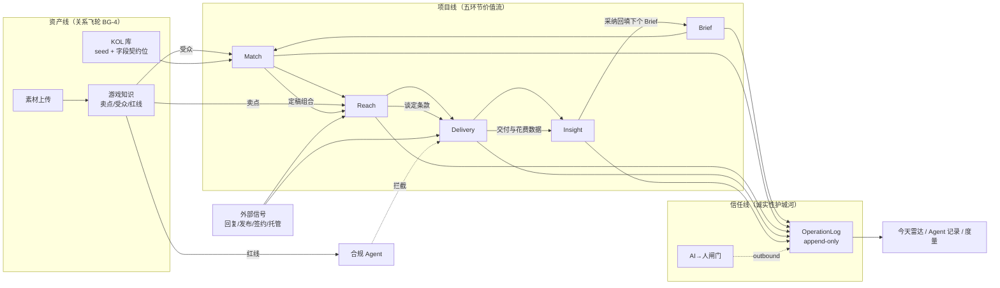
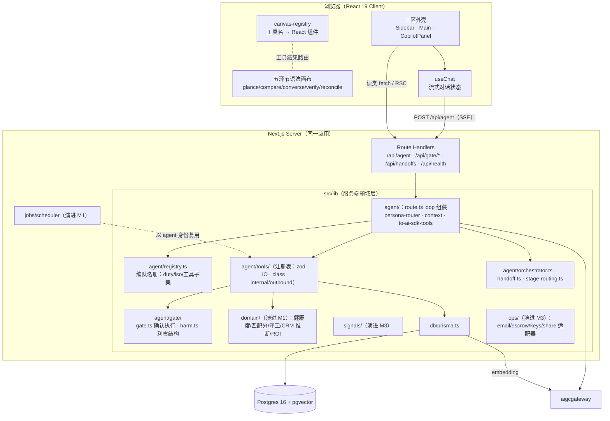
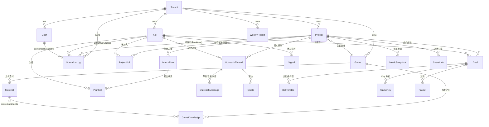
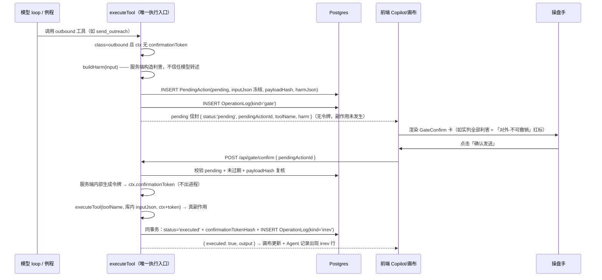
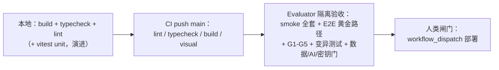

# KOLMatrix 全站架构设计文档

| 项 | 内容 |
|---|---|
| 版本 | **v1.2（2026-07-21）定稿版** |
| 日期 | 2026-07-21 |
| 状态 | **定稿**（ARCH-M05 F001 交付；后续批次以本文为工程落法权威） |
| 范围 | 覆盖 PRD 全站：六页工作台 · 项目五环节 · 多 Agent 编队 · AI→人闸门 · 数据与溯源 · 信号与集成 · 主动式 Agent · 度量 · 部署演进 |
| 输入 | `docs/product/KOLMatrix-PRD.md`（v1.0）· `interaction-prototype-v2.html` + 落地规范 · `docs/specs/AGENT-FOUNDATION-spec.md` · `docs/specs/ARCH-M05-spec.md` + `ARCH-M05-ui-inventory.md` · `gap-data-layer.md` · **仓库实物代码（as-built 校准源）** |
| 读者 | Generator（实现）、Evaluator（验收）、后续批次 Planner |
| 关系 | 本文是**工程侧全站目标态架构**；PRD §9–§13 是产品侧权威定义；批次 spec 是验收口径。冲突时：产品语义以 PRD 为准，批次验收以 spec 为准，工程落法以本文为准 |

> **作废层警示**：凡 `lead/bd/finance` 三角色、`scope`/`Approval` 审批链、阈值分级（$8,000/$2,000/10 封）、`copilotScope` 角色数据边界、角色切换器等表述均属已作废层（D26–D29 裁决），本文不引用、不实现。

---

## 阅读约定：as-built vs 演进目标（v1.2 新增，全文强制）

本文经 AGENT-FOUNDATION（M0）+ GO-LIVE + FE-REFACTOR 三批交付后**逐条对实物代码校准**。全文遵守两条标注纪律：

| 标注 | 含义 | 判定规则 |
|---|---|---|
| （无标注） | **as-built**：仓库中已实装，Evaluator 可 grep / 运行验证 | 已实装一律以实物为准，文档不得写「更好的设计」冒充现状 |
| **演进目标（未实装，归 M_x）** | 目标态设计，当前**没有**对应代码 | 按 M0–M5 路线归位；实装时以本文设计为起点，允许修订 |

**矛盾裁决原则（ARCH-M05 spec §2.4）**：已实装一律 as-built；未实装标「演进目标」按 M 路线归位。v1.0/v1.1 中与实物冲突的表述已在 v1.2 逐条改写，**不保留双份说法**。

---

## §1 架构总览

### 1.1 一句话架构定义

**一个 Next.js 全栈应用 = 常驻对话面 + Generative Canvas + 多 Agent 运行时（应答 + 例程）+ 服务端强制的 AI→人闸门，承载「项目五环节纵推」领域模型，立在 Postgres + pgvector 之上。**

KOLMatrix 不是「CRUD-over-REST + AI 挂件」，而是以「工具结果协议」为骨架的 Agent 驱动应用：用户意图经对话面进入 → Agent 运行时调工具 → 工具结果按工具名/`type` 渲染成画布组件 → 对外/不可逆/花钱的动作被服务端闸门拦在「已备好，等你按」；同时例程调度让 Agent 在无人值守时沿同一工具注册表推进工作并留痕（例程 = **演进目标（未实装，归 M1）**）。

### 1.2 架构要回答的七个问题

| # | 问题 | 架构回答 | 详解 |
|---|---|---|---|
| 1 | 全站业务如何统一建模？ | 六页 × 五环节能力地图 + 目标态领域模型 + 全套状态机 | §2、§5 |
| 2 | AI 如何从副驾变主驾？ | 四柱：工具层 / Agent 运行时 / 常驻对话面 / Generative Canvas | §8 |
| 3 | Agent「主动干活」（夜间筛查、今日完成）从哪来？ | 主动式例程：调度器以 agent 身份复用同一工具注册表，全量留痕 | §8.10 |
| 4 | 多 Agent 编队如何落地又不失控？ | Agent = system prompt 人格 + 按环节收窄的工具子集；隔离=否定式护栏 | §8.6 |
| 5 | 「AI 不替人做不可逆承诺」如何兑现？ | 工具二分 internal/outbound + 服务端 pending + 确认后服务端内部执行 + 留痕 | §9 |
| 6 | 「每个数字都知道从哪来」如何落地？ | 字段契约位（D15）+ `dataSource`/`fieldProvenance` 双层溯源 + `ProvenanceTag` | §7.5 |
| 7 | 外部世界（回复/发布/签约/托管）如何进来？ | 信号接入层：规范化 Signal → 领域事件 → CRM/交付推断 | §10.4 |

### 1.3 设计原则 → 架构机制映射

| 原则（PRD §6） | 架构机制 | 强制层 |
|---|---|---|
| DP-1 单角色，无角色分叉 | 无 role/scope/权限列；`owner` 仅展示标记 | schema + 代码评审 |
| DP-2 AI 主驾 | 常驻对话面 + canvas 为交互主轴；表单降级兜底 | 前端架构（§6） |
| DP-3 多 Agent 编队有隔离 | 编队名册注册表 + 工具子集 + 否定式护栏注入 | Agent 运行时（§8.6） |
| DP-4 AI→人闸门 | outbound 工具服务端强制 + 确认令牌服务端内部消费 + 无阈值 | **服务端**（§9） |
| DP-5 数据溯源 | `fieldProvenance` 逐字段 + `ProvenanceTag` + 缺值显「待接入」 | 数据契约 + UI（§7.5） |
| DP-6 流程是可计算实体 | 健康度/匹配分/交付达标=纯函数实时算；状态机有守卫；配变异测试 | 领域层（§5.3/§5.4） |

> DP-4 / DP-6 是不可让渡底线：机制化守门优先级 **服务端 > 前端 > 文档**。

### 1.4 技术选型总表（as-built 版本已锁定）

版本列 = `package.json` 实测值（2026-07-21）。**「状态」列区分已装 / 未装**——未装项不得在实现中假定其存在。

| 领域 | 选型（as-built 版本） | 状态 | 选型理由 | 反选型（不选原因） |
|---|---|---|---|---|
| 应用框架 | **Next.js 15.5.20** App Router，前后端同一应用 | 已装 | D1 硬决策：Route Handlers 免去独立后端；`output:'standalone'` 已接 Docker CD；运行时无状态设计让同应用也能留 RLS 边界 | 独立后端（NestJS/Fastify + SPA）：多一套部署与鉴权面；旧仓库后端：明确只参考不移植（D8） |
| UI 运行时 | **React 19.2.7 / react-dom 19.2.7**（正式版，非 RC） | 已装 | 模板 scaffold 基线；已随 FE-REFACTOR 稳定在正式版 | 降级 React 18：与模板 scaffold 冲突 |
| 语言 | **TypeScript 5.9.3**（`strict:true`，豁免 `strictNullChecks`/`strictPropertyInitialization`） | 已装 | ADR-08 的 TS5 升级**已销项**；AI SDK v5+ 要求 TS≥5，此前提已满足 | 停留 4.9：无法承载 AI SDK 选型（历史约束，已解除） |
| 设计系统 | **Tailwind ^3.3.3** + `AppWrappers.tsx` 运行时 CSS 变量色阶（`--color-50..900`，主色 `#422AFB`） | 已装 | 模板主设计系统就是 Tailwind + CSS 变量，**不是** Chakra theme（无 ChakraProvider/extendTheme）；浅色默认 + `body.dark` | Chakra theme 全家桶：模板架构不支持；再写一套 CSS 变量/`data-theme`：FR-12.26 明令禁止 |
| 交互原语 | Chakra 拆包（modal/hooks/popover/tooltip/accordion/icons/portal/system/theme-tools） | 已装 | GateConfirm 焦点陷阱 + Escape（NFR-A1）直接用 `@chakra-ui/modal` 现成可达性 | Radix/Headless UI：重复引入第三套原语体系。**Toast 不扩此白名单**——自建 `common/Toast`（裁决 #9） |
| Agent 运行时 SDK | **`ai` 7.0.31**（`streamText`）+ **`@ai-sdk/react` 4.0.34**（`useChat`）+ **`@ai-sdk/openai` 4.0.16** | 已装 | D2 硬决策：流式 loop、tool-calling、React hook 一体；工具定义天然接 zod；`useChat` 逐轮回传对话正好满足运行时无状态（FR-12.9） | LangChain/LlamaIndex：抽象层过重；手写 SSE loop：重造流式协议与 tool-call 解析；厂商 SDK 直连：绑定单一供应商 |
| 模型出口 | **aigcgateway**（OpenAI 兼容 baseURL），唯一接入点 `src/lib/ai/gateway.ts`，用 `createOpenAI({ baseURL, fetch: resilientFetch })` + `.chat(modelId)` | 已装 | D2：chat（tool-calling）+ embedding 双链路单出口；统一计费与成本记账挂点（`logUsage`）；密钥只走 env | 直连 OpenAI/Anthropic：多密钥多计费面。**注意**：用 `@ai-sdk/openai` 而非 `@ai-sdk/openai-compatible`，且**必须** `.chat()`——provider 默认 callable 走 Responses API，网关不支持 |
| Embedding | **bge-m3，1024 维**，经网关（`EMBEDDING_DIMENSIONS=1024`） | 已装 | D3：多语种强（全球 KOL）；维度与 `vector(1024)` 列一致 | OpenAI text-embedding-3：需另开出口；本地推理：dev 机不必要的重量 |
| ORM / DB | **Prisma 6.19.3 + @prisma/client 6.19.3** + PostgreSQL **16** + pgvector | 已装 | PRD §11 栈约束；migration 工具链成熟；`Unsupported("vector(1024)")` + `$queryRaw` 覆盖向量读写 | Drizzle：PRD 已锁 Prisma；裸 SQL：失去 migrate/类型生成 |
| 向量检索 | pgvector cosine（`<=>`）top-K，同库 | 已装 | ~2,524 条规模 DB 侧 <200ms（NFR-P3）绰绰有余；与业务数据同库同事务，溯源/闸门留痕不跨系统 | 独立向量库（Pinecone/Qdrant）：此规模纯增运维面；检索收敛在 `search_kols` 内、可换实现不改协议 |
| 校验 | **zod 4.4.3** | 已装 | NFR-S6/FR-11.20 硬要求：工具 IO、jsonb 契约位、API 入参统一一套 schema；AI SDK 工具定义原生吃 zod | yup/valibot：AI SDK 生态以 zod 为一等公民 |
| 图表 | ApexCharts 3.35.5 + react-apexcharts 1.4.0 | 已装 | 模板封装件现成（`components/charts/`）；`HalfGauge` = radialBar −90/90（FR-8.2.1.1） | ECharts/Recharts：重复引入，需重做 Horizon 视觉适配 |
| 表格 | @tanstack/react-table ^8.7.9 | 已装 | `DataTable` 抄模板 ComplexTable 写法；headless 与 Tailwind 无冲突 | AG Grid：闭源重件 |
| 上传 | react-dropzone ^14.2.3 | 已装 | `UploadZone`（FR-8.4.2）直接用 | 手写 drag events：已有依赖不重造 |
| 客户端状态 | 不新增全局状态库：`useChat` 持对话、URL 持导航与筛选态（§6.5 四位）、`ConfiguratorContext` 持主题 | 已有 | FR-7.6/7.8 要求环节态可链接直达；URL 即状态天然满足（ADR-18） | zustand/jotai/Redux：当前无跨树共享可变状态诉求，引入即闲置 |
| 单元/变异测试 | **vitest** | **未装** | 见 §12.6：当前测试由 tsx smoke 脚本 + Playwright 承担 | — |
| E2E / 视觉 | Playwright ^1.61.1（+ `playwright` ^1.61.1） | 已装 | 视觉回归已跑通（chromium 1512×982，darwin/linux 双 baseline，CI/linux 重生） | Cypress：迁移无收益 |
| 认证 | 无（硬编码 dev tenant，`slug='dev'`） | 已装（占位） | D4：单租户占位，`tenantId` 进 schema 不进逻辑分支 | next-auth 现在就上：M5 配合 RLS 一次到位，避免假多租户 |
| 部署 | Docker 四阶段（`deps`/`build`/`tools`/`runner`，node 20-alpine standalone）+ GH Actions：CI（push main → lint+tsc+build+visual）、CD 仅 `workflow_dispatch` 手动（VPS `newkol.guangai.ai:3300`） | 已装 | CICD-VPS + GO-LIVE 已 done；deploy/prod 永留人类闸门 | 自动部署 on push：违反人类闸门约束，禁止 |

**附注 · AI SDK 版本族配对核查（ARCH-M05 F001 要求，2026-07-21 实测）**

表面上 `ai@7` 与 `@ai-sdk/openai@4` / `@ai-sdk/react@4` 主版本号不一致，易误判为错配。经 `node_modules` 内 `peerDependencies` / `dependencies` 逐包核对，**配对合法，无冲突**：

| 包 | 装机版本 | 关键依赖 / peer | 判定 |
|---|---|---|---|
| `ai` | 7.0.31 | deps: `@ai-sdk/provider@4.0.3`、`@ai-sdk/provider-utils@5.0.11`；peer: `zod ^3.25.76 \|\| ^4.1.8` | — |
| `@ai-sdk/openai` | 4.0.16 | deps: `@ai-sdk/provider@4.0.3`、`@ai-sdk/provider-utils@5.0.11`（**与 `ai` 完全一致**）；peer: 同上 zod | ✅ 同族 |
| `@ai-sdk/react` | 4.0.34 | deps 含 `ai@7.0.31`（**精确等于根装版本**）；peer: `react ^18 \|\| ~19.0.1 \|\| ~19.1.2 \|\| ^19.2.1` | ✅ 同族 |
| `zod` | 4.4.3 | 满足三处 peer 的 `^4.1.8` | ✅ |
| `react` | 19.2.7 | 满足 `@ai-sdk/react` peer 的 `^19.2.1` | ✅ |

`npm ls ai @ai-sdk/openai @ai-sdk/react @ai-sdk/provider @ai-sdk/provider-utils zod` 输出中 `@ai-sdk/provider` / `@ai-sdk/provider-utils` / `zod` 全部 `deduped`，**node_modules 内各只有一份实例**（无嵌套重复副本），无 `UNMET PEER DEPENDENCY` 告警。

**结论：`ai@7` + `@ai-sdk/*@4/5` 是 AI SDK v5+ 的正常版本策略**——核心包（`ai`）与 provider/UI 包独立发版，靠共享的 `@ai-sdk/provider` 契约版本对齐。**配对经 peerDeps 检查无冲突、无版本告警。** 升级纪律：升 `ai` 时须同步确认 `@ai-sdk/openai` / `@ai-sdk/react` 依赖的 `@ai-sdk/provider` 版本仍与之一致，不一致则同批升级。

### 1.5 架构约束（已锁定，非本文决策）

- **AI 唯一出口**：aigcgateway（OpenAI 兼容 baseURL），chat（tool-calling）+ embedding 双链路；密钥全走 env。默认 chat=`deepseek-v3`、embedding=`bge-m3`（`src/lib/ai/gateway.ts` 常量，env 可覆盖）。
- **数据现状**：`scripts/seed/data/kol-seed-enriched-final.csv` **2,524 条**真实 KOL（含表头 2,525 行）入 git 可复现；Apify 采集、外购评估 API、平台一方 API 均后期。
- **租户与认证**：单租户硬编码 dev tenant（`slug='dev'`，schema 带 `tenantId` 占位），无真实认证；RLS 与认证是 M5 已知下游。
- **资金边界**：合同/支付走 partner（电子签 + Stripe escrow）；本系统只做触发条件 + 闸门 + 状态追溯，不碰资金与税务。
- **已交付地基**：DS-FOUNDATION（admin 外壳 / 色阶注入 / 深浅色 / 路由表 / 构建门）· **AGENT-FOUNDATION（M0：Prisma schema + pgvector + seed + gateway + 四柱 + 编排框架 + AI→人闸门）** · GO-LIVE（生产全栈化：db 容器 + migrate one-shot + `/api/health`）· FE-REFACTOR（前端整肃 + 视觉基线）。

> **v1.1 → v1.2 校准**：v1.1 §1.4 末句「**后端尚未落地**（无 `prisma/`、`src/lib/`、`src/app/api/`）」的「零后端」快照**已删除**——三者均已实装（`prisma/schema.prisma` + 2 个 migration、`src/lib/{agent,ai,db}/`、`src/app/api/{agent,gate/confirm,gate/reject,handoffs,health}/`）。

---

## §2 业务架构

### 2.1 业务结构一句话

**项目是空间、环节是时间**（D21/D22）：侧栏六页是跨项目工作台，项目内部五环节（Brief → Match → Reach → Delivery → Insight）纵推；操盘手是决策者+审阅者，编队沿环节把机械工作做完、把拍板点顶到面前。

### 2.2 业务能力地图（全站功能 → 架构落点）

| 页 / 域 | 用户只回答 | 核心能力 | 领域模块 | 当值 Agent | 批次 |
|---|---|---|---|---|---|
| 今天（雷达） | 哪个项目卡在我这、要我做什么 | 待办聚合 · 编队状态 · 今日完成 · 负荷 | ask 聚合（§8.7） | 编排 | M0.5 外壳 / M1 真数据 |
| 项目 · Brief | 方向对不对 | 目标拆解 · 预算配比 · 健康度监测 · 阻塞处置 | project + brief 域 | 策略 | M1 |
| 项目 · Match | 批准哪一组 | 语义搜索 · 可解释评分 · 组合生成 · 待裁定 | match 域 | 匹配 | M2 |
| 项目 · Reach | 这封发不发、价接不接 | 邀约起草 · 逐人谈判 · 报价 · 信号跟进 | reach（CRM）域 | 触达 | M3 |
| 项目 · Delivery | 这笔放不放 | 条件核对 · 合同/托管/披露 · 放款准备 · Key 分发 | delivery 域 | 交付 | M3 |
| 项目 · Insight | 对账原目标 | 目标 vs 实际 · 证据缺口 · 复盘草案 | insight 域（项目内） | 洞察 | M4 |
| 创作者库 | 有谁值得复用、分流到哪 | 发现 · 受众预排序 · 加入项目匹配 | kol 资产域 | 匹配 | M2 |
| 游戏知识 | 这游戏卖点/受众/红线 | 素材管理 · Agent 解析 · 特点提炼 | knowledge 域 | 策略 | M1 |
| 洞察（跨项目） | 哪个项目 ROI 高、加投谁 | 跨项目 ROI · 周报草案 · 对外分享 | insight 域（跨项目） | 洞察 | M4 |
| Agent 记录 | 编队做了什么、哪些不可逆 | 全量留痕 · 类型筛选 · 闸门审计闭环 | audit 域 | 编排 | M0（表已实装） |
| 合规（横切，无页） | 这个能不能发 | 品牌安全 · #ad 披露 · 授权范围核查 | compliance 域 | 合规（被调用） | M2/M3 |

铁律（FR-7.5）：**发现/分流 ≠ 执行**——创作者库唯一动作是「加入某项目匹配」；触达/谈判/放款只能在项目内发生。

### 2.3 三条业务主线



- **项目线**：Project 聚合是五环节的容器与游标，环节间交接物（组合→草稿→条款→凭证→复盘）是责任链。
- **资产线**：KOL 库 + 游戏知识 + 交互/交付数据回流喂 Agent——第一天起设计的数据闭环。
- **信任线**：闸门 + append-only 留痕 + 逐字段溯源，相对黑盒 AI 工具的诚实性护城河（FR-10.9）。

---

## §3 系统上下文

```mermaid
flowchart LR
    subgraph 用户侧
        U[营销操盘手<br/>单角色·1-5 人小团队]
    end

    subgraph KOLMatrix["KOLMatrix（单个 Next.js 全栈应用）"]
        FE[前端：三区外壳<br/>侧栏 / 画布 / Copilot]
        API["Route Handlers<br/>/api/agent · /api/gate/{confirm,reject}<br/>/api/handoffs · /api/health"]
        AGENT[Agent 运行时<br/>streamText 应答 loop]
        TOOLS[工具注册表<br/>class: internal / outbound]
        DOMAIN[领域服务<br/>纯函数 + 状态机（M1+）]
        LIB[数据访问层<br/>Prisma + zod]
    end

    subgraph 外部依赖
        GW[aigcgateway<br/>chat tool-calling + bge-m3 embedding]
        DB[(PostgreSQL 16 + pgvector<br/>dev docker / prod 容器)]
        PARTNER[partner 服务·M3<br/>电子签 + Stripe escrow]
        EXT[数据源·后期<br/>Apify 采集 / 外购评估 API / 平台一方 API]
        MAIL[邮件投递·M3<br/>Resend 等]
        SIGIN[入站信号·M3<br/>邮件回复 / partner 回调 / 平台发布]
    end

    U -->|HTTPS：对话/确认/页面| FE
    FE --> API
    API --> AGENT --> TOOLS --> DOMAIN --> LIB --> DB
    AGENT -->|OpenAI 兼容| GW
    LIB -->|embedding| GW
    TOOLS -. 出站适配·M3 .-> PARTNER
    TOOLS -. 出站适配·M3 .-> MAIL
    SIGIN -.->|webhook / 轮询·M3| API
    LIB -. 同一字段契约接入 .-> EXT
```



**边界声明（架构不做什么）**：不做人→人审批与组织权限层；不碰资金流与税务（partner 域）；不自建模型服务（gateway 域）；当前不做真实认证与多租户隔离。

| 外部系统 | 方向 | 交互 | 状态 |
|---|---|---|---|
| aigcgateway | 出站 | OpenAI 兼容：chat（tool-calling）+ embedding（bge-m3） | **已接**（M0/F003） |
| PostgreSQL 16 + pgvector | — | 主存储 + 向量检索（cosine `<=>`） | **已接**（dev docker + prod 容器） |
| partner（电子签 + Stripe escrow） | 双向 | 出站：签署/托管/放款执行；入站：signed/funded 回调 | 演进目标（未实装，归 M3） |
| 邮件投递（Resend 等） | 双向 | 出站：`send_outreach` 投递；入站：回复追踪 | 演进目标（未实装，归 M3）；当前 `send_outreach.execute` 为 mock 副作用（写 `SENT_MARKER` 日志行） |
| 平台发布信号 | 入站 | 频道轮询（RSS/API）或手动上传兜底 | 演进目标（未实装，归 M3+）；受平台收权影响（NFR-S10） |
| Apify / 外购评估 / 平台一方 API | 入站 | 补 `Kol` 深字段（受众/可信度/品牌安全） | 演进目标（未实装，归 M5）；字段契约位已预留 |

---

## §4 总体架构

### 4.1 分层视图



### 4.2 关键架构风格决定

1. **单全栈应用**（D1）：前后端同处一个 Next.js App Router 应用；后端 = Route Handlers + `src/lib`。无独立后端服务、无微服务、无消息队列。
2. **三条请求通道分离**：
   - **对话通道**：`POST /api/agent`，SSE 流式（`toUIMessageStreamResponse`），承载「NL → 规划 → 工具 → 画布结果」；
   - **数据通道**：页面读类数据走普通 Route Handler / Server Component 直读 repository——**读数据不经过模型**；
   - **作业通道**：调度器例程 + 信号 webhook（**演进目标，未实装，归 M1/M3**）——产物一律落库留痕，再经雷达/记录页呈现。
3. **工具结果协议解耦四柱**（FR-12.3）：新增工具或结果类型不改运行时 route 核心与对话面外壳（见 §8.5 as-built 路由键说明）。
4. **运行时不保存会话状态**（FR-12.9）：`/api/agent` 无状态；对话历史由前端 `useChat` 持有并逐轮回传。为多租户 RLS 留干净边界。
5. **领域逻辑是纯函数**：健康度、匹配分、交付达标、环节流转守卫、CRM 状态推断全部落在 `src/lib/domain/`（**演进目标，未实装，归 M1+**），可单测、可变异测试，不藏在组件或 prompt 里（DP-6）。
6. **能力只建一套**：应答 loop、主动例程、信号处理都复用同一工具注册表与领域函数——Agent「自己干活」和「替人答话」是同一份能力的两种触发方式（§8.10）。
7. **唯一执行入口**（as-built，架构级）：所有工具调用必经 `executeTool()`（`src/lib/agent/execute.ts`），以保证 ① zod 入参校验 ② `class` 分流（outbound 门控）统一生效。**禁止双执行语义并存**——`registerTool` 对重名直接抛错。

### 4.3 目录结构（文件级，as-built + 演进标注）

图例：`[已建]` 仓库现存 · `[新建]` 后续批次新增 · `(M0.5)` ARCH-M05 必须 · `(演进 Mx)` 后期批次。

```
src/
├── routes.tsx                              [已建] 6 项侧栏 IA
├── Fonts.tsx                               [已建] next/font/local 接线
├── app/
│   ├── layout.tsx                          [已建] 根布局，默认浅色（body 无 dark class）
│   ├── AppWrappers.tsx                     [已建] 运行时 CSS 变量色阶注入
│   ├── page.tsx                            [已建] 根重定向
│   ├── api/
│   │   ├── agent/route.ts                  [已建] 柱二：streamText 流式 loop + persona 路由（F005/F006）
│   │   ├── gate/confirm/route.ts           [已建] 闸门：人确认 →（服务端内部签令牌）→ 执行 → irrev 留痕
│   │   ├── gate/reject/route.ts            [已建] 闸门：拒绝 → 失效 PA + block 留痕
│   │   ├── handoffs/route.ts               [已建] 协同交接读写（F006）
│   │   ├── health/route.ts                 [已建] 纯 liveness 探针（GO-LIVE F001）
│   │   ├── kols/route.ts · kols/[id]/route.ts          [新建](演进 M1+) 读类数据通道
│   │   └── signals/inbound/route.ts        [新建](演进 M3) 入站信号 webhook
│   ├── preview/agent-canvas/               [已建] canvas fixture 预览页（视觉基线用）
│   └── admin/
│       ├── layout.tsx                      [已建] 三区外壳（侧栏 + 主区 + Copilot 列）
│       ├── page.tsx                        [已建]
│       ├── today/page.tsx                  [已建·外壳](M0.5 充实) 今天/雷达
│       ├── campaigns/page.tsx              [已建·外壳](M0.5 充实) 项目列表
│       ├── campaigns/[id]/page.tsx         [已建·外壳](M0.5 充实) 项目空间 + 五环节 tab（?env=）
│       ├── creators/page.tsx               [已建·外壳](M0.5 充实) 创作者库
│       ├── knowledge/page.tsx              [已建·外壳](M0.5 充实) 游戏知识
│       ├── insight/page.tsx                [已建·外壳](M0.5 充实) 洞察（跨项目）
│       ├── runs/page.tsx                   [已建·外壳](M0.5 充实) Agent 记录
│       ├── dashboards/page.tsx             [已建] ⚠️ redirect 桩（非删除）
│       ├── dashboards/default/page.tsx     [已建] ⚠️ redirect('/admin/today')
│       ├── discovery/page.tsx              [已建] ⚠️ redirect('/admin/creators')
│       ├── database/page.tsx               [已建] ⚠️ redirect('/admin/creators')
│       └── outreach/page.tsx               [已建] ⚠️ redirect('/admin/campaigns')
├── components/
│   ├── （card/charts/sidebar/navbar/fields/progress/dropdown/tooltip/popover/…）[已建] Horizon 库存
│   ├── common/                             [已建] **恰好 10 件**：Badge · Button · ChatBubble ·
│   │                                         ComingSoon · DefinitionRow · HandoffCard · PageHeader ·
│   │                                         PanelHeader · SectionLabel · SurfaceCard
│   │   ├── Toast.tsx                       [新建](M0.5) 自建轻量（单例+2.4s+底部居中，裁决 #9）
│   │   ├── DataTable.tsx                   [新建](M0.5) @tanstack/react-table 通用封装
│   │   ├── HalfGauge.tsx                   [新建](M0.5) ApexCharts radialBar −90/90
│   │   ├── UploadZone.tsx                  [新建](M0.5) react-dropzone + parseStatus
│   │   ├── ProvenanceTag.tsx               [新建](M0.5) variant: 'badge' | 'inline'（裁决 #10）
│   │   ├── AgentSquad.tsx                  [新建](M0.5) variant: 'grid' | 'compact'（裁决 #7）
│   │   ├── GateConfirm.tsx                 [新建](M0.5) 闸门确认卡（Chakra Modal + 焦点陷阱）
│   │   └── ConversationInbox.tsx           [新建](M0.5) Reach 三栏收件箱
│   ├── copilot/                            [已建]
│   │   ├── CopilotPanel.tsx                [已建] 常驻右栏容器（useChat 宿主）
│   │   ├── ExpertScope.tsx                 [已建] 专家头 + duty/iso 职责隔离卡
│   │   ├── HandoffCollab.tsx               [已建] 协同交接区（默认折叠）
│   │   └── canvas/                         [已建] ⚠️ **canvas 落点在 copilot/ 之下，非顶层 components/canvas/**
│   │       ├── canvas-registry.tsx         [已建] 工具名 → React 组件（§8.5）
│   │       └── KolResultCards.tsx          [已建] search_kols 结果卡片流
│   ├── envs/                               [新建](M0.5) 五套环节语法（brief/match/reach/delivery/insight）
│   └── project/                            [已建] 项目相关件
├── lib/
│   ├── ai/gateway.ts                       [已建] aigcgateway provider（chat + embedding + 成本/错误骨架）
│   ├── agent/
│   │   ├── registry.ts                     [已建] 编队名册（7 人格：duty/iso/uiSyntax/tools/systemPrompt）
│   │   ├── persona-router.ts               [已建] context → 人格 + 工具子集收窄
│   │   ├── context.ts                      [已建] buildToolContext（dev tenant 解析）
│   │   ├── execute.ts                      [已建] **唯一执行入口** executeTool（zod + class 分流）
│   │   ├── to-ai-sdk-tools.ts              [已建] 注册表 → AI SDK tool set 适配
│   │   ├── orchestrator.ts                 [已建] 环节路由 + pending 聚合（原样不改写）
│   │   ├── stage-routing.ts                [已建] client-safe 五环节纯函数
│   │   ├── handoff.ts                      [已建] handoff 信封协议
│   │   ├── gate/gate.ts                    [已建] createPendingAction / confirm / reject
│   │   ├── gate/harm.ts                    [已建] harm 单一 zod + PendingActionEnvelope
│   │   └── tools/
│   │       ├── types.ts                    [已建] ToolDefinition（**字段名 `class`**）· ToolContext
│   │       ├── registry.ts                 [已建] 注册表（重名即抛）
│   │       ├── index.ts                    [已建] native 工具装配入口（幂等注册）
│   │       ├── search-kols.ts              [已建] internal
│   │       ├── get-kol-detail.ts           [已建] internal
│   │       └── send-outreach.ts            [已建] **outbound**（唯一，闸门演示；execute 为 mock）
│   ├── db/prisma.ts                        [已建] Prisma client 单例
│   ├── domain/                             [新建](演进 M1+) 纯函数：health · match-score · env-guards · …
│   ├── data/schemas/ · provenance.ts       [新建](演进 M1+) zod 契约位 + resolveProvenance（§7.5）
│   ├── api/envelope.ts · errors.ts         [新建](演进 M1+) 统一响应信封 + ApiErrorCode（§10.1）
│   ├── env.ts                              [新建](演进) serverEnv 集中校验（§13.2）
│   ├── signals/                            [新建](演进 M3)
│   ├── jobs/                               [新建](演进 M1) scheduler + routines
│   └── ops/                                [新建](演进 M3) email · escrow · keys · share 适配器
├── contexts/ConfiguratorContext.ts         [已建]
├── hooks/                                  [已建]
├── variables/charts.ts                     [已建] chartOptions 预设复用源
└── styles/                                 [已建]

prisma/
├── schema.prisma                           [已建] §7.2.1 权威转录
└── migrations/
    ├── 20260718000000_init/                [已建] 建表 + CREATE EXTENSION vector
    └── 20260720000000_pendingaction_input/ [已建] PendingAction.inputJson

scripts/
├── seed/import-kol-csv.ts                  [已建] CSV → 规范化 → upsert → embedding（幂等）
├── seed/data/kol-seed-enriched-final.csv   [已建] 2,524 条
├── seed/demo-handoff.ts                    [已建]
├── deploy/migrate-seed.sh                  [已建] tools 镜像 one-shot 入口
└── test/                                   [已建] 见 §12.6

tests/visual/                               [已建] dashboard.spec.ts · agent-canvas.spec.ts
```

> **Import 别名根 = `src`**（`tsconfig baseUrl: "src"`，裸导入如 `lib/agent/registry`，无 `@/`）；保留既有 `@/public/*` 静态资源映射。

---

## §5 领域架构

> PRD §11 给出了 `Kol` / 知识平面 / `OperationLog` 的字段级契约，并明确 `Project` / `ProjectKol` / Match 组合 / Outreach / Deal / Payout 的**字段级 schema 留后续批次 spec 定义**。本章给出**目标态概念模型**：实体、职责、关系、状态机。
>
> **v1.2 校准**：本章 §5.2–§5.5 除已标注者外**整体是演进目标（未实装）**——当前 `prisma/schema.prisma` 只有 8 个模型（§7.2.1 为实装权威）。概念层变更需显式修订本文（R13）。

### 5.1 领域模块分解

| 模块 | 职责 | 核心实体 | 关键规则 | 批次 |
|---|---|---|---|---|
| project（项目聚合） | 五环节容器与游标 | `Project`（**已建·最小占位**） | `cur` 流转有守卫；`owner` 是分工不是权限 | M1 |
| brief | 目标与健康 | `Project.goal`(jsonb) | 健康度纯函数；阻塞处置=internal | M1 |
| match | 筛查/评分/组合 | `MatchPlan` · `PlanKol` · `MatchCandidate` | 批准=internal 不弹框；低置信度入「待裁定」不显裸分 | M2 |
| reach（CRM） | 对话/报价/跟进 | `OutreachThread` · `OutreachMessage` · `Quote` | CRM 状态事件推断；发送/报价=outbound | M3 |
| delivery | 条款/交付/放款 | `Deal` · `Deliverable` · `GameKey` · `Payout` | 条件齐才可放款、无绕过；放款/发 Key=outbound | M3 |
| insight | ROI/复盘/周报/分享 | `MetricSnapshot` · `WeeklyReport` · `ShareLink` | 证据缺口诚实标注；对外分享=outbound | M4 |
| kol 资产 | 库/溯源/向量 | `Kol`（**已建·完整**） | 契约位 nullable；发现≠执行 | M0 ✅ / M2 消费 |
| knowledge | 素材/特点 | `Game`（**已建·最小占位**）· `Material` · `GameKnowledge` | 知识溯源非空；supersede 链不物理删 | M1 |
| audit | 留痕 | `OperationLog`（**已建**） | append-only（当前**应用层约定**，DB 触发器欠账见 §7.7） | M0 ✅ |
| orchestration | 编排交接 | `Handoff`（**已建**）· `PendingAction`（**已建**） | 接收方按自身 scope 重读，不信任发送方结论 | M0 ✅ |
| compliance | 合规判断 | `Kol.brandSafety` × 红线 | 被调用形态；拦截写 block 留痕 | M2/M3 |

### 5.2 目标态领域模型（概念 ER · 演进目标）

> **未实装**：下图是 M1–M4 逐批建表的目标形态。实装表见 §7.2.1。



关键字段（示意，字段级以批次 spec 为准）：

| 实体 | 关键字段 | 说明 |
|---|---|---|
| `Project` | id · tenantId · gameId · name · owner · goal{目标曝光/预算/周期} · budgetTotal · currency · cur · status | `cur` = 环节游标；`owner` = 分工标记（D29）。**当前实装仅 id/publicId/slug/tenantId/name/owner/createdAt** |
| `ProjectKol` | projectId · kolId · owner · status（5 态） | 状态由事件推断（§5.3），非手切 |
| `MatchPlan` | id · projectId · name · metrics{触达/预算/风险/规模} · rationale · recommended · status(draft/approved/superseded) · approvedBy/At | 批准=internal 事件（D16 语义：选了就生效） |
| `PlanKol` | planId · kolId · matchScore · reasons[] | 可解释依据必带 |
| `MatchCandidate` | projectId · kolId · verdict(pending/kept/dropped) · doubts[] · preJudge | 「待你裁定」：存疑原因+初判，不显裸分 |
| `OutreachThread` | id · projectId · kolId · owner · lastSignalAt | 一个创作者=一段关系=一个 thread |
| `OutreachMessage` | threadId · direction(draft/sent/inbound) · body · language · gateLogId? · sentAt | 草稿改而非从零填；sent 必关联闸门记录 |
| `Quote` | threadId · amount · currency · deliverables[] · scope · status(proposed/committed/rejected) · gateLogId | committed 必经闸门 |
| `Signal` | id · tenantId · kolId · projectId? · type · source · externalId · payload · detectedAt | 规范化外部事件；externalId 唯一防重（§10.4） |
| `Deal` | id · projectId · kolId · terms · contractRef · escrowRef · status | contract/escrow 是 partner 侧引用，不存资金细节 |
| `Deliverable` | dealId · kind(content/key/contract/escrow/ad_disclosure) · status(pending/met/missing/na) · evidenceRef · verifiedBy | 对应台账「内容/Key/合同/托管/#ad」五列 |
| `GameKey` | dealId · keyRef · status(reserved/distributed) · distributedAt | 分发=outbound |
| `Payout` | dealId · payee · amount · currency · basis · status(prepared/released/blocked) · gateLogId | 放款=outbound，逐笔 |
| `MetricSnapshot` | projectId · date · reach · spend · conversions · roi | ROI 计算底表 |
| `WeeklyReport` | tenantId · period · draftContent · adopted · adoptedAt | 采纳=internal |
| `ShareLink` | projectId · scope · payloadRef · expiresAt · revokedAt · gateLogId | 生成=outbound；scope 区分 project/quarterly（裁决 #3） |

### 5.3 状态机集（配变异测试，D20）

**① 项目环节游标 `cur`**（责任链，FR-7.9；可回看已解锁、不可跳未解锁）— **演进目标（未实装，归 M1）**

| 流转 | 守卫（服务端校验，非仅前端隐藏） |
|---|---|
| → brief | 无（项目创建即入） |
| → match | brief 目标已确认（存在已确认 Brief 草稿） |
| → reach | 存在 `status=approved` 的 `MatchPlan` |
| → delivery | ≥1 `Deal`（由 committed quote 生成） |
| → insight | 全部 `Deal` 到 completed 或显式收尾 |

**② `ProjectKol.status` CRM 5 态（事件推断，FR-8.2.3.4）— 演进目标（未实装，归 M3）**

| 状态 | 进入事件 | 来源 |
|---|---|---|
| 待发送 | 加入已批准组合 | 内部动作 |
| 已发送 | `send_outreach` 确认执行 | 闸门执行路径 |
| 已回复 | `Signal(email_reply)` | 信号接入 |
| 谈判中 | 报价交互（议价回复/报价建议被采纳） | 信号 + 推断规则 |
| 已确认 | `commit_quote` 确认执行 | 闸门执行路径 |

人工覆盖范围 = 开放问题 Q4（M3 前定）；覆盖本身也是事件、写留痕。

**③ `Deal` 资金生命周期 — 演进目标（未实装，归 M3）**（D19：谈定条款→签署托管；交付审核→放款）

`negotiating → signed（电子签回调）→ escrowed（托管入账回调）→ delivering → completed（全部必需 Deliverable=met 且 Payout=released）`；分支：`blocked`（合规拦截，可恢复）/ `defaulted`（违约，规则 M3 定）。

**④ 闸门 `PendingAction.status` — as-built（已实装，3 态）**

```
pending ──confirm（人）──> executed        （confirmed 枚举值存在但当前路径未使用）
   │
   └──reject（人）──> 仍为 pending 但 expiresAt=epoch（失效），并写 block 留痕
```

详见 §9.3。**目标态 7 态**（`pending/confirmed/rejected/expired/executing/executed/failed`）= **演进目标（未实装，归 M3）**。

**⑤ `Material.parseStatus` — 演进目标（未实装，归 M1）**：`pending → parsing → parsed / failed`；failed 可重试回到 parsing。

**⑥ `GameKnowledge` 版本链 — 演进目标（未实装，归 M1）**：新解析生成新条目，旧条目 `supersededById` 指向新条目（不物理删除，FR-11.11）；读取恒取链头。

### 5.4 领域服务（`src/lib/domain/`，纯函数注册表）— 演进目标（未实装，归 M1+）

| 函数 | 输入 | 输出 | 消费方 | 批次 |
|---|---|---|---|---|
| `health.compute` | goal · 预算消耗 · 时间进度 · 阻塞项 | 0–100 + 绿/橙/红分档 | Brief 画布 · 雷达 | M1 |
| `matchScore.compute` | embedding cosine + `audienceDemo` + 知识受众画像 | 组合分 + 可解释依据（缺受众标「待核」） | Match · 创作者库 | M2 |
| `envGuards.canEnter / canAdvance` | Project 聚合 | bool + 原因 | 环节导轨 · 工具层 | M1 |
| `crmInfer.status` | thread 事件 + signals | `ProjectKol.status` | Reach | M3 |
| `deliveryCheck.row` | Deal + Deliverables + 相关信号 | 每条件齐/缺/不适用 + 可放款标记 | Delivery 台账 | M3 |
| `roi.compute` | MetricSnapshot + 花费 | ROI · 目标差异 · 达成方向 | Insight | M4 |
| `attribution.gaps` | 快照 + 回传完整性 | 证据缺口清单（不强行归因） | Insight | M4 |

这些函数同时被三处复用：页面数据通道（渲染）、工具层（Agent 调用）、例程（巡检/核对）——**一个真相源**。

### 5.5 领域事件与信号驱动 — 演进目标（未实装，归 M3）

事件词表（示意）：`plan.approved` · `outreach.sent` · `kol.replied` · `quote.committed` · `deal.signed` · `escrow.funded` · `deliverable.met` · `payout.released` · `keys.distributed` · `report.adopted` · `share.created`。来源两类：**内部动作**（工具执行成功，含闸门确认）与**外部信号**（Signal 规范化后解释）。

与 `OperationLog` 的关系：`OperationLog` 是**动作审计**（谁/何时/做了什么/哪一类），领域事件是**状态推断的输入**。**刻意不建事件溯源框架**（无独立 EventStore）：Signal 表 + OperationLog + 领域表状态列已足够，推断是纯函数（ADR-21，KISS）。

---

## §6 前端架构

### 6.1 信息架构与路由

侧栏固定 6 入口（跨项目）+ 项目详情下钻（不进侧栏）。路由即 PRD §7.2 表：

| 页 | 路由 | 常驻 Agent | 界面语法 | 主要构件（M0.5 口径） |
|---|---|---|---|---|
| 今天（雷达） | `/admin/today` | 编排 | KPI + 确认雷达 + 编队 + feed | KPI ×4（delta 有无两态不合并）· 「需要你确认」雷达卡（health pill 三态 / `irrev` 红标条件渲染 / 「进入项目」携 `data-goenv` 直落）· AgentSquad `grid` variant ×6 · Agent 活动 feed ×6 · 曝光趋势 chartcard · **团队负荷卡**（见下） |
| 项目列表 | `/admin/campaigns` | 编排 | 卡片列表（只做「进入」） | — |
| 项目详情（五环节） | `/admin/campaigns/[id]?env=` | 随环节切 | 项目头 + 环节导轨 + 落地面 | 五套语法互不相同（§6.3） |
| 创作者库 | `/admin/creators` | 匹配 | KPI + 筛选 chips + 表 + 详情抽屉 | 筛选态 URL 化（§6.5） |
| 游戏知识 | `/admin/knowledge` | 策略 | 游戏切换 + 上传 + 特点卡 | `kbGame` URL 化；ProvenanceTag `inline` variant |
| 洞察 | `/admin/insight` | 洞察 | 跨项目 ROI 看板 + 周报 | 对外分享 = outbound 闸门（quarterly scope） |
| Agent 记录 | `/admin/runs` | 编排 | 类型 chips + append-only 流 | `runFilter` URL 化；类型 pill 四态不合并 |

**「今天」页团队负荷卡（M0.5 裁决 #8，v1.2 补入）**：today 页保留「团队负荷」区块（`load` 行 ×3：avatar + Progress track + 右对齐 %）。其 eyebrow 文案 **「团队负荷 · 单一角色，仅用于分工」为必须元素**——该免责句是本卡与 DP-1/D26（单角色、无角色分叉）共存的前提：负荷展示的是 `owner` 分工标记（Leo/Ada/Kai）的工作量分布，**不派生任何权限、不构成角色分叉**。实现时免责句不得省略或弱化，否则本卡与 ADR-06/ADR-09 冲突。

- 原 5 个占位路由（`dashboards`/`dashboards/default`/`discovery`/`database`/`outreach`）**已收敛为 redirect 桩**（as-built：`redirect('/admin/today'|'/admin/creators'|'/admin/campaigns')`），**不是删除**——旧链接与外部书签仍可用。后续批次如需清理须显式立项。
- 五环节是项目详情的页内 tab（`?env=brief|match|reach|delivery|insight`），无跨项目环节页；雷达待办卡带 `data-goenv` 直落卡住环节（FR-7.8）。
- 环节流转守卫（§5.3①）在页面与工具层双重执行（**演进目标，归 M1**）。

> **命名歧义警示（as-built）**：URL 查询参数 `?env=` 指**五环节**（brief/match/…）；而服务端 `ToolContext.env` 字段是**运行环境**（`'default' | 'sandbox' | 'production'`，见 `src/lib/agent/tools/types.ts`）。两者同名不同义，实现时不得互相赋值——环节在服务端由 `stage-routing.ts` 的 `Stage` 类型承载。

### 6.2 三区外壳

`admin/layout.tsx` 为固定三列：**侧栏 285px**（6 入口 + 底部「Agent 自动边界」CTA 卡，常驻不可关闭）· **主区弹性**（落地画布 + 悬浮玻璃 navbar 内嵌指令栏）· **常驻 Copilot 360px**。移动端 Copilot 退为 `fixed` 右滑抽屉。路由切换只重绘主区与 Copilot 上下文，侧栏/navbar 不重挂载（FR-7.1）。

### 6.3 五环节界面语法 → 组件树

五套语法**结构不同**（FR-7.10/7.11，不得退化成同一张表换数据），各为 `components/envs/` 下独立组件树：

| 环节 | 语法 | 主组件 | 关键交互 |
|---|---|---|---|
| Brief | 仪表 glance | `HalfGauge`（ApexCharts radialBar −90/90）+ 4 tile + 阻塞卡 + 曝光趋势 + 推进 timeline | 看方向；**阻塞处置走 Copilot prompt 路径，blocker 卡不加按钮**（裁决 #1） |
| Match | 对比矩阵 compare | `.cmatrix` 组合列×指标行矩阵（**独立组件非 DataTable**）+ 「待你裁定」候选表（DataTable） | 批准一组（internal，不弹框）；低置信度不显裸分；「待核」触发 = 字段缺失/契约层 null（裁决 #2） |
| Reach | 对话收件箱 converse | `ConversationInbox`：左人列 280 / 中对话+草稿 1fr / 右档案 240 | 改草稿；「确认报价」钮**仅 `stage==='谈判中'` 条件渲染**（裁决 #6）；发送/报价=**outbound 闸门** |
| Delivery | 条件台账 verify | 条件台账（内容/Key/合同/托管/#ad 齐缺状态）+ 放款按钮 | **反向 guardrail：刻意无 KPI/图表/推荐卡/批量按钮，不得补**（D8）；放款=**outbound 闸门** |
| Insight | 对照账本 reconcile | 原目标 vs 实际差异表（三值三样式）+ 证据缺口卡 + 图 + 复盘草案 | 采纳=internal；对外分享=**outbound 闸门**（project scope，裁决 #3） |

### 6.4 组件策略

复用优先级（落地规范 §1）：① Horizon 现成组件 → ② 照 className/token 约定 → ③ 才新建（用 Horizon 原语拼）。**模板已提供的能力禁止在 `common/` 重新发明**（template-port-guide）。

**既有 `common/`（as-built，v1.2 fixing 刷新）**：F001 定稿时点 10 件（`Badge` · `Button` · `ChatBubble` · `ComingSoon` · `DefinitionRow` · `HandoffCard` · `PageHeader` · `PanelHeader` · `SectionLabel` · `SurfaceCard`）；本批 F003/F004/F005 新增 7 件（`AgentSquad`（grid|compact）· `ProvenanceTag`（badge|inline）· `DataTable` · `GateConfirm` · `HalfGauge` · `Toast` · `UploadZone`），**现 17 件**。

**新建产品件（M0.5，FR-12.27）**：

| 组件 | 职责 | 备注 |
|---|---|---|
| `CopilotPanel` | 常驻对话面：专家头 + 职责/隔离卡 + 刚刚完成 + 动作卡 + 协同交接 + 消息流 + 输入 | **已建** |
| `canvas-registry.tsx` | 工具结果 → React 组件（柱四） | **已建**（`components/copilot/canvas/`） |
| `GateConfirm` | 闸门确认卡：如实列全部利害 + 「对外·不可撤销」红标（Chakra Modal，焦点陷阱） | harm 行随 4 类动作与 scope 不同（裁决 #3） |
| `ProvenanceTag` | 溯源徽标：读 `fieldProvenance`，可展开明细；来源区分辅以图标/文字（色盲友好）。**`variant: 'badge' \| 'inline'`**——`badge` 用于创作者抽屉胶囊态，`inline` 用于知识页 kb-prov 溯源行（裁决 #10，单组件双形态，不拆两件） | |
| `AgentSquad` | 编队花名册。**`variant: 'grid' \| 'compact'`**——`grid` 用于 today 页 6 元卡片网格，`compact` 用于 Copilot 内嵌密度（裁决 #7，同一数据源两种密度，variant 优于拆分） | |
| `Toast` | 全局轻提示：底部居中 · 绿 check · navy 底 · **2.4s 自动收** · **单例**。**自建轻量 `common/Toast`，不扩 Chakra 原语白名单**（裁决 #9）——语义简单，Chakra 拆包白名单是既定架构边界 | |
| `ConversationInbox` | Reach 三栏收件箱 | |
| `HalfGauge` | 半环健康度仪表（ApexCharts radialBar −90/90） | |
| `DataTable` | @tanstack/react-table 通用封装（排序/筛选/分页） | |
| `UploadZone` | react-dropzone 上传 + 解析状态二态（done 绿 / analyzing 琥珀） | |

**port 件（自模板搬运，不重造）**：`MiniStatistics` · `LineAreaChart` · `BarChart` · `PieChart` · `CircularProgress` · `Progress`。

图表全部 ApexCharts；表格全部 react-table（Match 矩阵除外——独立组件）；弹层走 Chakra 拆包（Modal/Drawer + `useDisclosure`）。

### 6.5 状态管理（刻意从简）

- **URL 即状态**（裁决 #4，四个状态位**全部** URL 化——可分享、可回退、可深链）：

| # | 状态位 | 查询参数 | 落点 feature |
|---|---|---|---|
| 1 | 当前环节 | `?env=brief\|match\|reach\|delivery\|insight`（含 `?stage=` 兼容重写） | F007 项目详情 |
| 2 | 创作者库筛选 | 平台 chips + 品类 chips | F013 创作者库 |
| 3 | Agent 记录筛选 | `runFilter`（类型 chips ×5） | F016 记录 |
| 4 | 知识页当前游戏 | `kbGame` | F014 知识 |

> 裁决依据：kimi §6.5「URL 即状态」是架构权威；交互原型中这些状态是内存态，属**原型工具局限而非设计意图**，实现一律 URL 化。

- **对话状态**：`useChat` 持有消息流；context key（`route:projectId:env:agentId`，见 `persona-router.ts`）变化时重置线程、注入新专家开场白（FR-8.7.9）。
- **服务端数据**：读类 API + fetch / RSC 直读（需要时再引入 SWR/TanStack Query，不提前）。
- **不引入全局 store**（Redux/Zustand）：URL + useChat + 局部 state 足够（ADR-18）。

### 6.6 设计系统

Tailwind + CSS 变量驱动（`AppWrappers` 注入 `--color-50..900`，品牌紫 `#422AFB`）；深浅色走 `body.dark` + `dark:` 变体；**禁止再写一套 CSS 变量或 `data-theme`**（FR-12.26）。DM Sans / Poppins 经 `next/font/local` 接线（`src/Fonts.tsx`）。

### 6.7 mock 先行渲染契约

M0.5（WORKBENCH-UI）以真组件 + mock 数据建满 UI：**渲染只依赖字段契约，不依赖数据来源**。所有深字段读取走统一契约层入口：

- `null → 渲染「待接入 / 待补充 / 待核」`，**绝不抛错、绝不填 0 冒充实测**（FR-11.17/11.18，D2）；
- 「待核」的唯一触发条件 = **字段缺失 / 契约层返回 null**；有值即显（含低可信度值）（裁决 #2，与 §7.5 语义统一，可机械判定）；
- 数据到位后填真值，UI 零返工。

---

## §7 数据架构

### 7.1 存储选型与通用约定

PostgreSQL **16** + pgvector（dev：`docker-compose.dev.yml`，宿主端口 5434；prod：`docker-compose.prod.yml` 的 `pgvector/pgvector:pg16` 容器 + named volume `newkolmatrix-pgdata`，不暴露宿主端口）。Prisma **6.19.3**。

**as-built 约定（与 v1.1 的差异已校准）**：

| 约定项 | v1.1 表述 | **as-built（v1.2 权威）** |
|---|---|---|
| 主键 | uuid `gen_random_uuid()`；`OperationLog` 用 bigint autoincrement | **全表 `String @id @default(cuid())`**——含 `OperationLog`（**非 bigint**） |
| 命名映射 | Prisma camelCase / DB snake_case（`@map`） | **无 `@map` / `@@map`**——DB 侧即 PascalCase 表名 + camelCase 列名（如 `"OperationLog"."tenantId"`）。写 raw SQL 时须加双引号 |
| 时间戳 | `timestamptz` + `@updatedAt` | 各表 `createdAt @default(now())`；仅 `Kol` 有 `updatedAt @updatedAt`。**`OperationLog` 刻意无 `updatedAt`/`deletedAt`**（append-only 语义） |
| 软删除 | 长生命周期实体带 `deletedAt` | **当前无任何 `deletedAt` 列**（演进目标，归 M1+） |
| 租户 | 业务表带 `tenantId` 占位 | ✅ 一致：`Kol`/`Project`/`Game`/`User`/`PendingAction`/`OperationLog`/`Handoff` 均带 `tenantId` |
| JSONB zod | 柔性字段必须有对应 zod schema | ✅ 原则不变；`src/lib/data/schemas/` 目录为**演进目标（未实装）**，当前 zod 集中在工具 IO 与 `gate/harm.ts` |

**D-INTEROP 稳定对外标识（as-built）**：核心实体 `Tenant`/`Kol`/`Project`/`Game` 带 `publicId String @unique @default(cuid())`，`Tenant`/`Project`/`Game` 另带 `slug String? @unique`——为 GEO / 外部 agent 引用留插座；`fieldProvenance`/`dataSource` 兼作对外可信层。JSON-LD 具体字段 = EXTENSION POINT，未实装。

建表节奏：**M0 已建 8 表**（下表）；§5.2 领域表随环节批次建（M1 project/brief/knowledge 域、M2 match 域、M3 reach/delivery 域、M4 insight 域）。

### 7.2 数据模型

#### 7.2.1 Prisma schema 权威（as-built 实物转录）

> **本节是 schema 的唯一权威**，逐字对照 `prisma/schema.prisma`（2026-07-21）。任何其他章节的字段描述与本节冲突时，以本节为准；本节与实物冲突时，以实物为准并即刻修订本文。
>
> 迁移：`prisma/migrations/20260718000000_init`（建表 + `CREATE EXTENSION IF NOT EXISTS vector`）· `20260720000000_pendingaction_input`（`PendingAction.inputJson`）。

**枚举（3 个）**

```prisma
enum PendingActionStatus { pending  confirmed  executed }
enum OperationLogKind    { auto  gate  block  irrev }
```

（`Handoff` 无枚举；`artifactType` 为自由 `String?`。）

**① `Tenant` / `User`（单租户 · 单角色）**

```prisma
model Tenant {
  id        String   @id @default(cuid())
  publicId  String   @unique @default(cuid())
  slug      String?  @unique            // dev tenant = 'dev'
  name      String?
  createdAt DateTime @default(now())
  users     User[]   ; kols Kol[] ; projects Project[] ; games Game[]
}

model User {                            // D26：无 role / scope / 权限字段
  id        String   @id @default(cuid())
  tenantId  String
  email     String?  @unique
  name      String?
  createdAt DateTime @default(now())
  tenant    Tenant   @relation(fields: [tenantId], references: [id], onDelete: Cascade)
  @@index([tenantId])
}
```

**② `Kol`（核心实体 · 含向量列 + D15 字段契约位）**

```prisma
model Kol {
  id              String   @id @default(cuid())
  publicId        String   @unique @default(cuid())
  tenantId        String
  canonicalHandle String                        // F004 幂等 upsert 键（规范化 handle）

  displayName String? ; platform String? ; handle String? ; profileUrl String?
  avatarUrl   String? ; country  String? ; language String?
  followers   Int?    ; avgViews Int?    ; engagementRate Float?
  categories  String[] @default([])
  bio         String?

  embedding Unsupported("vector(1024)")?        // bge-m3；读写走 $queryRaw

  // D15 契约位（nullable，本批不填充）
  audienceDemo    Json?
  credibility     Json?
  brandSafety     Json?
  dataSource      String?
  fieldProvenance Json?

  owner     String?                             // D29 分工标记，非权限
  createdAt DateTime @default(now())
  updatedAt DateTime @updatedAt
  tenant    Tenant   @relation(fields: [tenantId], references: [id], onDelete: Cascade)

  @@unique([tenantId, canonicalHandle])
  @@index([tenantId]) ; @@index([platform])
}
```

> **去重键 as-built 校准**：实装为**单键** `@@unique([tenantId, canonicalHandle])`。v1.1 描述的「双键」（`(tenantId, platform, handle)` + `(platform, platformUserId)`）**未实装**——`platformUserId` 列不存在。采集 upsert 稳定键 = **演进目标（未实装，归 M5）**。

**③ `Project` / `Game`（最小占位）**

```prisma
model Project {                          // 五环节唯一容器（D22）。领域字段 → M1-M4
  id String @id @default(cuid()) ; publicId String @unique @default(cuid())
  slug String? @unique ; tenantId String ; name String
  owner String?                          // D29
  createdAt DateTime @default(now())
  tenant Tenant @relation(fields: [tenantId], references: [id], onDelete: Cascade)
  @@index([tenantId])
}

model Game {                             // 知识库实体。素材/解析 → M1
  id String @id @default(cuid()) ; publicId String @unique @default(cuid())
  slug String? @unique ; tenantId String ; name String
  owner String?
  createdAt DateTime @default(now())
  tenant Tenant @relation(fields: [tenantId], references: [id], onDelete: Cascade)
  @@index([tenantId])
}
```

> ⚠️ `Project` **无 `cur` 环节游标列、无 `goal`/`budgetTotal`**；`Game` **无 `Material`/`GameKnowledge` 关联表**。§5.2/§5.3① 的相关设计均为演进目标。M0.5 六页工作台的这些数据一律走 mock 契约层（§6.7）。

**④ `PendingAction`（AI→人闸门落点，F009）**

```prisma
model PendingAction {
  id                    String              @id @default(cuid())
  tenantId              String
  kind                  String                       // 当前恒为 'gate'
  toolName              String
  payloadHash           String                       // sha256(toolName + 稳定序列化 input + tenantId)
  inputJson             Json?                        // 冻结的工具入参（确认后据此执行）
  harmJson              Json                         // harm 结构（gate/harm.ts 单一 zod）
  status                PendingActionStatus @default(pending)
  confirmationTokenHash String?                      // 只存 hash，明文令牌不落库
  expiresAt             DateTime?
  createdAt             DateTime            @default(now())
  @@index([tenantId]) ; @@index([status])
}
```

> **3 态 as-built**：枚举含 `pending / confirmed / executed`，但**执行路径只用 `pending → executed` 两态**——`confirmPendingAction` 直接置 `executed`（单步确认即执行，见 §9.3），**`confirmed` 枚举值当前未被任何代码写入**。`rejected` / `expired` / `executing` / `failed` **不存在**（演进目标，归 M3）。拒绝路径不改 `status`，而是把 `expiresAt` 置为 epoch(0) 使其失效。

**⑤ `OperationLog`（留痕平面 · append-only）**

```prisma
model OperationLog {
  id        String           @id @default(cuid())     // ⚠️ cuid 字符串，非 bigint
  tenantId  String
  kind      OperationLogKind                          // auto | gate | block | irrev
  actor     String?                                   // 当前写入 agentId
  summary   String?                                   // 人类可读一句话
  ref       String?                                   // 关联引用（当前 = PendingAction.id）
  createdAt DateTime         @default(now())
  @@index([tenantId]) ; @@index([kind])
}
```

> **7 列 as-built 校准（关键）**：实装**恰好 7 列**（`id` / `tenantId` / `kind` / `actor` / `summary` / `ref` / `createdAt`）。v1.1 §7.7 描述的 `actorType` · `action` · `toolClass` · `reversible` · `gateStatus` · `confirmedBy` · `confirmedAt` · `projectId` · `kolId` · `payload` · `resultRef` **全部不存在**。
>
> 后果与承接方式：
> - 「谁/何时/做了什么/哪一类」由 `actor` + `createdAt` + `summary` + `kind` 承载；结构化字段级筛选（FR-11.13 的 `toolClass`/`reversible`/`projectId` 过滤）= **演进目标（未实装，归 M1）**，届时以**加列迁移**（expand-contract）扩展，不改已有行。
> - `kind` 四态语义（as-built 写入点）：`auto`=工具直接执行的可逆动作（含 `send_outreach` mock 副作用的 `SENT_MARKER` 行）· `gate`=outbound 被闸门拦截落 pending · `block`=人拒绝 · `irrev`=人确认后不可逆执行完成。
> - 「利害快照」当前存于 `PendingAction.harmJson`（经 `ref` 关联），**不在 OperationLog 行内**。

**⑥ `Handoff`（多 Agent 编排交接落点，F006）**

```prisma
model Handoff {
  id           String   @id @default(cuid())
  tenantId     String
  projectId    String?                    // 软引用，单租户下不强 FK
  fromAgent    String   ; toAgent String
  artifactType String?  ; artifactRef String?
  summary      String?                    // 可审计摘要（非权威数据源）
  messagesJson Json?
  createdAt    DateTime @default(now())
  @@index([tenantId]) ; @@index([projectId])
}
```

> 语义（`src/lib/agent/handoff.ts`）：handoff 只携带 **artifact 引用 + 可审计摘要**；**接收方按自身 scope 重新读取数据，不信任发送方携带的金额 / 状态 / 结论**。当前 `receiveHandoff` 返回「重读指令 + 审计信封」，不代读（代读需各专家领域工具，M1–M4）。

#### 7.2.2 `Kol` 字段契约位（D15）

浅字段由 seed 填（platform/handle/displayName/profileUrl/country/language/followers/avgViews/engagementRate/categories/bio）；深字段**建库即存在、全部 nullable、当前不填充**：

| 契约位 | 形状（zod 权威，**schema 待建**） | 消费方 |
|---|---|---|
| `audienceDemo` | `{ageDist, genderDist, geoDist, interests[]}` | 匹配% 组合分、创作者抽屉① |
| `credibility` | `{score 0-100, method, signals[](必带依据), assessedAt}` | 抽屉⑦、可信度分级 A/B/C |
| `brandSafety` | `{rating safe/review/risk, flags[](必带), assessedAt}` | 合规比对基准（与 `compliance_redline` 同命名空间，FR-11.10） |
| `dataSource` | 行级枚举（§7.5） | 行级溯源回退值 |
| `fieldProvenance` | `{[field]: {source, confidence, fetchedAt, detail}}` | `ProvenanceTag` 逐字段 |

铁律：`credibility.signals` / `brandSafety.flags` 空依据的分数 = 应用层 zod 判非法（「给分必给依据」，FR-11.4）——**该 zod refine 为演进目标（未实装，归 M2）**。`Kol.relationshipStatus`（库层粗粒度）与 `ProjectKol.status`（项目层 5 态）语义不同，不得合并（FR-11.1）；二者当前均未实装。

### 7.3 向量检索

- `embedding vector(1024)`：Prisma `Unsupported` 类型，经 `$queryRaw` 读写（表名/列名须双引号，见 §7.1 命名约定）。
- 源文本 = displayName + categories + country + bio/metadata 摘要 → aigcgateway bge-m3（`EMBEDDING_DIMENSIONS=1024`，`embedText()` 直连 `/embeddings`，见 §7.3 附注）。
- 检索：cosine（`<=>`）top-K。~2,500 行顺序扫即满足 NFR-P3（<200ms）；库规模增长后加 pgvector HNSW 索引，不改调用方（演进，M5）。
- **匹配% = embedding 余弦 + `audienceDemo` 契合组合分**（`domain/match-score.ts`，演进 M2）；`audienceDemo` 为 null 时降级为纯向量分并标「受众数据待接入」（FR-11.6）。
- `embeddingTextHash` 重嵌入守卫 = **演进目标（未实装）**——当前 schema 无此列，seed 幂等由 `@@unique([tenantId, canonicalHandle])` upsert 承担。

> **as-built 工程注记**：`search_kols` 工具内的 embedding **刻意不走 AI SDK 的 `embed()`**，而用 `gateway.ts` 的 `embedText()` 直连 fetch——因 AI SDK 的 `embed()` 与 `streamText` 的 chat 流并发时底层连接池会间歇返回 400（实测同请求体 curl 恒 200）。同因还有 `resilientFetch` 的三项修补：空 `content` 补丁（网关拒空 content，tool-call-only 的 assistant 消息被序列化为 `""`）、`keepalive:false`（SSE 流用完后污染连接池）、空体 400 重试。

### 7.4 seed 管道（F004）

`scripts/seed/import-kol-csv.ts`（`npm run seed:kol`）：CSV（`scripts/seed/data/kol-seed-enriched-final.csv`，**2,524 条**，入 git 可复现）→ 解析规范化 → 批量 upsert（幂等，走 `(tenantId, canonicalHandle)`）→ 经 gateway 生成 bge-m3 向量 → 写 pgvector。验收数据门：DB ≥2,000 条真实 KOL 且 embedding 非空；cosine 对 NL query 返回相关 top-K；脚本幂等（跑两遍行数不变）。生产 seed 由 `scripts/deploy/migrate-seed.sh` 在 `migrate` one-shot 容器内条件执行（§13.3 R6）。

### 7.5 溯源模型（差异化核心，平面一）

> **实现状态（v1.2 fixing 刷新，as-built）**：`Kol` 的两个契约位列**已实装**；`resolveProvenance` 三级回退与 `ProvenanceTag`（badge|inline 双 variant）**已由本批 F004 实装**——落点 `src/lib/data/provenance.ts` 与 `src/components/common/ProvenanceTag.tsx`，实装与本节契约一致（含第三级回退 `ai_estimate` 保守下限）；真数据接入仍归 M2。

`dataSource`（行级默认）× `fieldProvenance`（字段级覆盖）两层组合：

- `DataSource` 枚举（可信度从高到低）：`platform_api`（平台一方✓）/ `optin`（主动入驻）/ `purchased`（外购评估）/ `crawl`（Apify 采集）/ `user_upload`（你上传）/ `ai_estimate`（AI 估算·未验证，最低）。

#### 7.5.1 `resolveProvenance` 三级回退（FR-11.7）

`ProvenanceTag` 的唯一数据源。规则：**字段级覆盖 → 行级 `dataSource` → 皆空视为 `ai_estimate`（保守下限，绝不冒充实测）**。

```ts
// src/lib/data/provenance.ts（as-built，F004 实装；下为契约形状，实装见该文件 resolveProvenance）
export type ResolvedProvenance = {
  source: DataSource;
  confidence: 'high' | 'medium' | 'low' | null;
  fetchedAt: string | null;                    // null = 新鲜度未知
  detail?: string;
  resolvedFrom: 'field' | 'row' | 'fallback';  // 展开明细时说明溯源层级（FR-8.3.11）
};

export function resolveProvenance(
  kol: { dataSource: unknown; fieldProvenance: unknown },
  field: string,                               // 'followers' | 'audienceDemo.geoDist' …
): ResolvedProvenance {
  const fp = readContractSlot(fieldProvenanceSchema, kol.fieldProvenance, 'kol.fieldProvenance');
  const entry = fp?.[field];
  if (entry) return { ...entry, resolvedFrom: 'field' };          // ① 字段级

  const row = readContractSlot(dataSourceSchema, kol.dataSource, 'kol.dataSource');
  if (row) return { source: row, confidence: null, fetchedAt: null, resolvedFrom: 'row' };  // ② 行级

  return { source: 'ai_estimate', confidence: null, fetchedAt: null, resolvedFrom: 'fallback' }; // ③ 保守下限
}
```

`readContractSlot` 语义：契约位是**外部/历史数据**，读时校验失败**降级不抛错**（返回 undefined 走下一级回退），保证脏数据不打死页面（NFR-S6 的读侧应用）。

#### 7.5.2 读写不对称（务必分清的两个语义）

| 情形 | 渲染 | 理由 |
|---|---|---|
| 字段**值**为 null（如 `audienceDemo` 未填充） | 「**待接入 / 待核**」占位，**不渲染数据点**，因而也无溯源徽标 | 没有值就没有出处可标（裁决 #2：字段缺失/契约层 null → 待核） |
| 字段值存在、但溯源链空 | 正常渲染数据点 **+ `ai_estimate` 徽标**（「推断值·未验证」） | **永不出现裸数据点**（FR-11.19：无溯源不展示） |

**不对称的本质**：*写*入侧允许溯源缺失（历史/外部数据不可强求），*读*取侧绝不允许「无标数据点」——缺失被强制降级为最低可信档而非静默通过。这是「保守下限」原则的机制化落点。

- `fetchedAt` 兼作新鲜度（FR-11.8），「字段已过期」是可判定态。
- UI 一律经 `ProvenanceTag` 渲染；低置信度渲染「推断值·未验证」，不作行动依据静默展示。

### 7.6 游戏知识平面（平面二）— 演进目标（未实装，归 M1）

`Game` 1—N `Material`、`Game` 1—N `GameKnowledge`、`GameKnowledge` N—N `Material`（经 `sourceMaterialIds[]`）：

- `Material`：type（lore/art/gameplay_doc/review/data/video）· source · fileName · storageRef · parseStatus · parsedAt。
- `GameKnowledge`：kind（selling_point/audience/compliance_redline）· content · structured(jsonb) · `sourceMaterialIds[]`（**非空即知识溯源**，空则非法，FR-11.9）· confidence · generatedBy=strategy · supersededById。
- 重解析不物理删除：新条目生成、旧条目 `supersededById` 指向新条目（FR-11.11）。
- 下游消费映射（FR-8.4.8）：受众→匹配、卖点→触达、红线→合规；特点是**工具调用输入**（运行时注入），非硬编码——特点更新后下游下次调用即感知（FR-8.4.9，见 §8.3 第⑤层）。
- **flags 命名空间对齐**（FR-11.10）：`Kol.brandSafety.flags[].code` 与 `GameKnowledge(kind=compliance_redline).structured` 的 flag 码共用同一常量出处（`src/lib/compliance/flags.ts`，演进），使「游戏红线」与「KOL 安全标记」可直接做集合运算，无需字符串映射层。

### 7.7 `OperationLog`（平面三 · append-only）与触发器欠账

全编队动作留痕表，**只 INSERT，永不 UPDATE/DELETE**。字段见 §7.2.1 ⑤（7 列）。

- **写入点（as-built）**：`gate.ts` 三处（拦截 `gate` / 确认 `irrev` / 拒绝 `block`）+ `send-outreach.ts` 一处（mock 副作用 `auto`）。所有写入均为 `prisma.operationLog.create`，**产品代码（`src/`）内不存在任何 `operationLog.update` / `delete` 调用**（测试夹具 `scripts/test/gate-smoke.ts` 的 `deleteMany` 清理不计，v1.2 fixing 措辞收窄）。
- internal 动作也写日志，UI 默认弱化、突出 outbound 与不可逆（FR-11.14）。
- 它是三个产品面的**同一数据源**：Agent 记录页 · 今天雷达「Agent 今日完成」· Copilot「刚刚完成」（FR-8.1.4）。

> #### ⚠️ 欠账登记：append-only 的 DB 层强制**未落地**
>
> v1.1 §7.7 / ADR-12 / NFR-S4 要求 **DB 触发器（或撤销 UPDATE/DELETE 权限）阻断改写**，「不只靠应用层自觉」。
>
> **as-built 实况**：`prisma/migrations/` 两个 migration 中 **`grep -in "trigger\|rule\|revoke"` 零命中**——append-only 目前**仅由应用层约定与代码评审保证**，DB 层可被任意 UPDATE/DELETE。
>
> | 项 | 状态 |
> |---|---|
> | 应用层 append-only（只 create，无 update/delete） | ✅ 已满足 |
> | DB 触发器 / 权限撤销强制 | ❌ **未落地** |
> | 防双花部分唯一索引（`UNIQUE (gateId) WHERE confirmed`） | ❌ 未落地——当前单次性由 `PendingAction.status !== 'pending'` 检查保证（应用层） |
> | 对既有行 UPDATE/DELETE 被拒的集成测试断言 | ❌ 未落地（无 vitest，见 §12.6） |
>
> **处置**：转 **backlog 候选**（`backlog.json`），不在 ARCH-M05 范围内解决。补齐动作 = 一个 migration（`CREATE RULE`/`CREATE TRIGGER` 阻断 UPDATE/DELETE，或对应用角色 `REVOKE UPDATE, DELETE ON "OperationLog"`）+ 一条集成测试断言被拒。**在补齐之前，NFR-S4「DB 层强制」不得声称已满足**——涉及审计可信度，不得由文档口径掩盖。

### 7.8 数据层演进（契约解耦的价值兑现）

产品层只依赖字段契约（gap-data-layer §5）：Apify 采集 / 外购评估 / opt-in 入驻 / 平台一方 API 任何路径到位，产出都落同一组契约字段、带各自 `dataSource` + `fieldProvenance` 入表——**与 seed 共存、UI 不变、逻辑不变**（NFR-D1/D2）。效果追踪（Insight）对平台收权最敏感，预留一方授权架构位（NFR-S10）。

**迁移纪律（expand-contract）**：生产已有数据，迁移一律先加列/表（兼容旧镜像）再收缩——保证回滚到上一个 `IMAGE_TAG` 时 schema 仍兼容（§13.3 R4）。

---

## §8 Agent 架构（四柱 + 编队 + 例程）

### 8.1 四柱总览（as-built）

| 柱 | 职责 | 载体（实物路径） | 状态 |
|---|---|---|---|
| ① 工具层 | 原子能力注册表，zod 校验 IO，按 `class` internal/outbound 二分 | `src/lib/agent/tools/`（`types.ts` · `registry.ts` · `index.ts` + 3 个工具） | ✅ 已建 |
| ② Agent 运行时 | NL → 规划 → 调工具 → 流式产出的服务端 loop | `src/app/api/agent/route.ts` + `persona-router.ts` + `context.ts` + `to-ai-sdk-tools.ts` + `execute.ts` | ✅ 已建 |
| ③ 常驻对话面 | 用户与 Agent 唯一入口 | `useChat`（`@ai-sdk/react`）+ `components/copilot/CopilotPanel.tsx` | ✅ 已建 |
| ④ Generative Canvas | 工具结果 → React 组件 | `components/copilot/canvas/canvas-registry.tsx` | ✅ 已建 |
| ＋ 闸门 | outbound 的服务端信任边界 | `src/lib/agent/gate/{gate,harm}.ts` + `/api/gate/{confirm,reject}`（§9） | ✅ 已建 |
| ＋ 编排框架 | 人格路由 / 交接 / pending 聚合 | `registry.ts` · `orchestrator.ts` · `handoff.ts` · `stage-routing.ts` | ✅ 已建 |

> 编队运行时是**四柱之上的调度视图，非独立第五柱**：每个 Agent = 注入同一 `streamText` runtime 的 system prompt 人格 + 按环节收窄的工具子集 + 界面语法。

### 8.2 柱一 · 工具层

```ts
// src/lib/agent/tools/types.ts —— as-built 实物转录
export type ToolClass  = 'internal' | 'outbound';
export type ToolSource = 'native'   | 'mcp';       // mcp = 扩展点，本批不实装

export interface ToolDefinition<TInput = unknown, TOutput = unknown> {
  name: string;
  description: string;
  class: ToolClass;                                 // ⚠️ 字段名是 class，不是 kind
  source: ToolSource;
  inputSchema: z.ZodType<TInput>;                   // IO 一律 zod（FR-12.6）
  buildHarm?: (input: TInput, ctx: ToolContext) => Harm;   // outbound 必须提供
  execute: (input: TInput, ctx: ToolContext) => Promise<TOutput>;
}

export interface ToolContext {
  tenantId: string;
  agentId: AgentId;                                 // F006 persona router 注入
  projectId?: string | null;
  env?: 'default' | 'sandbox' | 'production';       // 运行环境，非五环节（见 §6.1 警示）
  confirmationToken?: string;                       // 只由 gate.confirmPendingAction 注入
}
```

> **as-built 校准**：v1.1 §8.2 写的是 `kind: 'internal' | 'outbound'` 与 `agents: AgentKey[]` 字段。实物字段名为 **`class`**，且**工具定义上没有 `agents` 字段**——可见性收窄由**人格侧**承担（`registry.ts` 的 `AgentPersona.tools: string[]` 白名单 + `persona-router.personaToolSubset()`），而非工具侧声明。`output` 也无独立 zod schema（输出形状由 `execute` 返回类型承载）。

**已实装工具（3 个）**：

| 工具 | class | 归属人格 | 说明 |
|---|---|---|---|
| `search_kols` | internal | match | NL query → `embedText` → pgvector cosine top-K |
| `get_kol_detail` | internal | strategy · match · reach | KOL 详情 |
| `send_outreach` | **outbound** | reach | **唯一 outbound**；`buildHarm` 列全收件人不折叠；`execute` 是 mock 副作用（写 `SENT_MARKER` 的 `auto` 日志行，供闸门/变异测试观测「副作用是否发生」） |

**目标态 outbound 六工具白名单**（`OUTBOUND_TOOL_NAMES`）= **演进目标（未实装，归 M3/M4）**：`send_outreach`（✅已建）· `send_bulk_outreach` · `commit_quote` · `payout` · `distribute_keys` · `create_share_link`。

> **口径分辨**：outbound **语义类别 5 类**（发信 / 报价 / 放款 / 分发 Key / 对外分享），**工具名白名单 6 个**——批量发信独立成工具，因其 harm 必须列全收件人名单。

**注册纪律（as-built）**：
- `registerTool` 对**重名直接抛错**（禁止双语义并存）；
- `tools/index.ts` 是唯一 native 装配入口，加工具 = 往 `NATIVE_TOOLS` 加一条，**不改 `route.ts`**（FR-12.3）；
- 注册幂等（`ensureNativeToolsRegistered`），防 Next dev HMR 模块重估导致重名报错。

### 8.3 柱二 · Agent 运行时与 system prompt 装配

`POST /api/agent`（`runtime='nodejs'`，`maxDuration=60`）→ `streamText` 驱动「模型 ↔ 工具」多轮 loop：

1. **上下文解析（服务端权威）**：请求体 `{ prompt | messages, context?: { route, projectId?, env?, agentId? } }` → `resolveContext()` 在**服务端**重新解析并校验，`agentId` 显式指定须合法、否则由 `defaultAgentForRoute(route)` 推导、最后回落 `orchestrator`——**不信任客户端指定的工具名单**。
2. **人格选取与工具收窄**：`selectPersona(copilot)` → `personaToolSubset(persona)` → `toAiSdkTools(toolNames, ctx)`。不同人格看到不同工具。
3. **system prompt 装配**（运行时注入，非硬编码在页面）——见下「五层装配管线」。
4. **执行与拦截**：一切工具调用经**唯一入口** `executeTool()`；`internal` 直接执行；`outbound` 无令牌 → §9 拦截路径（`stopWhen: stepCountIs(5)` 限制 loop 步数）。
5. **流式回传**：`toUIMessageStreamResponse()`，token + 工具结果边收边传（NFR-P2）；人格身份经响应头 `X-Agent-Id` / `X-Agent-Tools` 暴露。

#### 8.3.1 五层 system prompt 装配管线

**目标态设计（增量自 f5 §5.3.3）**：

```ts
// src/lib/agent/prompt.ts（演进目标，未实装）
export async function buildSystemPrompt(persona: AgentPersona, ctx: AgentRequestContext) {
  return [
    BASE_PROMPT,                                            // ① 基座层
    dutySection(persona),                                   // ② 职责层
    isoSection(persona),                                    // ③ 隔离层（D13 否定式护栏）
    await stageContext(ctx),                                // ④ 环节上下文层
    await gameKnowledgeSection(ctx, persona.knowledgeKinds), // ⑤ 游戏知识注入层
  ].filter(Boolean).join('\n\n---\n\n');
}
```

| 层 | 内容 | 数据来源 | as-built 状态 |
|---|---|---|---|
| ① 基座 | 产品世界观（单角色操盘手、AI 主驾人拍板）；工具结果协议（结构化产出必经工具，不徒手编数据）；**溯源诚实规则**（缺值=「待接入」，绝不用 0 或编造冒充，FR-11.17）；语言约定（UI 中文，触达邮件按 KOL 语言，NFR-I2） | 常量 | **部分**：`registry.ts` 的 `BASE_SYSTEM` 已含「基于工具返回的真实数据作答，不编造」；溯源/语言约定**未注入** |
| ② 职责 | `persona.duty` + 环节界面语法（`uiSyntax`，约束产出形态：match 出对比矩阵、reach 出单人纵向流） | `AgentPersona` | **已建**（duty 已注入；`uiSyntax` 已定义但**未注入 prompt**） |
| ③ 隔离 | 否定式护栏（见 §8.6） | `AgentPersona.isolation` | **已建**（含越界指路句：「越出边界的请求应说明不属于你的职责并建议交接给对应专家」） |
| ④ 环节上下文 | 项目快照：`cur` 游标、ProjectKol 5 态计数、阻塞项、**指向本专家的最近 Handoff 摘要** | 现查 DB | **未实装**（依赖 M1 领域表） |
| ⑤ 游戏知识 | `gameId` → `GameKnowledge` where `kind in persona.knowledgeKinds` and `supersededById is null`，逐条附 `sourceMaterialIds` 溯源标注 | 现查 DB | **未实装**（依赖 M1 knowledge 域） |

**当前 as-built 装配**（`route.ts`）= `persona.systemPrompt`（①②③的最小形态）+ **可用工具清单**（工具名 + description 逐行）；无工具时注入「你当前没有可调用的工具，只做本职分析与建议」。

⑤ 每轮请求**现查现组**（无服务端缓存，FR-12.9）——这正是 FR-8.4.9「特点是工具调用输入非硬编码」的实现：知识更新后，下一轮对话自动用新值，**无需任何失效逻辑**。知识条目量小时全量注入；后期演进为按 token 预算裁剪 top-N + embedding 相关性排序。

**硬性约束**：经 aigcgateway 走 chat tool-calling（FR-12.7）；失败给清晰错误不静默吞（`describeGatewayError` + `onError` 双钩子，服务端 log 真实错误并透传前端——AI SDK 默认会把工具错误脱敏为 "An error occurred."）；**无状态**（FR-12.9）；**模型路由挂点**（NFR-P8：轻量解析→小模型、长文周报→大模型；`chatModel(modelId)` 已支持传参，成本记账见 `logUsage`）。

### 8.4 柱三 · 常驻对话面

`CopilotPanel`（右栏常驻）+ 顶部指令栏（全局唯一 NL 入口）：

- **上下文随 route+env 切换**（FR-7.12/8.7.8）：context key = `route:projectId:env:agentId`（`buildContextKey`）；**key 变化 = 线程重置 + 新专家开场白**（避免串味）。同一专家在同一项目内跨页 key 不变则线程保持。
- **首屏五构件**（PRD §7.5）：① 职责/隔离卡（否定式，`ExpertScope.tsx`，数据源 = `personaBoundary()`，**与 prompt 同源防漂移**）②「刚刚完成」汇报（读 `OperationLog` 该 actor 近期动作，与雷达/记录页同源）③ 生成式动作卡 ④ 协同交接（`HandoffCollab.tsx`，默认折叠）⑤ 建议追问 chips + 输入框。
- **动作卡协议**：`{icon, title, sub, go}`，`go` 前缀驱动：`enter:<projectId>` / `env:<env>` / `pick:<kolId>`——点击即导航/办事（FR-7.14；解析见 `parseOrchestratorDirective`）。
- a11y：流式 `aria-live="polite"`；全键盘可达。

### 8.5 柱四 · Generative Canvas

`canvas-registry.tsx` 维护渲染器映射。**as-built 路由键 = 工具名（`toolName`），不是结果 `type`**：

```tsx
// src/components/copilot/canvas/canvas-registry.tsx —— as-built
const CANVAS_REGISTRY: Record<string, ComponentType<{ output: never }>> = {
  search_kols: KolResultCards,
};
export function hasCanvasRenderer(toolName: string): boolean;
export function renderToolResult(toolName: string, output: unknown);  // 未注册 → 返回 null（对话面回退文本）
```

| 路由键（工具名） | 渲染组件 | 状态 |
|---|---|---|
| `search_kols` | `KolResultCards`（KOL 卡片流，带匹配理由 + 溯源） | ✅ 已建 |
| `get_kol_detail` | 七分区详情（逐区 ProvenanceTag） | 演进（M2） |
| `match_plan` | 对比矩阵（组合列×指标行） | 演进（M2） |
| `gate_confirm` | 待确认动作卡（harm 结构） | 演进（M0.5 UI，见 §9.5） |
| `compute_roi` | 图表卡（ApexCharts） | 演进（M4） |
| — | 新类型 = 注册一个组件，**不改对话面与运行时**（FR-12.13） | |

> **as-built 与目标态的差异**：v1.1 §8.5 与 f5 §4.5 均描述「结果 `type` → 组件」并配 `registerCanvasRenderer(type, component)` 受控 register API。实装是**工具名 → 组件的静态对象字面量**。二者可扩展性等价（加类型只改这一个文件），但**测试注入能力（运行时 register）尚不具备**——`tests/unit/canvas-registry.test.ts` 类断言 = 演进目标。改为 `type` 路由 + register API 需在引入第二个工具的多结果形态时一并做（建议 M2）。
>
> 未注册键返回 `null` 而**不抛错**（模型输出是不可信输入，NFR-S6）——这条已满足。

**安全红线（FR-12.16）**：canvas 只渲染**受控 React 组件树**，模型输出/工具结果一律作为数据 props 传入，**禁止 `dangerouslySetInnerHTML` 承接模型文本**；上传素材解析后展示文本同样净化。每个渲染数据点必带 `ProvenanceTag`（FR-12.14，非可选装饰）。性能：大结果集按类型增量渲染，虚拟化/分页留精调层（R8）。

> 建议机制化：`react/no-danger` 提为 **error 级** lint 规则覆盖 `src/components/copilot/**`（当前未配置，backlog 候选）。

### 8.6 多 Agent 编队名册（`src/lib/agent/registry.ts`，as-built）

每个专家 Agent = **一套 system prompt 人格 + 一个工具子集 + 一套界面语法**，不是新角色、不是新用户（FR-12.17）。7 人格共享单一 `/api/agent` 端点，**不起独立进程**（PRD §12.6/FR-12.1）。

| key | 中文名 | 归属 stage | **as-built `tools`** | 隔离（否定式护栏 `isolation`） | uiSyntax |
|---|---|---|---|---|---|
| `orchestrator` | 编排 Agent | 工作区层 | `[]` | 不亲自执行环节工作，只分派与汇总 | 今天/雷达 |
| `strategy` | 策略 Agent | ① Brief | `[get_kol_detail]` | 不联系创作者、不放款——交给触达/交付 | 仪表 |
| `match` | 匹配 Agent | ② Match | `[search_kols, get_kol_detail]` | 只做发现与匹配，不发起触达、不谈价 | 对比矩阵 |
| `reach` | 触达 Agent | ③ Reach | `[get_kol_detail, send_outreach⛔]` | 不批预算、不放款；报价与发送需你确认 | 对话收件箱 |
| `delivery` | 交付 Agent | ④ Delivery | `[]` | 不选人、不谈判；放款需你逐笔确认 | 条件台账 |
| `insight` | 洞察 Agent | ⑤ Insight | `[]` | 只读结果数据，不改动执行动作 | 对照账本 |
| `compliance` | 合规 Agent | 跨环节（被调用） | `[]` | 跨环节被调用，只做合规判断 | 嵌入各环节 |

（⛔ = outbound，经闸门。空 `tools` = EXTENSION POINT，各人格领域工具随 M1–M4 落地时补入。）

**目标态工具子集**（演进，随批次补入 `tools`）：strategy += `parse_material`/`draft_brief`/`compute_health`；match += `evaluate_creator`/`match_plan`；reach += `draft_email`/`refine_email`/`get_active_plan`/`send_bulk_outreach⛔`/`commit_quote⛔`；delivery += `track_delivery`/`check_deliverables`/`distribute_keys⛔`/`payout⛔`；insight += `compute_roi`/`draft_report`/`create_share_link⛔`；compliance += `check_brand_safety`/`check_platform_compliance`；orchestrator += `list_pending_asks`/`summarize_squad`。

**隔离的两个语义维度**（PRD §9.3）：
- **横向 = Agent 间分工**（越车道的事交接下游）。越界请求的回应模式已写进 prompt 组装：**不是拒答，而是指路**（「说明不属于你的职责并建议交接给对应专家」）。
- **纵向 = AI→人行为边界**（任何专家对 outbound 都只能备好）。护栏是**自然语言镜像**，§9 服务端强制是**兑现**，二者必须一致（FR-10.7）。

**文案单源防漂移（as-built）**：`personaBoundary()` 导出 `{id, name, duty, isolation, uiSyntax}` 供 UI 职责/隔离卡直接消费；`buildSystemPrompt()` 由同一 `duty`/`isolation` 组合注入模型——**prompt 与 UI 卡片同源，不可能各说各话**。

#### 8.6.1 承诺-兑现一致性断言（FR-10.7）— 演进目标（未实装）

**机制**：单测断言「每个专家 `isolation` 中提及的 outbound 行为 ⊆ 该专家 `tools` 中 `class==='outbound'` 的工具集合，且注册表中该工具确实走 `executeTool` 的 pending 分支」。

- prompt 说「我不会直接发」与服务端 pending 拦截**必须指向同一批工具**，任何一侧漂移测试即红；
- 配合 D20 变异测试（把 `send_outreach.class` 改成 `internal`，断言必须变红）；
- **当前状态**：`scripts/test/gate-smoke.ts`（`npm run gate:smoke`）覆盖 G1–G5 + D20 变异测试的服务端行为面，但**「iso 文案 ⊆ outbound 工具集」这条文本-行为一致性断言尚未实装**（需 vitest，见 §12.6）。列为 backlog 候选。

此外对话面顶部常驻「只做可撤销的事…」声明（FR-7.16）由柱③渲染，文案同样取自单一常量源。

### 8.7 编排 Agent 与「今天雷达」聚合

编排 Agent 只做两件事（FR-9.6）：**待办汇总** + **环节调度**。

- **待办汇总（as-built）**：`orchestrator.aggregatePending(ctx)` 查 `PendingAction where status='pending'`（按 `createdAt desc`），**原样返回 `{id, kind, toolName, status, harm, createdAt}`，不改写 `harm`、不软化任何专家/闸门结论**。
- **不改写铁律的双保险**（FR-9.6 + FR-10.8）：① **数据层**——聚合接口只做 SELECT 透传，签名中**没有任何改写/过滤/摘要参数**；② **prompt 层**——orchestrator 的 `isolation` 声明「不亲自执行环节工作，只分派与汇总」。
- **目标态**：`ask` = 派生计算（非手工打标），来源三类：① `PendingAction(status='pending')` 的 outbound 待确认（✅已建）② 合规 `block` 待补件（演进 M2）③ 健康度/阻塞报警（演进 M1）。KPI「待你确认」计数与卡数**必须同源**（FR-8.1.3）——经同一取数函数，不得各查各的。
- **环节调度（as-built）**：`stage-routing.ts` 提供 client-safe 纯函数 `routeToStage()` / `STAGE_AGENT`（brief→strategy, match→match, reach→reach, delivery→delivery, insight→insight）/ `parseOrchestratorDirective()`（`enter:` / `env:` / `pick:`）。抽为独立 client-safe 模块是**刻意的**——避免页面 client bundle 拉入 prisma。
- 编排不持有对话之外的写能力；跨环节跳转只产动作卡。
- **squad 卡固定 6 元入卡**（5 环节专家 + 合规）；orchestrator 是汇报者，**不入卡**（FR-8.1.4）。

### 8.8 领域计算的 Agent 消费

§5.4 的纯函数同时是工具的执行体（如 `compute_health` 工具 = `health.compute` 的薄封装）——Agent 拿到的数字与页面渲染的数字同源，**不会出现「画布一个数、Agent 嘴里另一个数」**（DP-6 推论）。演进目标（随 M1+ 领域层落地）。

### 8.9 协同交接（handoff，as-built 框架已立）

典型链（FR-9.5）：匹配→触达（定稿组合→N 封草稿）· 触达→交付（谈定条款→合同/托管/披露待办）· 交付→合规（交付凭证→合规判断）· 交付→洞察（交付与花费→ROI 归因）。

**两种实现形态**：

| 维度 | 工具级共享（主用） | 子 Agent 调用（演进） |
|---|---|---|
| 形态 | 上游把产物**持久化到 DB**，下游经自己作用域内的读工具取用 | 某工具 `execute` 内部再起一次 `generateText`（子专家 prompt + 子工具集） |
| 状态 | `Handoff` 表 + `handoff.ts` 信封协议 ✅已建 | 未实装 |

**信封协议（as-built）**：

```ts
interface HandoffEnvelope {
  projectId: string | null;
  fromAgent: AgentId; toAgent: AgentId;
  artifactType: 'brief' | 'match_plan' | 'outreach_thread' | 'deal' | 'report';
  artifactRef: string;   // 接收方据此按自身 scope 重读
  summary: string;       // 可审计摘要——仅供人看 / 审计，非权威数据源
  messages: HandoffMessage[];
}
```

**核心语义（不可让渡）**：handoff 只携带 **artifact 引用 + 可审计摘要**；**接收方按自身 scope 重新读取数据，不信任发送方携带的金额 / 状态 / 权限结论**——防止「结论沿交接链层层失真」。交接三要素（交接对、来回消息、交接物+结果）写入上下文并在 Copilot「本环节协同」区（`HandoffCollab.tsx`）可展开核验。合规 Agent 恒以「被调用」形态出现在其它 Agent 的 collab 里（FR-7.15）。

### 8.10 主动式 Agent（例程调度）— 演进目标（未实装，归 M1）

PRD 的核心体验（J1：夜间筛查 3,100 位、为 6 位起草邀约、同步 14 条信号、拦下 2 笔放款）要求 Agent **在无人值守时推进工作**。请求-响应式 loop 回答不了这个——架构上增加与「应答」并列的第二种触发形态：

| | Reactive 应答（✅已建） | Proactive 例程（**未实装**） |
|---|---|---|
| 触发 | 用户消息 → `/api/agent` | `jobs/scheduler` 定时触发 |
| 人格 | 当值专家（按 route+env） | 例程指定专家 |
| 工具 | 该专家工具子集 | **同一注册表**的 internal 子集（outbound 照样被闸门拦） |
| 产出 | 流式回话 + 画布卡 | `OperationLog(kind=auto)` + ask 聚合 + 备好物（草稿/候选/待确认卡） |
| 可见面 | Copilot 对话流 | 雷达「Agent 今日完成」· 记录页 · Copilot「刚刚完成」 |

**例程清单（规划值）**：

| 例程 | 频率（示意） | 专家 | 干什么 |
|---|---|---|---|
| `nightly-screen` | 每夜 | match | 对在跑项目重跑筛查/评估，刷新候选与待裁定 |
| `signal-sync` | 每 15–30 min | reach | 拉入站信号 → 规范化（§10.4）→ CRM 推断 → 跟进草稿备好 |
| `health-scan` | 每小时 | strategy | 重算各项目健康度，新阻塞 → ask |
| `delivery-watch` | 每 30 min | delivery | 新信号核对交付条件；达标 → 备好放款（停闸门） |
| `weekly-draft` | 每周 | insight | 汇总跨项目数据起草周报草案 |

实现要点：

- **能力复用**：例程函数 = repositories + 领域纯函数 +（需要生成时）gateway chat 的组合，与工具执行体同源（§8.8）；筛查/巡检多为纯计算，起草才调模型（成本克制，NFR-P8）。
- **调度器**：`node-cron` 进程内调度（或系统 cron 打内部端点，二选一）；**单实例运行 + 例程互斥锁**防重复执行；不引入队列框架（ADR-20）。
- **安全**：例程没有任何 outbound 直通——要发信/放款只能备好进 pending（§9），与人在场时同一道闸。**例程路径的闸门断言必须与应答路径同等覆盖**（§9.7）。
- **克制**：例程产出经雷达聚合呈现，频率与数量设上限，避免「今日完成」变噪音流（R11）。

---

## §9 AI→人闸门架构（安全核心）

### 9.1 设计目标与威胁模型

原则（D27）：**凡对外、不可逆、花钱的动作，AI 只能走到「已备好，等你按」，绝不自动执行。**

要防的不是「恶意用户」，而是**模型自己**：即使模型在自主 loop 或例程中「决定」直接调 outbound 工具，服务端也必须拦住（FR-10.2）——**闸门是运行时硬约束，不是 system prompt 建议**。

判定标准只有一问：执行后能不能撤销、会不会对外、要不要花钱/承诺——任一为是 → outbound（**纯粹二分，无阈值无角色**，D28）。

**系统不变量**：
- **I1** 拦截点在**工具执行层**（`executeTool`），不在 Next middleware、不在前端、不在 prompt——伪造 `/api/agent` 请求体夹带工具调用同样过不了闸。
- **I2** 模型 loop 的 `ToolContext` **永远没有 `confirmationToken`**（`buildToolContext()` 不设该字段），故模型**无法自我放行**。
- **I3** 确认令牌**从不下发到客户端**（as-built 强化版，见 §9.3）。

### 9.2 拦截点：工具执行器统一入口

运行时执行任一工具前查注册表 `class`（`src/lib/agent/execute.ts`）：

```ts
// (1) zod 入参校验（边界校验，失败快、错误清晰）
const parsed = tool.inputSchema.safeParse(rawInput);
if (!parsed.success) throw new Error(`[tools] ${name} 入参校验失败: …`);

// (2) class 分流：outbound 服务端强制门控
if (tool.class === 'outbound' && !ctx.confirmationToken) {
  if (!tool.buildHarm) throw new Error(`[gate] outbound 工具 ${name} 未声明 buildHarm，无法披露利害`);
  const harm     = tool.buildHarm(parsed.data, ctx);
  const envelope = await createPendingAction(name, parsed.data, harm, ctx);
  return { toolName: name, output: envelope };     // 副作用未发生
}
return { toolName: name, output: await tool.execute(parsed.data, ctx) };
```

- `internal` → 直接执行（不写 gate 类日志）；
- `outbound` 且**无确认令牌** → 落 `PendingAction(pending)` + 写 `OperationLog(kind='gate')`，返回 **pending 信封**（含 harm，**不含令牌**），**副作用不发生**；
- outbound 工具**未声明 `buildHarm` 即抛错**——「无法披露利害就不许执行」是结构性保证，不靠自觉。

### 9.3 端点契约与令牌（as-built：单步确认即执行）

> **as-built 校准（关键，与 v1.1 / f5 均不同）**：实装是**单步确认**，非两步票据。

| 端点 | 方法 / 入参 | 行为（as-built） | 失败 |
|---|---|---|---|
| `/api/agent` | POST `{ prompt\|messages, context }` | 柱二流式 loop；outbound 工具结果 = pending 信封，副作用 0 | 500 + `describeGatewayError` |
| `/api/gate/confirm` | POST `{ pendingActionId }` | ① 校验 PA 存在且 `tenantId` 匹配 ② `status==='pending'` ③ 未过期（TTL）④ 复核 `payloadHash` ⑤ **服务端内部生成令牌** → 以带令牌的 ctx 再入 `executeTool` **执行副作用** ⑥ 同事务 `status='executed'` + 写 `OperationLog(kind='irrev')` | **409** + `{ error }` |
| `/api/gate/reject` | POST `{ pendingActionId }` | 同事务：`expiresAt = epoch(0)`（失效）+ 写 `OperationLog(kind='block')` | **409** + `{ error }` |

**令牌机制（as-built）**：

| 项 | 实装 | 与 v1.1/f5 设计的差异 |
|---|---|---|
| 生成 | `crypto.randomBytes(32).toString('hex')`，**不透明随机串** | v1.1 写 `HMAC_SHA256(GATE_TOKEN_SECRET, …)`。**as-built 无 HMAC、无 `GATE_TOKEN_SECRET` env**——随机串无签名密钥可泄露，安全性等价或更优 |
| 存储 | 仅存 `sha256(token)` 于 `confirmationTokenHash`，明文不落库 | ✅ 一致 |
| **流向** | **令牌只在 `confirmPendingAction` 函数内部存活**：生成 → 注入 ctx → 调 `executeTool` → 写 hash。**从不返回给任何 HTTP 响应，从不经网络传输** | 比两步票据**更强**：客户端根本拿不到令牌，重放/伪造/窃取攻击面在设计上消失 |
| TTL | `TOKEN_TTL_MS = 15 * 60 * 1000`（15 分钟），由 `PendingAction.expiresAt` 承载 | v1.1 写 ≤10 分钟、f5 写 5 分钟。**as-built 为 15 分钟** |
| 单次性 | `status !== 'pending'` 即拒（应用层检查） | v1.1 的部分唯一索引防双花 **未实装** |
| payload 绑定 | `payloadHashOf(toolName, stableStringify(input), tenantId)`，确认时**二次复核**；执行入参**只从库内 `inputJson` 回放**，不接受客户端供给 | ✅ 一致（「确认 A 执行 B」结构性不可能） |

`stableStringify` 递归排序 object key——因 JSONB 存储会重排 key，`payloadHash` 必须 order-independent。

**无 `/api/gate/execute` 端点**：确认与执行在服务端同一函数内完成。这消除了「已确认但未执行」的中间态，代价是**失去了 pending 恢复流之外的重试粒度**（副作用失败时整个 confirm 请求失败，PA 停在 `pending` 可重新确认）。

#### 9.3.1 攻击面与防御矩阵（as-built）

| 攻击 / 失效场景 | as-built 防御 | 强度 |
|---|---|---|
| 模型 loop 自我放行（含 prompt 注入「帮我确认」） | **I2**：`buildToolContext()` 不设 `confirmationToken`；令牌只由 `confirmPendingAction` 内部注入 | ✅ 强（结构性） |
| 令牌被窃取 / 重放 | **I3**：令牌从不出服务端进程，无网络传输面 | ✅ 强（结构性，优于两步票据） |
| 伪造 `/api/agent` 请求体夹带工具调用 | 拦截点在 `executeTool`（工具执行层），不在 prompt 层 | ✅ 强 |
| 「确认 A、执行 B」（换包） | confirm 端点**不收工具入参**，只回放库内 `inputJson` + 复核 `payloadHash` | ✅ 强（结构性 + 纵深） |
| 重复确认（双击 / 脚本重放） | `status !== 'pending'` → 抛错 → 409 | ⚠️ **应用层检查，非原子条件 UPDATE**——理论上存在并发窗口（见下） |
| 并发双确认（两请求同时通过 status 检查） | **无原子防护**：`findFirst` 与 `update` 之间无事务锁 | ❌ **已知缺口** |
| 令牌过期后使用 | `expiresAt < now()` → 抛错 | ✅ |
| 跨租户操作 | `findFirst({ where: { id, tenantId } })` | ✅ |
| 伪造 / 枚举令牌 | 256-bit 随机 + 只存 hash；且无外部输入面 | ✅ |

> **⚠️ 已知缺口（backlog 候选）**：防并发双确认应改为**单条原子条件 UPDATE**（`UPDATE "PendingAction" SET status='executed' WHERE id=$1 AND tenantId=$2 AND status='pending' RETURNING *`，0 行 = 拒绝）。当前实现在极端并发下可能双执行。**当前单人操盘手 + UI 单例确认卡的使用形态下风险极低**，但不得声称「并发安全已保证」。

#### 9.3.2 目标态：两步票据 + 7 态状态机 — 演进目标（未实装，归 M3）

M3 引入**真实副作用**（真发信 / 真放款）后，需要更细的失败与恢复粒度，届时演进为：

- **端点**：`GET /api/actions/[id]`（pending 详情，供刷新/跨会话恢复确认卡）· `POST …/confirm`（签票，票仅在此响应出现一次）· `POST …/execute { ticket }`（消费票执行）· `POST …/reject`。
- **状态机 7 态**：`pending → confirmed → executing → executed / failed`；`pending → rejected`；`confirmed → expired`。
- **并发防护**：两处均为原子条件 UPDATE（`WHERE status='pending'` / `WHERE status='confirmed' AND ticket_used_at IS NULL AND ticket_expires_at > now()`），败者 409。
- **事务语义**：确认 = 签票（写 gate 日志）；执行 = 消费票 → 副作用成功 → **同一事务** `executed` + INSERT `irrev` 行 + 业务状态变更；副作用失败 → `failed`、**无 irrev 行**。外部副作用无法进 DB 事务，用 `actionId` 作 **idempotency key** 传给适配器——crash 后重放不重复发信（**日志至少一次、副作用恰好一次**）。
- **HTTP 错误分码 envelope**（G 系测试断言引用）：

| HTTP | code | 场景 |
|---|---|---|
| 403 | `GATE_TOKEN_INVALID` | 无票 / 伪票 / payloadHash 不符 / 未确认先执行 |
| 404 | `GATE_NOT_FOUND` | actionId 不存在 |
| 409 | `GATE_ALREADY_DECIDED` | 已确认 / 已驳回 / 已执行 / 票已消费 / 并发败者 |
| 410 | `GATE_EXPIRED` | 票 TTL 过期 |

> **迁移纪律**：从单步演进到两步时，`PendingActionStatus` 枚举扩容走 expand-contract（加值不删值），`confirmed` 枚举值届时才真正投入使用。

### 9.4 闸门时序（as-built）



**拒绝路径**：人点「取消」→ `POST /api/gate/reject` → 同事务 `expiresAt=epoch(0)`（失效）+ 追加 `OperationLog(kind='block')`。**留痕同样 append-only**；备好物（`inputJson`）保留，Agent 若要重试须产出**新的** `PendingAction`（新一轮披露、新的确认）——**不可逆动作严禁静默重试**。

### 9.5 确认卡：如实披露，无阈值

**harm 单一 zod 权威**（`src/lib/agent/gate/harm.ts`，as-built）——所有 outbound 的利害结构由此单一 schema 定义，其他地方一律 `z.infer` 引用，不得另立：

```ts
export const HARM_LABEL = '对外·不可撤销';          // 逐字符定死；机器可断言锚点

export const harmSchema = z.object({
  action:       z.string().min(1),                 // send_outreach / commit_quote / payout / …
  summary:      z.string().min(1),                 // 一句话人类可读描述
  targets:      z.array(z.string()).min(1),        // 对象全名单——批量必须列全，不折叠
  amount:       z.number().nonnegative().optional(),
  currency:     z.string().optional(),             // NFR-I4：金额带币种
  quantity:     z.number().int().nonnegative().optional(),
  scope:        z.string().optional(),             // 授权/分享范围（裁决 #3：project vs quarterly）
  irreversible: z.boolean(),
  evidence:     z.string().min(1),                 // 依据（供人核对）
  expiresAt:    z.string(),                        // ISO 8601；由 gate 以 TTL 覆盖
  label:        z.literal(HARM_LABEL),             // 统一红标，强制
});
```

`createPendingAction` 强制覆盖 `label` 与 `expiresAt`（与 PA 的 TTL 一致），保证披露的过期时间与实际一致、红标不可被工具侧绕过。

每张确认卡必须列全该动作**全部利害**（FR-10.5，「不撒谎」而非分级）：

| 动作 | 披露内容 | harm 字段映射 |
|---|---|---|
| 发信 / 批量发 | **全部收件人名单（逐一不折叠）** · 封数 · 「发出后不可撤销」 | `targets[]` · `quantity` |
| 报价 | 金额（带币种）· 交付内容 · 授权范围 · 「承诺后不可撤销」 | `amount` · `currency` · `scope` |
| 分发 key | 领取方 · key 数量 · 「一经发放不可回收」 | `targets[]` · `quantity` |
| 放款 | 收款方 · 金额（带币种）· 依据（合同+托管+披露证据）· 「不可逆·逐笔确认」 | `targets[]` · `amount` · `evidence` |
| 对外分享 | 被分享内容 · **可见范围** · 有效期 · 「链接一经生成即暴露」 | `scope` · `expiresAt` |

**`buildHarm` 是服务端函数**（从 DB 读真实名单/金额，**不信任模型转述**）；`GateConfirm` 组件**只做渲染，不参与任何判定**。

**M0.5 闸门 UI 边界（D6）**：本批只做**触发与确认卡 UI**——`GateConfirm` 接既有 `/api/gate` 链路，或 mock pending 流并**显式 stub 标注**；真实 `send`/`quote`/`payout`/`share` 工具实装归 M3/M4。确认卡 harm 行随 4 类动作与 scope 不同（裁决 #3）。

> **internal 动作一个确认框都不加**（FR-10.6）——**outbound 一个不漏、internal 一个不加，两条边同等重要**（假闸门稀释真闸门，K10=0）。

### 9.6 留痕闭环

- **确认与留痕同事务**（as-built）：`prisma.$transaction([PA.update(executed), OperationLog.create(irrev)])`——要么都成功要么都回滚（FR-8.6.7，不得漏记）。
  - ⚠️ **注意**：真副作用（`tool.execute`）在事务**之外**先执行。当前 `send_outreach` 的副作用是写库（mock），M3 接真实投递后须按 §9.3.2 的 idempotency key 语义处理「副作用成功但留痕事务失败」。
- 防双花：见 §9.3.1 已知缺口。
- `irrev` 行携带归属：`actor`（发起 Agent）· `createdAt`（确认时间）· `ref`（→ `PendingAction.id`，经其取 `harmJson` 利害快照）。**「确认人」字段当前不存在**（无认证，单租户）——M5 真实认证后加 `confirmedBy` 列（expand 迁移）。
- 合规拦截（如缺 #ad）写 `kind:'block'` 记录并带原因，拦截即暂停放款退回补件（FR-8.2.4.4/8.6.5）——演进 M2/M3。

### 9.7 闸门测试策略（硬性）

**G1–G5 服务端行为断言**（PRD §15.4，载体 `scripts/test/gate-smoke.ts`，`npm run gate:smoke`）：

| # | 断言 |
|---|---|
| G1 | 直调触发 outbound 未确认 → 返回 pending 信封且**副作用未发生**（`SENT_MARKER` 日志行数不变——地面真值） |
| G2 | 确认卡含全部利害：`harm.label === '对外·不可撤销'`（逐字符）且 `harm.targets` 含全部收件人 |
| G3 | internal（`search_kols`）响应不含 harm/确认卡结构，且**不产生 `PendingAction`** |
| G4 | 1 位与 N 位收件人 → 同样单次确认，响应**无任何 threshold/tier 字段**（无阈值） |
| G5 | 不可逆留痕可查可筛（按 `kind` 过滤）；确认与留痕同事务 |

**变异测试（D20，已实装）**：把拦截退回原状（允许直接执行），G1 断言**必须变红**——未变红视为无效断言。**断言验行为不验源码关键字。**

- 首批 mutant：① `send_outreach.class` 改成 `internal`；② `executeTool` 的 outbound 分支删除；③ 令牌校验改为恒通过；④ `createPendingAction` 落单语句删除。
- **红线**：绝不在产品代码里留 `GATE_BYPASS` 之类的 env 开关来「方便测试」——**那本身就是闸门泄漏**。变异永远发生在测试脚本对源码副本的补丁上。
- **例程路径同样覆盖**（M1 起）：例程触发 outbound 必须停在 pending。

### 9.8 副作用适配器（`src/lib/ops/`）— 演进目标（未实装，归 M3）

闸门机制 ≠ 投递集成。outbound 工具的执行体应面向适配器接口：`EmailSender.send()` / `EscrowPartner.payout()` / `KeyDistributor.distribute()` / `ShareLinkService.create()`；适配器负责幂等（外部调用带 idempotency key）、失败分类（可重试 vs 终态）、`resultRef` 回写。

**当前 as-built**：`send_outreach.execute` 直接写一条 `SENT_MARKER` 的 `auto` 日志行代表「已对外发生」——**这是刻意的测试地面真值**，让闸门/变异测试能观测副作用是否发生。M3 抽出 `ops/` 适配器层时，此 mock 成为 `EmailSender` 的一个实现。

> **「闸门、留痕、确认卡从第一天就是真的」**——这正是「机制化守门优先」的含义：先建强制层，再接真实投递。

---

## §10 API 契约与信号集成架构

> **v1.2 新增 §10.1**（f5 增量③）。原 §10.1–§10.4 顺延为 §10.2–§10.5。

### 10.1 API 契约

#### 10.1.1 路由清单（as-built）

| 端点 | 方法 | 运行时 | 职责 | 响应形态 |
|---|---|---|---|---|
| `/api/agent` | POST | nodejs（`maxDuration=60`） | 柱二流式 loop | **SSE 流**（`toUIMessageStreamResponse`）+ 头 `X-Agent-Id` / `X-Agent-Tools`；错误 `Response.json({error}, {status:400\|500})` |
| `/api/gate/confirm` | POST | nodejs | 确认并执行 outbound | `{ executed: true, output }`；错误 `{ error }` **409** |
| `/api/gate/reject` | POST | nodejs | 拒绝 outbound | `{ rejected: true }`；错误 `{ error }` **409** |
| `/api/handoffs` | — | nodejs | 协同交接读写 | JSON |
| `/api/health` | GET | nodejs（`dynamic='force-dynamic'`） | **纯 liveness** 探针 | `{ ok: true }` 200 |

> **`/api/health` 刻意不查 DB / 不探网关**（GO-LIVE D-GL5）：DB 就绪由 compose `depends_on: db healthy` 保证；探测外部依赖会让瞬态抖动误判 app unhealthy、打死容器。**这条与 f5 R5 建议的 `SELECT 1` 相反，以 as-built 为准**（理由更充分：健康检查的语义是「进程是否在服务」，不是「全链路是否可用」）。

#### 10.1.2 统一响应 envelope 与错误码 — 演进目标（未实装）

**当前 as-built**：各端点返回**裸 JSON**（`{executed}` / `{error}`），无统一信封；错误码用 HTTP status 表达（400 参数缺失 / 409 闸门冲突 / 500 内部）。随 REST 资源面（M1+）开放，收敛为：

```ts
// src/lib/api/errors.ts（演进目标）
export type ApiErrorCode =
  | 'VALIDATION_FAILED'      // 400 — zod 边界校验失败，details 带 flatten 后的字段错误
  | 'NOT_FOUND'              // 404
  | 'GATE_PENDING'           // 403 — outbound 未经人确认（闸门语义）
  | 'GATE_TOKEN_INVALID'     // 403
  | 'GATE_ALREADY_DECIDED'   // 409
  | 'GATE_EXPIRED'           // 410
  | 'UPSTREAM_AI_ERROR'      // 502 — aigcgateway 4xx/5xx/坏响应
  | 'UPSTREAM_AI_TIMEOUT'    // 504 — aigcgateway 超时熔断
  | 'INTERNAL';              // 500 — message 用户友好，完整 cause 只进服务端日志

// src/lib/api/envelope.ts —— 全部非流式端点强制
export interface ApiOk<T> {
  success: true;  data: T;    error: null;
  meta?: { total: number; page: number; limit: number };
}
export interface ApiErr {
  success: false; data: null;
  error: { code: ApiErrorCode; message: string; details?: unknown };
  gate?: GatePendingInfo;    // 仅 GATE_PENDING 携带
}
```

**闸门 403/pending 响应体**（`GATE_PENDING` 专属 `gate` 块——任何绕过 UI 的直调都会拿到它，且**不含令牌**）：

```json
{
  "success": false, "data": null,
  "error": { "code": "GATE_PENDING",
             "message": "该动作对外且不可撤销，须由操盘手在确认卡上拍板后才会执行" },
  "gate": {
    "pendingActionId": "clx…",
    "tool": "send_outreach",
    "toolClass": "outbound",
    "harm": { "action": "send_outreach", "summary": "批量发送邀约给 3 位创作者",
              "targets": ["PixelNoob", "…", "…"], "quantity": 3,
              "irreversible": true, "evidence": "邀约正文：…",
              "expiresAt": "2026-07-21T09:30:00Z", "label": "对外·不可撤销" },
    "expiresAt": "2026-07-21T09:30:00Z"
  }
}
```

**状态码语义**：无认证故**无 401**；**403 在本系统专属闸门语义**；500 遵守 NFR「error messages 不泄漏敏感数据」——`details` 只在 4xx 校验错误时回传，完整 cause 只进服务端日志（as-built `describeGatewayError` 已遵守此纪律）。

`internal` 工具**永远不产生 `GATE_PENDING`**（FR-10.6，假闸门稀释真闸门）。

#### 10.1.3 REST 资源约定 — 演进目标（未实装）

REST 是兜底面（D5），不是主轴——大部分读写走 Agent 工具。约定：

- **命名**：复数名词、kebab-case 路径段（`/api/operation-logs`）；JSON 字段 camelCase。
- **分页**：`?page=1&limit=20`（limit 上限 100），响应 `meta: { total, page, limit }`。
- **筛选**：白名单 query 参数，zod 校验后转 Prisma where。
- **写操作**：POST 建、PATCH 部分更新。**`OperationLog` 例外：只 GET，写入只经 gate/工具层，HTTP 面不暴露写端点**（append-only 的 HTTP 面镜像）。
- **深字段**：`Kol` 五契约位 **null 原样返回 null**——「待接入」是**显示态**，由前端 `ProvenanceTag` 兜底，**API 不编造默认值**（FR-11.17，绝不用 0 冒充实测）。
- **所有入参先 zod 再落库**（NFR-S6）；jsonb 契约字段的 zod schema 是形状唯一权威（FR-11.20）。

### 10.2 集成总览

| 系统 | 方向 | 模式 | 状态 |
|---|---|---|---|
| aigcgateway | 出站 | OpenAI 兼容 SDK（chat + embedding） | ✅ 已接（M0） |
| 邮件投递（Resend 等） | 出站 + 入站 | 适配器调用；inbound webhook / IMAP 轮询 | 演进 M3 |
| partner（电子签 + escrow） | 出站 + 入站 | 适配器调用；signed/funded 回调 webhook | 演进 M3 |
| 平台发布信号 | 入站 | 频道轮询（RSS/API）；手动上传兜底 | 演进 M3+ |
| Apify / 外购 / 一方 API | 入站 | 采集管道 → 同一字段契约入库 | 演进 M5 |

### 10.3 出站集成（ops 适配器）— 演进目标（未实装，归 M3）

§9.8：接口先行、mock 起步；真实集成只换适配器实现，**工具/闸门/留痕不变**。适配器负责：幂等（外部调用带 idempotency key = `pendingActionId`）、失败分类（可重试 vs 终态）、`resultRef` 回写。

**aigcgateway 集成要点（as-built，`src/lib/ai/gateway.ts`）**：

- **唯一出口**：全项目只从 `gateway.ts` 拿模型实例，任何文件**不得自行 fetch 网关或硬编码 URL/key**。
- **懒初始化**：env 校验在 `getGateway()` 工厂内（非模块顶层）——`/api/agent` import 本模块后，`next build` / CI 在无 secret 时不因顶层 throw 而构建失败。
- **必用 `.chat(modelId)`**：provider 默认 callable 走 OpenAI Responses API，**网关不支持**。
- **`resilientFetch` 三职**：① 空 `content` 补丁（网关拒空 content，tool-call-only 的 assistant 消息被序列化为 `""` → 400；补成 `" "`）② `keepalive:false`（SSE 流用完后 undici 归还坏连接污染池）③ 空体 400 重试（≤2 次，150ms）。**只对「400 + 空响应体」重试**，有体的 400（真实坏请求）直接返回，不掩盖真错误。
- **双保险**：SDK 中间件（`emptyAssistantContentMiddleware`，结构层）+ `resilientFetch`（wire 层）互为兜底——实测网关对空 content 一律 400，漏修致命。
- **成本记账挂点**：`logUsage(model, usage)` → token 用量 + 估算成本打控制台（单价表 `MODEL_PRICE_PER_MTOKEN`）。**真实成本持久化 / 预算闸门 = EXTENSION POINT**（FR-12.31）。
- **失败不静默**：`describeGatewayError` 给清晰可诊断信息（含 cause），调用方 catch 后向上抛或返回明确错误状态（FR-12.7）。

### 10.4 入站信号（Signal ingestion）— 演进目标（未实装，归 M3）

外部世界是 CRM 推断（FR-8.2.3.4）与交付核对（FR-8.2.4）的输入。统一接入层：

```
源（邮件回复 / partner 回调 / 平台轮询 / 手动上传）
 → signals/sources/* 适配解析
 → normalize.ts 规范化为 Signal{type, source, externalId, kolId, projectId?, payload, detectedAt}
 → 入库（externalId 唯一防重）
 → 解释器映射为领域事件（§5.5）
 → crmInfer.status / deliveryCheck.row 重算
 → OperationLog(kind=auto) 留痕（「同步 14 条信号」即此）
```

| 源 | 方式 | `Signal.type`（词表） | 说明 |
|---|---|---|---|
| 邮件回复 | 投递服务 inbound webhook / IMAP 轮询 | `email_reply` | 自有通道，最稳；M3 主路径 |
| partner 回调 | e-sign / escrow webhook | `contract_signed` / `escrow_funded` | 驱动 Deal 状态机（§5.3③） |
| 平台发布 | 频道轮询（RSS/API）或手动上传 | `post_published` | 交付物「内容」条件达成候选；受平台收权影响（NFR-S10），断供降级手动上传/一方授权位 |
| 合作信号 | 手动标注/后期 | `collab_signal` | 关系资产回流 |

**合规与韧性**：平台信号只是 Signal 的一个 source——**平台收权堵死某源时，信号架构不塌**（R12）；webhook 一律验签（partner/邮件服务签名）+ zod 校验后处理（NFR-S6）。

### 10.5 数据采集管道（KOL 深字段）— 演进目标（未实装，归 M5）

Apify 爬取 / 外购评估 API / opt-in 入驻 / 平台一方 API → 规范化入 `Kol` 契约位（§7.2.2），逐帧携带 `dataSource` + `fieldProvenance`（NFR-D1）。管道与产品层经字段契约解耦，**到位即填、UI 不变**（§7.8）。效果追踪类数据（Insight）最敏感，预留一方授权架构位。

---

## §11 关键流程时序

### 11.1 hello-agent（M0 验收基线，✅已跑通）

```
用户在指令栏输入「找东南亚原神向 KOL」
 → useChat POST /api/agent（context: 当前 route）
 → resolveContext 服务端解析 → selectPersona → match 专家
 → buildSystemPrompt（persona + 工具清单）→ streamText → 模型规划 → 调 search_kols({query})
 → executeTool：zod 校验 → class=internal 直接执行
 → query 文本 → gateway.embedText() → pgvector cosine top-K（$queryRaw）
 → 工具结果流式回传 → useChat 接住 → canvas-registry['search_kols'] → KolResultCards 渲染
```

全程无表单/翻页/手填筛选；TTFT < 2s（NFR-P1），端到端 < 3.5s（NFR-P4）。E2E 载体：`npm run f010:e2e`（需 dev server + 网关）。

### 11.2 一句话跨环节（J3：Match+Reach 串联）— 演进目标（归 M2/M3）

「给我上周为『料理次元日本区』推荐的、粉丝 10 万以上女性向创作者，起草触达邮件」→ 编排解析意图 → 串调 `match_plan`（取历史推荐）→ 过滤 → `draft_email`（逐人生成，消费游戏知识卖点）→ 画布出 N 封草稿卡 → **发送停在闸门**（§9.4）。无需切页/手填（FR-8.7.7）。

### 11.3 游戏知识上传解析 — 演进目标（归 M1）

上传素材 → 写 `Material(parseStatus=parsing)` → 策略 Agent 抽取（同步解析 + 前端轮询状态；量大再升级队列）→ 生成 `GameKnowledge`（三类 kind，`sourceMaterialIds` 非空）→ 特点卡刷新「基于 N 份素材分析」→ 受众/卖点/红线作为**运行时输入**注入 match/reach/compliance 的工具调用（FR-8.4.9，§8.3 第⑤层）。

### 11.4 交付放款（outbound 最密环节）— 演进目标（归 M3）

交付 Agent 逐笔核对条件（`track_delivery` + `deliveryCheck.row`）→ 条件齐的行出现放款按钮 → 点放款 → `payout` 未携带令牌 → pending + 冻结载荷 → `GateConfirm` 列收款方/金额/依据 → 人确认 → 服务端内部执行（M3 起调 partner escrow 适配器）→ `irrev` 留痕。

同屏：条件未齐的行只显「条件未齐」，**无推荐卡、无绕过入口**（D8 反向 guardrail）；合规拦截先行写 `block` 记录。

### 11.5 晨间雷达（最高频动线）

打开「今天」→ `aggregatePending` 聚合 pending（+ M1 起的 block / 阻塞）→ 「需要你确认」卡按紧急度排序 → 点卡直落 `ask.env`（携 `data-goenv`，Copilot 已切对应专家、备好物已就位）→ **人只做三件事：读、判、按。**

### 11.6 夜间例程（Agent 主动推进）— 演进目标（归 M1）

```
scheduler 触发 nightly-screen / signal-sync / health-scan …
 → 例程以 agent 身份调同一工具注册表（internal）
 → 结果落库（候选刷新 / Signal 入库 / 健康度重算 / 草稿备好）
 → 全部写 OperationLog(kind=auto)；outbound 需求 → pending 停闸门
 → 次日雷达：「Agent 今日完成 24 件」+「需要你确认 3」同源呈现
```

---

## §12 非功能架构

### 12.1 性能

| 目标（P95） | 手段 |
|---|---|
| TTFT < 2.0s | `streamText` 边收边传；prompt 装配轻量化（知识摘要有界） |
| `search_kols` E2E < 3.5s | embedding 缓存（同 NL query 按文本 hash 复用，演进）；pgvector 现规模顺序扫，HNSW 预留 |
| 页面 TTI < 2.5s | App Router 流式 SSR；图表按需；外壳不重挂载 |
| canvas 30 卡 < 500ms / 60fps | 增量渲染；大结果集虚拟化/分页留精调层 |
| 模型成本可控 | 模型路由（NFR-P8）：解析/巡检→小模型或纯计算，周报/长文→大模型；`logUsage` 成本记账挂点已在位 |
| 热点读取 | `get_kol_detail` 短 TTL 缓存（NFR-P7，演进）；失效随 `updatedAt` |
| 网关超时 | `AIGC_TIMEOUT_MS` 默认 15s（CJK/长文本下网关 P95 可达 5–10s）；`DEFAULT_MAX_OUTPUT_TOKENS` 默认 2000，调用方按用例覆盖 |

知识解析等长任务：M1 同步解析 + `parseStatus` 轮询（文件小、量小）；若实测超 route handler 时限，再升级后台 worker/队列——**不提前建队列**（ADR-19）。

### 12.2 安全与合规

- **闸门服务端强制**（§9，NFR-S1/S2/S3）✅；append-only 留痕（NFR-S4）**应用层已满足、DB 层欠账见 §7.7**；例程无 outbound 直通（§8.10，演进）。
- **密钥全走 env**（`DATABASE_URL` / `AIGCGATEWAY_BASE_URL` / `AIGCGATEWAY_API_KEY`），无硬编码；`.env.example` 无明文真值（NFR-S5）。✅ **注意：`GATE_TOKEN_SECRET` 不存在**（as-built 令牌为随机串，无签名密钥，§9.3）。
- **一切边界输入不可信**：API 入参、模型输出、上传素材、外部采集、信号 webhook → **先 zod 校验后处理**（NFR-S6）。`executeTool` 的入参 zod 校验是这条的核心落点。
- **XSS**：canvas 只走受控组件树，禁 HTML 注入；素材文本净化（NFR-S7）。
- **数据保护**：KOL 公开画像/联系方式最小化采集、可删除、可溯源（NFR-S11）；采集遵守平台条款并持续评估（NFR-S10）。
- **多租户预留**：运行时无状态 + 全表 `tenantId` → M5 启用 RLS 不改上层（NFR-S9）。当前所有查询已带 `tenantId` 条件（`buildToolContext` 统一注入）——**这是 RLS 平滑切换的前提，不得绕过**。

### 12.3 可观测性

- **业务审计** = `OperationLog`（四态 `auto`/`gate`/`block`/`irrev`）——Agent 记录页、雷达、「刚刚完成」同源。
- **运行追踪**：Agent loop 的 model/latency/tool-calls/成本（`logUsage` 已在位）；交接链三要素可查（`Handoff` 表）；例程执行历史 = `OperationLog` 按 `actor` 过滤。
- **闸门健康指标**（K9 越权拦截率=100%、K10 假闸门=0、K11 撤销率、K12 溯源覆盖率≥95%）可由 `OperationLog` + `PendingAction` + 溯源字段直接计算。
  - ⚠️ 部分指标依赖 §7.2.1 ⑤ 未实装的结构化列（如按 `toolClass` 统计），届时加列后方可精确计算。

### 12.4 国际化

UI 文案外置（默认中文，架构支持切换，不硬编码）；Reach 起草按 KOL 语言/地区生成对应语种（NFR-I2，`Kol.language` 列已在位）；时间 UTC 存储、按用户时区展示；金额带币种（默认 USD），闸门卡（`harm.currency`）与 ROI 显式标注（NFR-I4）。

### 12.5 可访问性（WCAG 2.1 AA）

`GateConfirm` 焦点陷阱 + Escape + 明确焦点顺序（确认按钮有语义标签，**不仅靠红色**）；流式 `aria-live="polite"`；全键盘可达 + 焦点可见；对比度 ≥4.5:1；`ProvenanceTag` 来源区分**辅以图标/文字**（色盲友好）；图表提供文本替代/数据表兜底。

### 12.6 可测试性与测试架构

#### 12.6.1 质量门总览

原则：**每道门验行为不验源码关键字（D20）**；Evaluator 在隔离上下文执行验收，结论原样落盘。

| 门 | 载体 | 执行位置 | 状态 |
|---|---|---|---|
| 构建门 | `next build` + `tsc --noEmit`（`npm run typecheck`）+ `next lint` 全绿 0 error | 本地 + `ci.yml` | ✅ 生效 |
| Visual baseline 门 | Playwright 截图对比（chromium 1512×982，darwin/linux 双 baseline，CI/linux 重生） | `ci.yml` visual job | ✅ 生效；**新增页面必补 baseline** |
| 闸门服务端测试门 | G1–G5 + D20 变异测试 → `npm run gate:smoke` | 本地 + Evaluator | ✅ 生效（F009 起硬性） |
| 编排框架门 | `npm run orch:smoke`（多 Agent 编排框架） | 本地 + Evaluator | ✅ 生效 |
| 工具层门 | `npm run agent:smoke`（`executeTool` 直调） | 本地 + Evaluator | ✅ 生效 |
| 数据门 | migrate 成功、seed ≥2,000 条非空 embedding、cosine top-K 相关、幂等 → `npm run db:smoke` | 本地 + Evaluator | ✅ 生效 |
| AI 门 | `npm run ai:smoke`：1 chat（含 tool-call）+ 1 embedding，失败清晰 | 本地/Evaluator（**花钱，不进 CI**） | ✅ 生效 |
| E2E/交互门 | `npm run f010:e2e`（hello-agent 端到端浏览器实测，需 dev server + 网关） | 本地 + Evaluator | ✅ 生效 |
| 前端审计 | `fe-audit-component-matrix.mjs` · `fe-audit-dup-scan.sh` · `fe-audit-token-scan.mjs` | 本地 + Evaluator | ✅ 生效（FE-REFACTOR 起） |
| 密钥门 | 无硬编码、走 env、`.env.example` 无明文 | Evaluator + security-review | ✅ 生效 |
| **单元/集成门** | **vitest，覆盖率 ≥80%** | 本地 + CI | ❌ **未装**（见 12.6.3） |

#### 12.6.2 as-built 测试形态

**当前无测试 runner**——`package.json` 无 vitest/jest，无 `vitest.config.ts`。测试由三类载体承担：

| 载体 | 目录 | 形态 |
|---|---|---|
| tsx smoke 脚本 | `scripts/test/*.ts` | `node --env-file=.env --import tsx …`，直连真 DB + 真网关，**断言行为与副作用** |
| 浏览器 check 脚本 | `scripts/test/*.mjs` | 起浏览器打真页面（`f007`/`f008`/`f010`/`ds-*`） |
| Playwright visual | `tests/visual/*.spec.ts` | `dashboard.spec.ts` · `agent-canvas.spec.ts` |

> **取舍说明**：smoke 脚本走**真 DB + 真网关**，因此天然满足「验行为不验源码关键字」，且闸门变异测试已在此形态下实装（`gate-smoke.ts`）。代价是**跑得慢、要 env、不能进 CI**（AI 门花钱），且**无覆盖率度量**。

#### 12.6.3 vitest 单元/集成层 — 演进目标（未实装，规划态）

> 以下为**规划设计**，当前仓库中不存在。引入时机建议：M1（领域纯函数落地）——纯函数层正是单测收益最高处。

**安装与配置**（新增 devDeps：`vitest` + `@vitest/coverage-v8` + `vite-tsconfig-paths`）：

```ts
// vitest.config.ts（规划）
import { defineConfig } from 'vitest/config';
import tsconfigPaths from 'vite-tsconfig-paths';

export default defineConfig({
  plugins: [tsconfigPaths()],        // 吃 tsconfig baseUrl:src，覆盖全部裸导入，不手写 alias
  test: {
    environment: 'node',             // 只测服务端/lib 层
    include: ['tests/unit/**/*.test.ts', 'tests/integration/**/*.test.ts'],
    coverage: { provider: 'v8', include: ['src/lib/**'], thresholds: { lines: 80 } },
  },
});
```

| 目录 | 环境 | 测什么 |
|---|---|---|
| `tests/unit/` | node，无 DB/网络 | 契约位 zod（含 FR-11.4「空依据分数非法」）；**工具注册表完整性**（每工具有 `class`、zod IO；outbound 集合 = `OUTBOUND_TOOL_NAMES` 六工具名白名单**恰好相等**，多一少一都红）；**承诺-兑现一致性断言**（§8.6.1）；闸门判定纯函数；健康度加权算法（DP-6）；**provenance 三级回退链**（§7.5.1） |
| `tests/integration/` | node + 真 docker pg | `prisma migrate` 后 schema 断言；seed 幂等（跑两遍行数不变）；pgvector `<=>` top-K；**`OperationLog` append-only**（对既有行发 UPDATE/DELETE，**断言被 DB 触发器拒绝**——依赖 §7.7 欠账补齐）；**`PendingAction` 并发防护**（同一动作只成功执行一次——依赖 §9.3.1 缺口补齐）；闸门 G1–G5 |
| `scripts/test/` | node 直跑冒烟 | 保留既有 smoke（花钱类 AI 门人工触发） |

**组件级单测的取舍（务实约束）**：已装 `@testing-library/react ^13` 与 React 19 **不兼容**（需 ^16）。当前不做 jsdom 组件单测——**组件正确性由 Playwright（visual + E2E）兜底**；若需组件单测，先升 `@testing-library/react` 再开 jsdom 环境。

#### 12.6.4 canvas 协议可扩展性断言

两层验证「新结果类型 = 只加组件，不改 route 核心」：

1. **单测（机械，演进）**：注册表须改为**受控 register API**（`registerCanvasRenderer(type, component)`）方可注入 fixture 断言；当前是静态对象字面量（§8.5），**注入能力尚不具备**。`resolve('unknown_type')` 返回兜底而**不抛错** ✅ 已满足。
2. **验收（流程，已生效）**：Evaluator 对「新增一个结果类型」的交付 commit 做 **diff 范围断言**——改动集合 ⊆ {`canvas-registry.tsx` 注册行, 新组件文件, 工具注册表新条目}，`src/app/api/agent/route.ts` **核心零改动**；违反即 FAIL。

3. **lint 兜底（建议，未配置）**：`react/no-danger` 提 **error 级**覆盖 `src/components/copilot/**`——禁 `dangerouslySetInnerHTML` 由规则而非测试保证（backlog 候选）。

#### 12.6.5 执行位置汇总



### 12.7 度量架构（KPI 从哪来）

原则：**只算不埋**——业务动作已在 `OperationLog` 与领域表中，度量层是查询与派生，不是另一套埋点系统（ADR-23）。

| 指标 | 计算来源 | 可算性 |
|---|---|---|
| 北极星 · 操盘手杠杆 | 环节推进事件计数 × 周活操盘手 | 演进（需领域表） |
| K1 Agent 自主完成率 | `OperationLog`：`kind='auto'` 占比 | ✅ 现可算 |
| K2 一句话入口占比 | 任务入口来源标记（指令栏 vs 表单，请求带 `origin` 字段——**唯一轻量埋点**） | 演进 |
| K3 推荐采纳率 | `MatchCandidate.verdict` / plan 批准记录 | 演进（M2） |
| K8 交付达标放款率 | `Payout` released 中条件齐占比（`delivery-check` 保证 =100%） | 演进（M3） |
| K9 越权拦截率 | **运行时不变量**：无令牌 outbound 执行成功数 = 0（告警 + `gate:smoke` 断言） | ✅ 现可算 |
| K10 假闸门数 | internal 产生 `PendingAction` 的数量 = 0（G3 断言） | ✅ 现可算 |
| K12 溯源覆盖率 | 展示字段有 `fieldProvenance` 占比 | 演进（需填充数据） |
| K14 复盘完成率 | `WeeklyReport.adopted` / 完结项目数 | 演进（M4） |

---

## §13 部署与环境架构

### 13.1 环境总览（as-built）

| 环境 | 形态 | 说明 |
|---|---|---|
| dev | `next dev` :3000 + `docker-compose.dev.yml`（Postgres 16 + pgvector，宿主 :5434） | `npm run db:up` → `npm run db:migrate` → `npm run seed:kol` |
| CI | GitHub Actions `ci.yml`：install → typecheck → lint → build → visual baseline（linux 重生） | push 触发；**deploy 永留人类闸门**；进度类文件 paths-ignore |
| prod | VPS `newkol.guangai.ai:3300`：ghcr 镜像 + `docker-compose.prod.yml` + nginx 反代 | **全栈**：`db`（pgvector/pg16 容器 + named volume）+ `migrate`（one-shot）+ `app`（standalone） |

**镜像与管线**：`build-push.yml` 构建**两个**镜像推 ghcr——`newkolmatrix`（app runner，最小，不含 prisma CLI）与 `newkolmatrix-tools`（含 prisma CLI + migrations + seed 脚本 + CSV）。Dockerfile 四阶段：`deps` → `build` → `tools`（`CMD sh scripts/deploy/migrate-seed.sh`）→ `runner`（node 20-alpine，非 root `nextjs:nodejs`，`CMD node server.js`）。

**部署流程**（`deploy-prod.yml`，仅 `workflow_dispatch`）：SSH → `compose pull` → `up -d --wait --wait-timeout 600`（compose `depends_on` 先跑 `migrate` one-shot：`migrate deploy` + 首次/幂等 seed → 再起 `app`）→ curl `/api/health` 重试 10×3s。**回滚 = 同一入口填上一个 good SHA**（因迁移走 expand-contract，旧镜像对新 schema 向后兼容，**回滚不需要逆向迁移**）。

### 13.2 环境变量清单与启动校验

**as-built 变量表**（`.env.example` 为模板，只放占位符不放明文真值；`.env` 已 gitignore）：

| 变量 | 引入 | 必填 | 默认 / 校验 | 说明 |
|---|---|---|---|---|
| `DATABASE_URL` | F002 | **必填** | 无默认；Prisma 侧校验 | dev 指 compose 的 pg+pgvector（:5434）；prod 由 `POSTGRES_*` 派生指向容器网内 `db:5432` |
| `AIGCGATEWAY_BASE_URL` | F003 | **必填** | `requireEnv` 非空校验 | OpenAI 兼容端点（`https://aigc.guangai.ai/v1`） |
| `AIGCGATEWAY_API_KEY` | F003 | **必填** | `requireEnv` 非空校验 | 无硬编码（NFR-S5） |
| `AIGCGATEWAY_CHAT_MODEL` | F003 | 可选 | 默认 `'deepseek-v3'` | ⚠️ **非** f5 稿的 `AIGC_CHAT_MODEL`。模型须在网关已配 active channel，否则 503 |
| `AIGCGATEWAY_EMBEDDING_MODEL` | F003 | 可选 | 默认 `'bge-m3'` | 换模型须配合 `EMBEDDING_DIMENSIONS` 断言与**全量重嵌入** |
| `AIGC_TIMEOUT_MS` | F003 | 可选 | 默认 `15000` | CJK/长文本网关 P95 可达 5–10s |
| `AIGC_MAX_OUTPUT_TOKENS` | F003 | 可选 | 默认 `2000` | 调用方按用例覆盖 |
| `POSTGRES_USER` / `POSTGRES_PASSWORD` / `POSTGRES_DB` | GO-LIVE | prod 必填（密码） | compose 插值，`?:` 强制 | **密码是派生 `DATABASE_URL` 的单一来源**，避免重复两处 |
| `IMAGE_TAG` | GO-LIVE | 可选 | 默认 `latest` | 回滚填上一个 good SHA |
| `NEXT_PUBLIC_BASE_PATH` | 既有 | 可选 | — | 子路径部署 |
| `NEXT_TELEMETRY_DISABLED` | 既有 | 可选 | `1` | — |
| `APIFY_TOKEN` / `PARTNER_ESCROW_API_KEY` 等 | 演进 M3/M5 | — | 真实现时定义 | — |

> **`GATE_TOKEN_SECRET` 不存在**（v1.1 曾列入）——as-built 闸门令牌为 `randomBytes(32)` 随机串，**无签名密钥**（§9.3）。

**启动校验现状（as-built）**：**无集中 `serverEnv()`、无 `src/instrumentation.ts`**。校验为**分散的懒校验**——`gateway.ts` 的 `requireEnv(name)` 在 `getGateway()` 工厂内首次调用时检查，缺失则抛出带变量名与 `.env.example` 指引的清晰错误。

- **为何懒校验**（刻意设计）：`/api/agent` route import `gateway.ts` 后，若模块顶层 throw，`next build` / CI 在无 secret 环境下会**构建失败**。懒初始化把校验推迟到首次真实调用。
- **代价**：配错的 env 在**首个请求时**才暴露，而非启动时。

**演进目标（未实装）——集中式 fail-fast**：

```ts
// src/lib/env.ts —— 全项目读 env 的唯一入口，禁止散落 process.env.X
const serverEnvSchema = z.object({
  DATABASE_URL:                 z.string().url(),
  AIGCGATEWAY_BASE_URL:         z.string().url(),
  AIGCGATEWAY_API_KEY:          z.string().min(16),
  AIGCGATEWAY_CHAT_MODEL:       z.string().default('deepseek-v3'),
  AIGCGATEWAY_EMBEDDING_MODEL:  z.string().default('bge-m3'),
});
let cached: z.infer<typeof serverEnvSchema> | null = null;
export function serverEnv() {
  if (cached) return cached;
  const parsed = serverEnvSchema.safeParse(process.env);
  if (!parsed.success)
    throw new Error(`环境变量缺失/非法：${Object.keys(parsed.error.flatten().fieldErrors).join(', ')}（对照 .env.example）`);
  return (cached = parsed.data);
}
```

fail-fast 时机：`src/instrumentation.ts`（**本仓库有 `src/`，故不在仓库根**）的 `register()` 调一次 `serverEnv()`——standalone `node server.js` 启动即校验，配错秒退并**只列缺失变量名、不打印值**；seed/smoke 脚本 import 同一模块，脚本与服务共享同一权威。**引入时须保留 `build` 阶段豁免**（构建期无 secret），否则重蹈懒校验要解决的问题。

**当前散落的 `process.env` 读取点**（引入 `env.ts` 时须一并收口；v1.2 fixing 刷新）：`gateway.ts`（4 处）· `db/prisma.ts`（`NODE_ENV`）· `lib/data/provenance.ts`（`NODE_ENV`，F004 新增）· `Fonts.tsx` / `image/Image.tsx`（`NEXT_PUBLIC_BASE_PATH`，客户端侧，不入 `serverEnv`）。

### 13.3 生产化清单 R1–R7（销项状态）

> f5 §9.3 提出的生产全栈化改造七项。**R1–R6 已于 GO-LIVE 批次完成**；R7 未做。

| # | 项 | 目标 | **as-built 状态** | 证据 |
|---|---|---|---|---|
| **R1** | compose 加 `db` 服务 | `pgvector/pgvector:pg16` + named volume + 内部网络；**不暴露宿主端口**；app `depends_on: db healthy` | ✅ **已完成** | `docker-compose.prod.yml`：`db` 服务、`newkolmatrix-pgdata` volume、无 `ports` 映射、`healthcheck: pg_isready` |
| **R2** | env 注入 | app 服务接 `.env`，`DATABASE_URL` + `AIGCGATEWAY_*` 不入 git、不进镜像 | ✅ **已完成**（实现优于原案） | compose `environment:` 由 `${POSTGRES_PASSWORD}` **派生** `DATABASE_URL`——密码单一来源，避免 `.env` 里重复两处；`?:` 语法强制必填 |
| **R3** | Dockerfile 加 Prisma | build 阶段 `prisma generate`；新增 `migrate` stage 供 R4 | ✅ **已完成** | `postinstall: prisma generate`；Dockerfile `FROM build AS tools` 阶段 + `newkolmatrix-tools` 镜像 |
| **R4** | 迁移进部署流程 | `up -d` 前跑 `prisma migrate deploy`（幂等；失败即中止，不 up 新版本）；expand-contract | ✅ **已完成**（实现优于原案） | compose `migrate` one-shot 服务 + `app.depends_on.migrate.condition: service_completed_successfully`——**由 compose 保证顺序与失败中止**，比 workflow 内插命令更可靠 |
| **R5** | healthcheck 升级 | 新建 `/api/health`；compose 与 deploy 的 curl 改打它 | ✅ **已完成**（**语义有意偏离原案**） | `src/app/api/health/route.ts` 返回 `{ok:true}`。**刻意不查 DB**（原案建议 `SELECT 1`）——DB 就绪由 `depends_on: db healthy` 保证，避免瞬态抖动误判 app unhealthy（D-GL5）。compose healthcheck + `deploy-prod.yml` 均已改打 `/api/health` |
| **R6** | 生产 seed | 一次性幂等 seed（embedding 花钱 → 人工触发） | ✅ **已完成** | `scripts/deploy/migrate-seed.sh` 在 `migrate` 容器内条件执行；deploy workflow 注释「首次 seed 会对 ~2500 KOL 算 embedding，可能数分钟」，`--wait-timeout 600` |
| **R7** | 备份 | VPS cron `pg_dump` + 滚动保留 + **恢复演练一次** | ❌ **未做** | 无 cron / 无备份脚本。**归 M5（PROD-HARDENING）**；生产已有真实数据，此项风险等级随数据积累上升，建议提前 |

> **R7 是当前唯一未销项的生产化欠账**，与 §7.7 的 append-only 触发器欠账并列为两条生产可靠性 backlog。

---

## §14 架构演进路线（M0 → M5）

| 里程碑 | 领域交付 | 架构增量 | 状态 |
|---|---|---|---|
| **M0（AGENT-FOUNDATION）** | audit 域 + kol 浅字段 + 编排框架 | 数据地基（schema + pgvector + seed）· gateway 双链路 · 四柱 · **AI→人闸门** · 多 Agent 编排（registry/router/handoff/orchestrator）· hello-agent | ✅ **已交付** |
| **GO-LIVE** | 生产全栈化 | db 容器 + migrate one-shot + `/api/health` + 两镜像管线（R1–R6） | ✅ **已交付** |
| **FE-REFACTOR** | 前端整肃 | common 10 件 + 视觉基线 + fe-audit 三脚本 | ✅ **已交付** |
| **M0.5（ARCH-M05 / WORKBENCH-UI）** | 六页工作台外壳 | 架构定稿（本文）· 路由收敛 · 三区外壳 · **渲染契约层**（mock）· 共用产品件 · 五环节语法真组件 · 视觉基线扩展 | 🔵 **进行中** |
| M1（BRIEF-CAMPAIGNS） | project + brief + knowledge 域 | 项目空间 + 游标守卫 + 知识解析管道 + 健康度纯函数 + 雷达聚合 + **例程调度器** + `domain/` 层 + vitest | 计划 |
| M2（MATCH） | match 域 + kol 深字段消费 | `match_plan` 组合算法 + 评估面板 + 创作者抽屉七分区 + 夜间筛查例程 + **`resolveProvenance` + ProvenanceTag 接真数据** | 计划 |
| M3（REACH-CRM · DELIVERY） | reach + delivery 域 | CRM 事件推断 + 信号接入层 + **真实邮件/partner 适配器** + 资金状态机 + **闸门两步票据 + 7 态**（§9.3.2） | 计划 |
| M4（INSIGHT-ROI） | insight 域 + 度量 | `compute_roi` + 周报 + 对外分享 + 看板追问 + KPI 看板 | 计划 |
| M5（PROD-HARDENING） | 数据管道 + 硬化 | 真实认证 + RLS + Apify/外购接入 + **R7 备份与恢复演练** + HNSW 索引 | 计划 |

**扩展点食谱**：
- 新能力 = 加一条工具注册表条目（`tools/index.ts` 的 `NATIVE_TOOLS`）+（可选）注册一个 canvas 组件；
- 新数据源 = 填同一组字段契约位 + 标新 `dataSource`；
- 新 Agent = `registry.ts` 名册加一行（人格 + 工具子集）；
- 新 outbound 动作 = 注册 `class:'outbound'` + `buildHarm` + 一个 ops 适配器（**自动获得闸门 + 留痕 + 测试门**）；
- 新信号源 = 加一个 `signals/sources/` 适配器（自动获得规范化 + 事件推断 + 留痕）；
- 新例程 = 加一个 `jobs/routines/` 条目（自动获得调度 + 留痕）。

---

## §15 架构决策记录（ADR 摘要）

| # | 决策 | 依据/来源 | 状态 |
|---|---|---|---|
| ADR-01 | 单全栈 Next.js 应用，无独立后端/微服务/队列 | D1；KISS | 锁定 ✅ 已兑现 |
| ADR-02 | Agent 运行时 = Vercel AI SDK；AI 唯一出口 = aigcgateway | D2 | 锁定 ✅ 已兑现 |
| ADR-03 | 数据 = CSV seed + bge-m3 起步，采集/外购后期走同契约 | D3/D15 | 锁定 ✅ 已兑现 |
| ADR-04 | 单租户 dev tenant + `tenantId` 占位，认证/RLS 留 M5 | D4 | 锁定 ✅ 已兑现 |
| ADR-05 | 激进 AI-native：对话面 + canvas 为主轴，表单兜底 | D5 | 锁定（A6 方向由 M0.5 mock 先行验证） |
| ADR-06 | 单角色，无 role/scope/权限层/审批链 | D26 | 锁定 ✅ 已兑现（`User` 无权限列） |
| ADR-07 | 删人→人审批，留 AI→人闸门；internal 不设闸门 | D27 | 锁定 ✅ 已兑现 |
| ADR-08 | 闸门无阈值，一律一次确认 + 如实列全部利害 | D28 | 锁定 ✅ 已兑现（harm zod 无 threshold 字段） |
| ADR-09 | `owner` 标记 = 分工不是权限，不派生权限判定 | D29 | 锁定 ✅ 已兑现（含 today 团队负荷卡免责句，裁决 #8） |
| ADR-10 | 字段契约位解耦产品层与数据层（nullable + zod） | D15 | 锁定 ✅ 列已建 |
| ADR-11 | 否定式护栏 = AI 行为边界（非角色数据边界） | D13 升级版 | 锁定 ✅ 已兑现（prompt 与 UI 同源） |
| ADR-12 | `OperationLog` append-only，DB 触发器强制 | FR-11.12 / NFR-S4 | ⚠️ **部分兑现**：应用层已满足，**DB 触发器欠账**（§7.7） |
| ADR-13 | 确认令牌绑定载荷哈希；单次性 | FR-10.1 工程化 | ⚠️ **修订**：as-built 为**随机串 + 服务端内部消费**（非 HMAC），payloadHash 绑定 ✅；**部分唯一索引防双花未实装**（§9.3.1） |
| ADR-14 | 设计系统 = Tailwind + CSS 变量，非 Chakra theme | FR-12.25/12.26 | 锁定 ✅ 已兑现 |
| ADR-15 | Agent 运行时无状态，会话前端持有 | FR-12.9 | 锁定 ✅ 已兑现 |
| ADR-16 | 领域逻辑纯函数化，三处复用（页面/工具/例程） | DP-6 | 锁定（`domain/` 归 M1） |
| ADR-17 | 副作用走 ops 适配器接口，mock 先行、真集成后置 | §9.8 | 锁定（`ops/` 归 M3；当前 mock 内嵌于工具） |
| ADR-18 | 前端不引入全局 store；URL + useChat + 局部 state | §6.5；KISS | 锁定 ✅ 已兑现（含 URL 化四位，裁决 #4） |
| ADR-19 | 知识解析 M1 同步 + 轮询；调度用进程内 node-cron，不建队列 | §12.1；KISS | 锁定（归 M1） |
| ADR-20 | 主动式 Agent = 例程复用同一工具注册表与领域函数；单实例 + 互斥锁 | §8.10 | 锁定（归 M1） |
| ADR-21 | 外部世界经 Signal 规范化接入；不建事件溯源框架 | §10.4 / §5.5 | 锁定（归 M3） |
| ADR-22 | 目标态领域模型先行（概念层 §5.2），字段级 schema 随批次 spec 锁定 | PRD §11.1 | 锁定 ✅ 运行中 |
| ADR-23 | 度量层只算不埋；唯一埋点 = 任务入口来源 | §12.7 | 锁定 |
| **ADR-24** | **唯一工具执行入口 `executeTool`**：禁止双执行语义并存；zod 校验 + class 分流在此统一生效 | §4.2.7 / §9.2 | **v1.2 新增** ✅ 已兑现 |
| **ADR-25** | **确认令牌不出服务端进程**：令牌在 `confirmPendingAction` 内部生成/消费/丢弃，从不经网络——较两步票据消除令牌窃取与重放攻击面 | §9.3 | **v1.2 新增** ✅ 已兑现（M3 演进两步票据时须保留此不变量的等价保护） |
| **ADR-26** | **handoff 只携引用与摘要**：接收方按自身 scope 重读，不信任发送方结论——防结论沿交接链失真 | §8.9 | **v1.2 新增** ✅ 已兑现 |
| **ADR-27** | **`/api/health` 为纯 liveness**：不级联探测 DB / 网关，避免外部依赖抖动打死容器 | §10.1.1 / §13.3 R5 | **v1.2 新增** ✅ 已兑现 |
| **ADR-28** | **canvas 路由键 = 工具名**（as-built），非结果 `type`：可扩展性等价，但缺运行时 register 注入能力——引入第二种多结果形态时（建议 M2）改为 `type` + 受控 register API | §8.5 | **v1.2 新增**（待演进） |

---

## §16 风险与开放问题（架构视角）

| # | 风险 | 架构缓解 | 状态 |
|---|---|---|---|
| R5 | aigcgateway 单点 | 错误清晰不静默吞（`describeGatewayError`）；`resilientFetch` 三重修补；成本/错误骨架先行；`/api/health` 不级联探测（ADR-27） | 缓解中 |
| R6 | bge-m3 游戏垂类质量未验证 | 可解释匹配让用户自判；M2 真实 seed 人评基线 | 开放 |
| R7 | 闸门漏标 = 泄漏口 | 注册表 `class` 强制标注 + outbound 无 `buildHarm` 即抛错 + G1–G5 + 变异测试 + 留痕可审计 | ✅ 已缓解 |
| R8 | canvas 大结果集性能 | 增量渲染；虚拟化留精调层 | 开放 |
| R10 | 激进 canvas 方向未经验证（A6） | **M0.5 mock 先行低成本试错**；画布/表单双层并存兜底 | 验证中 |
| R11 | 主动例程产噪/失控 | 例程只调 internal + 频率/数量上限 + 聚合不改写结论 + 全量留痕 | 归 M1 |
| R12 | 平台信号断供（收权） | Signal 多源设计，邮件自有通道为主，平台仅 source 之一，断供降级手动上传/一方授权位 | 归 M3 |
| R13 | 目标态概念模型与批次 spec 偏差 | 字段级以批次 spec 为准；概念层变更需**显式修订本文** | 运行中 |
| **R14** | **`OperationLog` append-only 无 DB 层强制** | 应用层已只 INSERT；DB 触发器/权限撤销**待补**——补齐前不得声称 NFR-S4 已满足 | ⚠️ **backlog 候选**（§7.7） |
| **R15** | **闸门并发双确认无原子防护** | 应改为原子条件 UPDATE；当前单人操盘手 + UI 单例确认卡下风险极低 | ⚠️ **backlog 候选**（§9.3.1） |
| **R16** | **生产无备份（R7 未做）** | 生产已有真实数据，风险随积累上升；建议提前于 M5 | ⚠️ **backlog 候选**（§13.3） |
| **R17** | **无单测 runner，覆盖率不可度量** | smoke 脚本已覆盖关键行为面；纯函数层（M1）落地时引入 vitest 收益最高 | 归 M1（§12.6.3） |
| Q1 | 数据采集合规路径（M5 前必定） | 字段契约已解耦，任何路径不返工 | 开放 |
| Q3 | 组织级二次确认会否重引人→人审批（M3 前定） | 架构上闸门只认「AI→人」，加设置项也需显式决策 | 开放 |
| Q4 | CRM 人工覆盖范围（M3） | 状态推断纯函数化，覆盖入口易加且留痕 | 开放 |
| Q7 | 对外分享闸门粒度（M4） | `harm.scope` 已区分 project/quarterly（裁决 #3）；有效期/撤销留 payload 扩展位 | 部分定 |
| Q8 | 交接可观测性深度（M1+） | 交接三要素写 `Handoff` 表 + `HandoffCollab` UI，展开粒度随批次调 | 开放 |

---

## 附录 · 权威文档索引

| 文档 | 角色 |
|---|---|
| `docs/product/KOLMatrix-PRD.md` | 产品需求权威（§9 编队 / §10 闸门 / §11 数据 / §12 技术 / §13 NFR） |
| `docs/product/interaction-prototype-v2.html` + 落地规范 | IA 与交互定稿；组件映射基线（**浏览器打开为主视觉参照**） |
| `docs/specs/ARCH-M05-spec.md` + `ARCH-M05-ui-inventory.md` | M0.5 批次验收口径 + 18 视图 / 301 元素「不得简化清单」+ 10 处裁决记录 |
| `docs/specs/AGENT-FOUNDATION-spec.md` | M0 批次验收口径 |
| `docs/specs/DS-FOUNDATION-spec.md` · `CICD-VPS-spec.md` | 已交付前端地基 / 部署管线 |
| `docs/dev/agent-architecture.md` | Agent 实现侧 how-to（四柱 + 编排框架 + 闸门 + 数据流操作序列） |
| `docs/dev/template-port-guide.md` · `template-inventory.md` | 模板搬运指引 / 模板件清单（**模板已提供的能力禁止在 `common/` 重新发明**） |
| `docs/dev/deploy.md` | 生产部署一次性人工设置清单 |
| `docs/product/gap-data-layer.md` | 字段契约解耦依据 |
| `docs/audits/KOLMatrix-integrated-architecture-design-2026-07-17.md` | 集成架构设计审计稿（历史输入） |
| `docs/archive/architecture_f5-v1.0-draft.md` | f5 实现层草稿（v1.2 十条增量来源，已归档） |
| **本文 `docs/dev/architecture.md`** | **全站工程目标态架构（定稿权威）** |

---

> **变更记录**
>
> - **v1.0**（2026-07-17）地基架构初版。
> - **v1.1**（2026-07-17）扩为全站架构——新增业务架构（§2）、领域架构（§5：目标态概念模型 + 6 组状态机 + 领域服务）、主动式 Agent 例程（§8.10）、信号与集成架构（§10）、度量架构（§12.7）；ADR 增至 23 条；风险增至 R13。
> - **v1.2**（2026-07-21）**定稿版**（ARCH-M05 F001）。本次定稿做三件事：
>   1. **基底**：以 v1.1 全站架构为骨架，保留其业务/领域/横切主线与章节结构。
>   2. **并入 f5 实现层十条增量**：① 闸门端点契约 + 防重放矩阵（§9.3/§9.3.1）② Prisma schema 权威（§7.2.1，**以实物转录**）③ API envelope + `ApiErrorCode`（新 §10.1）④ env 清单 + `serverEnv` 校验（§13.2）⑤ 测试架构（§12.6，vitest 明确注为规划态）⑥ 技术选型表 + 反选型（§1.4）⑦ 文件级目录树（§4.3）⑧ `resolveProvenance` 三级回退 + 读写不对称（§7.5.1/§7.5.2）⑨ 生产化 R1–R7 及销项标注（§13.3）⑩ 五层 prompt 装配 + 承诺-兑现断言（§8.3.1/§8.6.1）。
>   3. **as-built 校准**：逐条对实物代码核对并改写与现状冲突的表述——`OperationLog` 实为 **7 列 cuid**（非 bigint、无 11 个结构化列）｜`PendingAction` 实为 **3 态**（`confirmed` 未使用）｜闸门实为 **单步确认即执行**（`/api/gate/{confirm,reject}`，**无 execute 端点、无 HMAC、令牌服务端内部消费**，TTL 15min）｜**append-only 触发器未落地 → 记欠账**（§7.7，backlog 候选）｜删除「零后端」快照｜版本表校准为 **TS 5.9.3 / React 19.2.7 / Prisma 6.19.3 / ai 7.0.31**｜工具字段名为 **`class`** 非 `kind`（且无 `agents` 字段）｜canvas 落点为 **`components/copilot/canvas/`** 且**路由键为工具名**非结果 `type`｜`common/` **恰好 10 件**｜旧 5 路由为 **redirect 桩非删除**｜`Kol` 去重为**单键**非双键｜无 `@map`/snake_case 映射｜无 `GATE_TOKEN_SECRET`｜env 为分散懒校验非集中 `serverEnv`。
>
>   同时**同步 M0.5 批次裁决**：§6.1 today 行补团队负荷卡（含 D26 免责句必须，裁决 #8）· §6.4 组件表补自建 `Toast`（裁决 #9）与 `AgentSquad`/`ProvenanceTag` 双 variant（裁决 #7/#10）· §6.5 URL 化四状态位（裁决 #4）· §6.3 补裁决 #1/#2/#6 · §9.5 补裁决 #3 scope 区分。
>
>   **AI SDK 版本族核查**（§1.4 附注）：`ai@7.0.31` + `@ai-sdk/openai@4.0.16` + `@ai-sdk/react@4.0.34` 经 `peerDependencies` 逐包核对——共享同一 `@ai-sdk/provider@4.0.3` / `@ai-sdk/provider-utils@5.0.11`，`npm ls` 全部 `deduped` 无重复副本，zod 4.4.3 与 react 19.2.7 均满足 peer 范围，**配对经 peerDeps 检查无冲突、无版本告警**。
>
>   新增 ADR-24～28（唯一执行入口 / 令牌不出进程 / handoff 只携引用 / health 纯 liveness / canvas 路由键）；ADR-12、ADR-13 标注为部分兑现并说明差异；新增风险 R14–R17（触发器欠账 / 并发缺口 / 无备份 / 无单测 runner）。
>
>   **全文标注纪律**：已实装无标注、未实装一律标「演进目标（未实装，归 M_x）」——见文首「阅读约定」。
