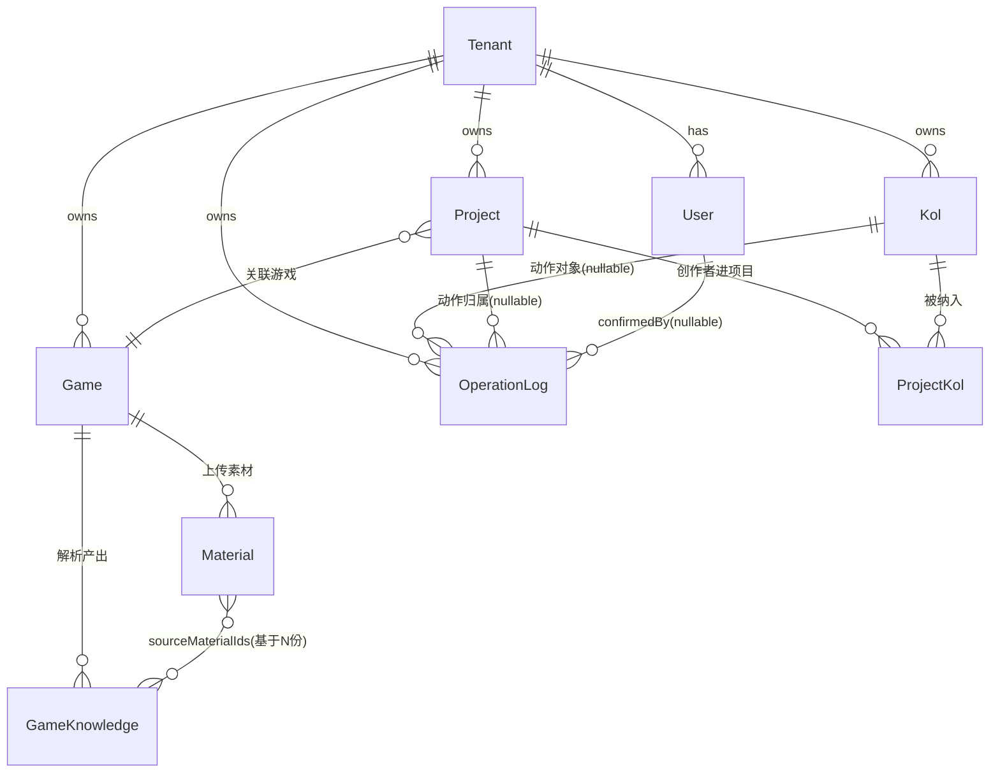

# KOLMatrix 产品需求文档（PRD）

| 项 | 内容 |
|---|---|
| 产品名 | **KOLMatrix** |
| 版本 | v1.0 |
| 日期 | 2026-07-17 |
| 状态 | 草案（Draft） |
| 作者 | KOLMatrix 产品 Planner |
| 关联文档 | 确认原型 `docs/product/interaction-prototype-v2.html`；落地规范 `docs/product/interaction-prototype-v2-落地规范.md` |

> **术语与引用口径（全文适用）**
> - 术语以《KOLMatrix 产品事实锚》为准：单角色「营销操盘手」+ 多 Agent 编队 + 项目内五环节（Brief → Match → Reach → Delivery → Insight）+ AI→人闸门。凡 role / scope / 审批链 / 六环节 / 阈值分级 / 角色切换器 / `copilotScope` 角色边界等表述均属**已作废层**（AGENT-FOUNDATION §3.1.5），本文不引用。
> - 竞品规模 / 效果数字除特别说明外，均为**竞品官网宣称、未经审计**，抓取日期 2026-07-14，引用须带此口径。
> - 编号约定：功能需求统一为 `FR-<章节>.<序号>`；非功能需求为 `NFR-<类别><序号>`；`F001–F008` 指 AGENT-FOUNDATION 批次 `features.json` 的功能号（与 FR 不同）；`D<n>` 指 harness 决策编号。

---

## 目录

- **§1 执行摘要**
- **§2 产品概述**
- **§3 背景与机会**
- **§4 目标用户与核心场景**
- **§5 产品目标与成功指标**
- **§6 产品设计原则**
- **§7 信息架构与整体框架**
- **§8 功能需求（六页 · 五环节）** — §8.1 今天 / §8.2 项目与五环节 / §8.3 创作者库 / §8.4 游戏知识 / §8.5 洞察 / §8.6 Agent 记录 / §8.7 Copilot
- **§9 多 Agent 架构**
- **§10 AI→人闸门模型**
- **§11 数据模型与字段契约**
- **§12 技术架构**
- **§13 非功能需求（NFR）**
- **§14 路线图与里程碑**
- **§15 验收标准与度量**
- **§16 风险 · 假设 · 开放问题**
- **§17 附录**

---

## §1 执行摘要

### 1.1 一句话定义

KOLMatrix 是面向**中小游戏营销团队**的 **AI-native** 全球游戏 KOL 营销工作台。它跨 YouTube / Twitch / TikTok / Instagram 四平台，由一支专家 Agent 编队驱动「发现 → 评估 → 触达 → 交付 → 复盘」的完整 Campaign 流程；人只在**对外、不可逆、花钱**的关键节点拍板。

### 1.2 产品本质与核心赌注

KOLMatrix 是旧项目 `kolmatrix` 的**重构版**——保留旧系统已工程化落地的全链路 AI 能力（向量语义搜索、SmartMatch top-30 重排、可解释匹配理由、可解释评分、邮件个性化改写、AI 周报……），推翻其传统 SaaS 的交互外壳。

重构的核心诊断只有一句：**旧系统「AI 无处不在，却从不是交互主轴」**。已落地的 AI 能力被降格为各功能页角落的「加分按钮 / 逃生舱」（旧解析器甚至自称 `escape hatch`）。用户仍在手填 15 维筛选侧栏、在 10⁵ 行表格里翻页手淘 KOL、从零填活动表单、手切 多态 CRM 下拉、手拼周报。

因此核心赌注是**把 AI 从副驾提到主驾**：

- **产品中心**：从「一堆功能模块」→「**一个常驻 Agent 对话面 + generative canvas**」；
- **用户角色**：从「操作员」→「**决策者 + 审阅者**」；
- **传统界面**（表单 / 表格 / 筛选器）：从「入口」→「精调兜底」，想手动细调时才展开。

### 1.3 差异化（收窄后的三点组合）

「AI-native / Agent」标签已被稀释——GRIN `Gia`（2025-05）、HypeAuditor `HypeAgent`（2025-12 beta）均已上线；约 59–60% 营销人员已用 AI 做创作者发现。差异化必须收窄为三者交叉：

| # | 差异化支点 | 对手空白 |
|---|---|---|
| 1 | **游戏垂类 × Agent × 完整五环节项目制工作流** | 通用平台（HypeAuditor/Modash/CreatorIQ）无游戏垂类工作流；垂类对手（Lurkit/Partnier）未 Agent 化。没有一家把三者打通。 |
| 2 | **可解释匹配 + 可解释评估 + 逐字段数据溯源** | 竞品 AI 评分多为黑盒（HypeAuditor 95.5% 欺诈检测为自报、有 Trustpilot 争议）；不同来源数据混作一谈。 |
| 3 | **关系资产飞轮**（第一天起设计数据闭环，交互/交付回流喂 Agent） | GRIN 用 $1B+ 一方交易数据喂 Gia 已证方向正确，护城河靠时间积累——先发者占位。 |

> **规模不是竞争点。** ~2,500 种子 KOL：对垂类对手 1/22–1/40、对通用平台 ~1/10⁵、对 YouTube 一方 ~1/1200。差距集中在**库规模 / 验证深度 / 字段深度**三项数据层问题，靠 AI 工作流深度 + 垂类深度打（详见 §13.5、§16）。

### 1.4 现状与本 PRD 范围

前端交互原型已定稿（`interaction-prototype-v2.html` + 落地规范）；当前批次 `AGENT-FOUNDATION`（P0 地基）处 planning；技术方向 Next.js 15 App Router · React 19 · TS · Tailwind · Horizon UI Pro · Prisma + Postgres + pgvector · Vercel AI SDK → aigcgateway；数据为旧仓库 ~2,524 条真实 KOL CSV seed + bge-m3 embedding 入 pgvector（第三方评估 API / Apify 采集留后期）；路线图 P0 地基 → P1 Brief → P2 Match → P3 Reach+CRM → P4 Insight+ROI+周报 → P5 收尾。

本 PRD 的 §1–§3 建立立论；§4–§6 定义用户、指标与设计原则；§7–§8 展开信息架构与逐页/逐环节功能；§9–§13 给出多 Agent 架构、AI→人闸门实现、数据模型、技术四柱与非功能约束；§14–§17 收口路线图、验收、风险与附录。

---

## §2 产品概述

### 2.1 愿景

**让每个中小游戏团队都能像拥有一支资深 KOL 营销小队一样运作。** 一个人（营销操盘手）+ 一队专家 Agent：把重复、机械的工作（搜全库、逐个评可信度、按理由排序、起草触达、追踪交付、拼复盘）交给 Agent 沿五环节自动推进；人只保留策略判断与对外承诺。产品目标：**Agent 把能做的做完、把需要你拍板的顶到面前**。

### 2.2 产品定位

**定位坐标：** 服务对象=中小游戏营销团队（典型 2–3 人，同等权限，无组织分工可分）；品类=全球游戏垂类 KOL 营销工作台（出海为主战场）；平台=YouTube / Twitch / TikTok / Instagram；交互范式=AI-native 激进 Agent 驱动（工作流页面是 Agent 产出的落地画布，非独立操作台，不采用「页面为主 + Agent 侧栏为辅」的温和形态）；与旧项目关系=`kolmatrix` 的重构（保功能、去传统 SaaS 化、改 AI-native）。

**支柱一 · 单角色「营销操盘手」。** 产品只有一个业务角色，负责从目标到复盘的完整 Campaign。**无 role / scope / 权限层 / 审批链 / 角色切换**（早期三角色体系被用户否决并整体作废）。团队成员（如 Leo / Ada / Kai）仅作为 `owner` 负责人标记——是**分工不是权限**（避免两人同时给一位创作者发信）。立论：权限体系服务组织分工，中小团队无分工可分；拆掉角色后信任边界反而更纯粹（见 §2.2.3、§10）。

**支柱二 · 多 Agent 编队。** 一个操盘手 + 一队专家 Agent，每个环节由该环节专家负责，各有职责与隔离边界，需要时协同交接（权威名册见 §9.2）：

| Agent | 归属 | 职责 |
|---|---|---|
| 策略 Agent | Brief | 解析目标、拆解 Brief、消化游戏知识 |
| 匹配 Agent | Match | 语义搜索 + 可解释评分 + Top-N 排序 |
| 触达 Agent | Reach | 起草个性化触达、对话式 Refine、谈判追踪 |
| 交付 Agent | Delivery | 交付条件核对、结算台账 |
| 洞察 Agent | Insight | 跨项目 ROI、周报草案 |
| 合规 Agent | 跨环节被调用 | 品牌安全 / 合规红线判断 |
| 编排 Agent | 工作区层 | 环节间调度与交接 |

进环节时常驻 Copilot 切到该环节专家，显示其**职责/隔离卡** + 主动汇报「刚刚完成」+ 生成式动作卡 + 协同交接。顶部「问 Agent 或下达任务」指令栏是常驻对话面入口（详见 §7.5、§8.7）。

### 2.2.3 信任边界：AI→人闸门（关键约束）

产品把所有工具二分：**internal**（搜索/评估/匹配/起草 = 内部、可撤销、不花钱 → AI 直接执行、不设闸门）vs **outbound**（发信/批量发/报价/分发 key/放款/对外分享 = 对外、不可逆、花钱 → AI 只能「已备好，等你按」）。定位分水岭：**删掉「人→人审批」（组织层级产物），留下「AI→人闸门」（AI-native 的信任边界）**——形式相似、本质相反。配套原则：不设假闸门；不撒谎、不分级（一律一次确认、无阈值，但如实列全部利害）；数据溯源（每个数据点标来源与可信度，对应 `fieldProvenance`）。完整模型见 **§10**。

### 2.3 一句话价值主张

> **一句话说需求，一队 Agent 沿五环节把 KOL 营销跑完——你只在对外、花钱、不可逆的那一下拍板。**

对操盘手：不用再手填 15 维筛选/翻页淘人/从零写邮件/拼周报，Agent 起草整份，你审阅微调。对采购决策者：把游戏垂类完整工作流做进 Agent，每个数字标来源、每个推荐给理由，对外动作永远由人拍板。对工程/设计：产品中心是常驻对话面 + generative canvas，五环节页面是 Agent 产出的落地画布，传统表单降级为精调兜底。

### 2.4 信息架构概览（详见 §7）

侧栏 6 页（今天/项目/创作者库/游戏知识/洞察/Agent 记录）；项目内五环节纵推（**项目是空间、环节是时间，环节只存在于项目内部**）；「今天=雷达」只回答「哪个项目卡在你这、要你做什么」，进项目后是连续推进流；五环节各有不同界面语法（仪表 glance / 对比矩阵 compare / 对话收件箱 converse / 条件台账 verify / 对照账本 reconcile）；创作者库只做发现和分流，触达/谈判必须回项目内。

---

## §3 背景与机会

### 3.1 问题陈述（传统 KOL 工具的五个真痛点）

- **P1 · 评分黑盒，不可解释不可信。** 竞品 AI 匹配/评估只给分不给依据（HypeAuditor 95.5% 欺诈检测为自报、有争议）。→ 解法：可解释匹配（每卡带分 + 「为什么推荐」）+ 可解释评估（互动率/粉丝比、增长异常、受众构成、点赞者可信度给依据）。
- **P2 · 通用平台无垂类工作流，垂类对手未 Agent 化。** 没有一家把「游戏垂类 × Agent × 完整五环节项目制」打通——核心交叉点。
- **P3 · 数据可信度不透明，爬取推断与一方数据混作一谈。** → 解法：逐字段溯源徽标（`dataSource` = crawl/purchased/optin/platform_api；`fieldProvenance` 逐字段）。**溯源即差异化。**
- **P4 · 「AI-native」标签已稀释，但对手深度不足。** GRIN Gia、HypeAuditor HypeAgent 已上线，但 Agent 未深入垂类工作流。→ 解法：在垂类五环节工作流深度上拉开差距。
- **P5 · 传统 SaaS 交互负担本身就是痛点。** 手填筛选、翻页手淘、手填表单、手切状态、手拼周报——每步都是可被 Agent 消化的机械劳动。横向反模式（「有墨公考」）显式避免：只保留一个 NL 入口；流程必须是可计算实体（非硬编码健康度）；状态机必须有守卫；低置信度降级为「待补充」而非显裸低分（如「73%」不可行动）。

### 3.2 目标市场

核心用户=中小游戏营销团队（典型 2–3 人，出海/全球发行），需要「一人顶一队」的杠杆而非企业级权限系统。市场成熟度：~59–60% 营销人已用 AI 做发现（**教育已完成**，可直接竞争「谁的 AI 工作流更完整」）。垂类价格锚点（存在真实付费意愿）：JustInfluencers $10/创作者起、内容集成 $999+、红人电竞 $1,499+、头部红人 $5,000+；Lurkit 已产品化竞价→escrow→Stripe→审核放款；game key 分发已是 4+ 家独立品类。触达规模参照（官网宣称）：Partnier/Keymailer 覆盖 55,000+ influencers、275,000+ creators、500,000+ players、2,400+ press。

### 3.3 竞品格局

主战场=类别 A（游戏垂类），能力对标类别 B（通用综合），生态约束来自类别 C（平台原生市场）。

**类别 A · 游戏垂类专业平台（主战场）**

| 竞品 | 规模宣称 | 模式/渠道 | 可攻击短板 |
|---|---|---|---|
| **Lurkit** | 90k–100k+ verified（站内自相矛盾）、900+ publishers | 主动入驻 + 人工验证；Twitch/YT/Shorts/TikTok（**无 IG**） | 覆盖增长慢、长尾/未入驻盲区；无 IG；未 Agent 化 |
| **Keymailer→Partnier** | 55,000 gaming influencers(opt-in)、2.4B reach、20,000 orgs | 主动 opt-in；游戏垂类 | opt-in 覆盖瓶颈；未 Agent 化 |
| **Woovit / Terminals** | —（game key 分发独立品类） | — | key 分发单点，无完整工作流 |

> 类别 A 共性：供给靠「主动入驻 + 人工验证」，覆盖慢、有盲区，**全体未 Agent 化**——正是 KOLMatrix「第三方爬取 + AI 富化 + Agent 工作流」要攻击的点（爬取可覆盖长尾，代价是质量/合规需自证）。

**类别 B · 通用综合平台（数据/AI 能力对标）**

| 竞品 | 库规模宣称 | 平台 | 关键 AI 能力 | 可攻击短板 |
|---|---|---|---|---|
| **HypeAuditor** | 227.8M+、15k new/日 | IG/YT/TikTok/X/**Twitch** | 95.5% 欺诈检测、35+ metrics、发布前预测、One-click outreach、**HypeAgent**(2025-12 beta) | 95.5% 自报有争议；索引≠可搜索；无游戏垂类工作流 |
| **Modash** | 380M+（250/350/380M **不一致**） | IG/TikTok/YT（**无 Twitch**） | credibility 评分、Discovery API $16,200/年起、Raw API $10,000/年起，**仅年付** | **无 Twitch**（垂类致命）；门槛 $10k+/年；数字自相矛盾 |
| **GRIN** | 主动为 70 万+ 创作者打分 | IG/TikTok/YT/FB | 0–100 可信度评分、**Gia**(2025-05，$1B+ 交易数据、180 属性) | 无游戏垂类工作流；数据飞轮已成型（方向对标标杆） |
| **CreatorIQ/Aspire/Traackr/Upfluence/Influencity** | 能力矩阵/定价**未验证** | — | 受众画像 + 假粉评分（table-stakes 佐证） | 该能力已全行业商品化、无差异化；垂类准确度未验证 |

> 类别 B 共性：受众画像 + 假粉评分已 **table-stakes 化**、无差异化；通用 credibility 在游戏创作者上准确度未验证。库规模学不来（10⁵ 量级），但**垂类工作流是它们的空白**。

**类别 C · 平台原生市场（生态挤压 + 机会窗口）**

| 平台 | 动作 | 时间 | 对第三方的含义 |
|---|---|---|---|
| **YouTube Creator Partnerships** | 集中式平台，集成 YT Studio + Ads/DV360；3M+ 创作者 | 2026-03-23 | API 仅 17 家大厂、**no self-serve**；仅覆盖选择共享的创作者 |
| **TikTok** | 禁关键词检测追踪 campaign posts，强制 TTCM API；旧采集帖隐藏 | 2026-02-17 | 第三方爬取的**效果追踪**最先撞墙（confidence: medium） |
| **Twitch** | Dashboard 内 sponsorships tab，StreamElements 首个支付伙伴；Bounty Board 退役 | 2025-02-25 | 「一方入口 + 伙伴执行支付」混合，**执行/结算层仍有 partner 空间** |

> 类别 C 双面性：平台方收权、封堵爬取（发现能撑，Insight 效果追踪最先撞墙），但**执行/结算/工作流层仍对伙伴开放**——机会在「把平台不做的完整工作流做深」。**覆盖缺口须标「待补证」**：CreatorIQ 等能力/定价、EMV/归因标准、亚太出海玩家（AnyTag/Kolr/Partipost）、Agentio 等均缺一手验证。

### 3.4 为什么现在

1. **平台生态窗口开合中**：TikTok/YouTube 收紧爬取与一方入口，但执行/结算/Agent 工作流层仍开放（Twitch 留伙伴支付位）——先把垂类工作流做深者占位。
2. **AI 能力已成熟且商品化**：受众画像+假粉评分成 table-stakes，对话式 Agent 已上线；窗口从「有没有 AI」变成「谁先把 AI 做进游戏垂类完整五环节」，而对手 Agent 尚未深入垂类。
3. **市场教育已完成**：~60% 营销人已用 AI 做发现，可直接卖「更完整的 AI 工作流」。
4. **重构成本可控**：旧 `kolmatrix` 已证明全链路 AI 能力可工程化落地（均带优雅降级），本次是「换外壳 + 提主轴」而非从零造轮子；风险集中在交互范式与数据层，非 AI 可行性。

### 3.5 AI-native 论点

**副驾→主驾：产品中心位移。** 本质不是「补 AI 能力」而是「把已有 AI 从副驾提到主驾」。三类分工贯穿所有环节：**用户**（表达意图、审阅、对高风险动作确认、必要时精调）·**Agent**（理解意图→规划→调工具→渲染画布→解释「为什么」）·**传统界面**（退为兜底/精调）。

**五个具体范式转换（带旧系统实证）：**

| # | 副驾（旧/传统 SaaS） | 主驾（新/AI-native） |
|---|---|---|
| 入口反转 | Match 687 行、15 维手填筛选侧栏作入口 | 一句自然语言作入口，侧栏降为精调抽屉 |
| 起草替代从零填 | 1260 行手动邮件工作台 | Agent 起草整封个性化邮件，人只审阅微调 |
| 推荐流替代翻页 | 10⁵ 行表翻页手淘 | Top-N 卡片流 + 匹配理由，逐个 Accept/Skip |
| 信号驱动替代手动打标 | 多态合作状态手切下拉 | 状态从真实事件（已回复/已签约）自动推断 |
| 跨模块串联 | 切页 + 手填收件人/模板/变量 | 一句话跨 Match+Reach 全自动起草 |

配套内建能力：可解释性内建、对话式 Refine、画布可追问、Agent 主动引导下一步。技术上由**四柱**支撑（① 工具层 ② Agent 运行时 ③ 常驻对话面 ④ generative canvas，详见 §12）。

**主驾但非失控：** AI→人闸门（§2.2.3，完整模型见 §10）是 AI-native 的信任前提——internal 直接执行，outbound 只能「备好等你按」，服务端强制、如实列利害。**对中小团队恰好成立**：闸门过载不是「太多」而是「归属错了」；删掉「人→人审批」这整层、只留「AI→人」真闸门，加「不设假闸门、不分级、不撒谎」，最终每个操盘手面对的是一组语义清晰、数量克制、值得认真对待的真闸门。

---

## §4 目标用户与核心场景

### 4.1 单角色的真实含义

服务对象=中小规模全球游戏营销团队（独立/中小工作室、出海发行商、小型代理商），典型 1–5 人，无分层市场部、无独立采买/法务/财务岗、无 BD 与营销负责人的组织分工。这是「单角色」决策的根源（D26）。产品只承认一个业务角色：**营销操盘手**，对一个 Campaign 负全责。团队 2–3 人是**同权限的操盘手**，靠 `owner` 标记（Leo / Ada / Kai）分工「谁在跟」——**分工不是权限**（D29）。任何「因角色隐藏功能」的界面分叉都是越界。

### 4.2 用户画像

- **画像 A（主）· 独立操盘手（身兼数职）**：1–3 人发行/工作室的唯一/主力营销负责人，同管 3–5 个项目；核心目标是有限人手并行推多个 Campaign 且每笔对外承诺心里有数；今天的痛=在传统工具里像操作数据库；对「AI 帮我干活」有明确期待（AI 是基线预期）；成功=「早上看一眼就知道哪个项目卡在我这、要我做什么」。
- **画像 B · 小团队操盘手（2–3 人分工型）**：与 A 同权限同界面，差异只在多人靠 `owner` 分项目/分区域；额外痛点是接手同事项目时要一眼看懂 Agent 做了什么、卡在哪（今天雷达 + Agent 记录留痕解决）。
- **反画像**：设有市场总监→BD→财务分层审批链的大型品牌/4A 团队——他们要的「人→人审批」正是本产品刻意删掉的（D27）。

### 4.3 Jobs-to-be-done（JTBD）

- **JTBD-1（今天/雷达）**：并行多项目时，要一个只回答「哪个项目卡在我这、要我做什么」的入口，把注意力只投在真正需要拍板的决策上。
- **JTBD-2（Brief）**：启动新 Campaign 时，用一句话说清目标，让 Agent 起草整份 Brief 并监测健康度，审阅方向而非从零填表单。
- **JTBD-3（Match）**：选人时，要 Agent 主动给「排好序 + 带理由 + 可信度已核验」的几组候选组合，「比较并批准一组」。
- **JTBD-4（Reach）**：触达时，要 Agent 起草整封个性化邀约、逐人跟进、从真实信号自动推断状态，只审阅微调、在「发送」亲自拍板。
- **JTBD-5（Delivery）**：交付后，要 Agent 逐笔核对交付条件并拦下不达标放款，「逐笔核对放款」。
- **JTBD-6（Insight）**：项目结束时，要 Agent 对齐原目标算差异、生成复盘/周报草案，「对账原目标」。
- **JTBD-7（创作者库）**：发现/复用创作者时，要一个只做发现与分流的库，把合适的人「加入某项目匹配」。
- **JTBD-8（游戏知识）**：上传游戏素材时，要策略 Agent 解析出卖点/受众/合规红线，喂给匹配/触达/合规各环节。
- **JTBD-9（Agent 记录）**：要一份「谁/何时/做了什么」的完整留痕、不可逆动作单独标注，能查证也能让同事接手。

### 4.4 核心用户旅程（取自定稿原型真实数据）

**J1 晨间雷达→直插待决策环节（最高频）**：打开「今天」，顶部 4 KPI（待你确认 3 / Agent 今日完成 24 / 进行中项目 4 / 本月有效触达 8.4M）；「Agent 今日完成」流告诉你昨夜自动发生了什么（夜间筛查 3,100 位、为 6 位起草邀约、同步 14 条信号、拦下 2 笔未达条件放款）；「需要你确认」雷达列出等你拍板的项目（《星轨协议》reach：审阅并发送 12 封邀约，标对外不可撤销）；点卡直落该项目 reach 环节（Copilot 已切触达 Agent、12 封草稿已备好）；抽查微调后点发送→触发 AI→人闸门（如实列 12 位收件人 + 「对外·不可撤销」）；确认执行、写入 Agent 记录。全程只做三件属于人的事：读、判、按。

**J2 一个项目从 Brief 到 Insight 纵推全程**（以《料理次元·日本区上线》$12,000 为例）：

| 环节 | 界面语法 | 人做什么 | Agent 做什么 | 拍板点 |
|---|---|---|---|---|
| Brief | 仪表 | 说目标、审阅健康度 | 拆预算配比、监测曝光、标阻塞 | internal，无闸门 |
| Match | 对比矩阵 | 比较 3 组方案、批准一组 | 筛查 3,100 位、生成 3 组、核验可信度、标存疑候选 | 批准（internal，无闸门） |
| Reach | 对话收件箱 | 逐人审阅、谈判、按发送 | 起草邀约、跟进、报价建议、同步信号 | 发送/报价=**outbound 闸门** |
| Delivery | 条件台账 | 逐笔核对、按放款 | 核对条件、合同/托管/披露、拦不达标 | 放款/分发 Key=**outbound 闸门** |
| Insight | 对照账本 | 采纳结论、决定是否分享 | 对齐目标算差异、生成复盘/周报 | 采纳=internal；对外分享=**outbound 闸门** |

**J3 一句话跨模块**：指令栏「给我上周为『料理次元日本区』推荐的、粉丝 10 万以上女性向创作者，起草触达邮件」→ Agent 跨 Match+Reach 全自动（调结果→过滤→生成收件人→逐封起草），无需切页/手填，发送停在闸门。**J4 创作者库发现→分流**：详情抽屉每块数据带来源徽标，唯一动作「加入某项目匹配」。**J5 交付逐笔闸门**：交付 Agent 提示放款、条件逐项打勾、点放款走闸门列收款方/金额/依据；同屏自动拦下 2 笔未达条件放款。

---

## §5 产品目标与成功指标

### 5.1 业务目标

- **BG-1** 证明「AI 主驾」重构假设成立（标志：同一操盘手在同等人手下能并行推进更多项目）。
- **BG-2** 拿下「游戏垂类 × Agent × 完整五环节」无人占据的交叉点，同时补齐 table-stakes（评估 UI/game key/绩效计费/合同+支付走 partner）。
- **BG-3** 用逐字段数据溯源建立「可信度可见」的差异化。
- **BG-4** 从第一天启动关系资产飞轮（不拼库规模，靠全流程沉淀的一方关系/交付/绩效数据积累护城河）。
- **BG-5** 以中小团队可负担的低门槛切入（对标 Modash $10k–16.2k/年仅年付的高门槛）。

**非目标：** 不比库规模；不碰资金与税务（走 partner）；不做人→人审批与组织权限层；不追泛「AI-native」叙事。

### 5.2 北极星指标

> **北极星 =「操盘手杠杆」= 平均每位周活操盘手每周经产品推进的『项目×环节』步数。**（一次「环节推进」=批准一组组合/发送一批邀约/放行一笔交付/采纳一份复盘等。）

它把**采纳 × AI 杠杆 × 留存**耦合成一个数，且**诚实退化**（产出是垃圾则被弃用、指标自然下跌，无法刷量）。等式：`操盘手杠杆 = 周活操盘手数 × 人均在管活跃项目数 × 单项目周均环节推进步数`（后者由「Agent 自主完成率」驱动）。

### 5.3 KPI 体系（分层，均为 Beta 目标假设，待真实基线校准）

**第 1 层 · AI 主驾力度：** K1 Agent 自主完成率 ≥70% · K2 一句话入口占比 ≥60% · K3 推荐采纳率（Accept/(Accept+Skip)）≥40% · K4 草稿采用率（改而非从零）≥80%。

**第 2 层 · 工作流产出：** K5 环节流转周期（逐版下降）· K6 有效触达率（建基线后逐版升）· K7 匹配→签约转化（建基线）· K8 交付达标放款率 = 100%（不达标 0 放款）。

**第 3 层 · 信任与闸门健康（红线级）：** K9 越权 outbound 拦截率 **= 100%（硬红线）** · K10 假闸门数 **= 0** · K11 闸门确认后撤销率（尽量低且可观测）· K12 数据溯源覆盖率 ≥95%。

**第 4 层 · 采纳与商业：** K13 操盘手周活留存（第 4/8 周）· K14 项目复盘完成率（飞轮进料口）· K15 付费转化/NRR（后期）。

**护栏：** K9=100%、K10=0、K12≥95% 不可让渡；任何提升 K1/K2 的改动若使这三项退化，一律回滚。

---

## §6 产品设计原则

6 条可执行、可测的原则，评审新界面/新功能时逐条对照即验收清单。

- **DP-1 · 单角色，无角色分叉**（D26）。落地：`owner` 标记（Leo/Ada/Kai）是分工不是权限；区域差异用属性字段；所有用户看同一完整视图。反模式：`if(user.role===X)` 功能门、「提交上级审批」文案、切角色清空对话。
- **DP-2 · AI 主驾非副驾：对话面为轴，传统界面降级为兜底**（D5）。落地：每页是 Agent 落地画布；入口=一句自然语言；推荐流取代翻页、信号驱动取代手动打标；可解释性内建；画布可追问/可 Refine。反模式：温和「页面为主+侧栏为辅」聊天框、让用户从零填表单、低置信度显裸分（应降级为「待补充」）。
- **DP-3 · 多 Agent 编队，各有职责与隔离边界**。名册见 §9.2。落地：进环节切专家、显示「职责/隔离」卡（隔离用**否定式**写，D13 升级版）；主动汇报「刚刚完成」+ 生成式动作卡；协同交接可展开；全产品只保留一个 NL 入口。反模式：多个不一致 NL 入口、专家越出职责边界。
- **DP-4 · AI→人闸门：AI 不替人做不可逆的对外承诺**（D27–D29）。落地：服务端强制 403/pending；确认卡如实列全部利害；无阈值分级（删 $8,000/$2,000/10 封）；不可逆动作 append-only 留痕。反模式：给内部可撤销动作加确认框（假闸门稀释真闸门，K10=0）、outbound 拦截只做前端（须服务端，K9=100%）。完整模型见 §10。
- **DP-5 · 数据溯源：每个数字都知道从哪来**。落地：详情抽屉每块带 `ProvenanceTag`；缺值显「待接入」绝不裸露无来源数字；低置信度降级；给分必可展开看依据。反模式：混作一谈不加区分、展示无溯源总分。
- **DP-6 · 流程是可计算实体，状态机有守卫（工程红线）**。落地：健康度/进度/匹配分/交付达标一律实时算；环节流转有 guard；守卫/闸门/状态机类配变异测试（断言验行为不验源码关键字，D20）；机制化守门优先（服务端>前端>文档）。反模式：假数据编流程健康度、只有文案的阶段门、本应服务端强制却只做前端。

> **原则优先序：** DP-4/DP-6 为不可让渡安全底线；DP-5 为对外可信度底线；DP-1/DP-3 定义组织与协作形态、DP-2 定义交互主轴——四者协同产出核心体验。

---

## §7 信息架构与整体框架

### 7.1 三区外壳

固定三列外壳（原型 `.app` = `285px minmax(0,1fr) 360px`）：**侧栏（工作台层，285px）**=6 个跨项目入口 + 底部「Agent 自动边界」CTA 卡；**主区（落地画布，弹性）**=Agent 产出的落地画布 + 顶部悬浮玻璃 navbar 内嵌指令栏；**常驻 Copilot（360px）**=多 Agent 编队对话驱动面。移动端 Copilot 退为 `fixed` 右滑抽屉。

- **FR-7.1** 三列外壳全局常驻；路由切换只重绘主区与 Copilot 上下文，侧栏与 navbar 不重挂载。
- **FR-7.2** navbar 内嵌顶部指令栏（placeholder「问 Agent 或下达任务…」），回车=向当前上下文 Agent 下达任务并展开 Copilot；常驻「Agent 推进中」脉冲指示。
- **FR-7.3** 侧栏底部常驻「Agent 自动边界」CTA 卡（固定文案「可检索·评估·匹配·起草。发送/报价/放款/分享一律停在你面前」），不可关闭。

### 7.2 侧栏 6 页（跨项目，不承载任何对外动作）

| # | 页 | 用户只回答 | 主要出口动作 | 常驻 Agent | 路由 |
|---|---|---|---|---|---|
| 1 | 今天（雷达） | 哪个项目卡在我这、要我做什么 | 进入某项目当前环节 | 编排 | `/admin/today` |
| 2 | 项目 | 我要进哪个项目 | 进入项目（→五环节画布） | 编排 | `/admin/campaigns` |
| 3 | 创作者库 | 有谁值得复用、分流到哪 | **加入某项目匹配**（不能发信/报价） | 匹配 | `/admin/creators` |
| 4 | 游戏知识 | 这个游戏的卖点/受众/红线 | 上传素材→触发策略 Agent 解析 | 策略 | `/admin/knowledge` |
| 5 | 洞察 | 哪个项目 ROI 高、该加投谁 | 生成周报 / **对外分享（闸门）** | 洞察 | `/admin/insight` |
| 6 | Agent 记录 | 编队做了什么、哪些不可逆 | 按类型筛选留痕（只读） | 编排 | `/admin/runs` |

- **FR-7.4** 侧栏固定 6 项，顺序与图标固定；active=`pathname.includes(routeName)`；今天与 Agent 记录带待办计数徽标。
- **FR-7.5** 侧栏页遵守「发现/分流 ≠ 执行」铁律：创作者库唯一动作是「加入某项目匹配」，不得出现发信/报价按钮。
- **FR-7.6** 项目详情不进侧栏——它是卡片 `router.push` 进入的下钻空间；五环节用页内 tab（`?env=`）。

### 7.3 项目=空间，环节=时间：五环节纵推

`目标 Brief → 创作者匹配 Match → 触达谈判 Reach → 交付结算 Delivery → 复盘洞察 Insight`。项目外壳=项目头 + 环节导轨（5 节点，done 打勾/on 高亮/未开始灰）+ 环节落地面；项目携带 `cur` 游标。

- **FR-7.7** 项目详情固定「项目头 + 环节导轨 + 环节落地面」三段；导轨三态；点已解锁节点切落地面，不改路由页。
- **FR-7.8** 项目携带 `cur` 游标；卡片进入携带 `data-goenv` 直落目标环节（雷达待办落 `ask.env`，普通进入落 `cur`）。
- **FR-7.9** 环节推进是责任链而非自由跳转：未完成前序环节的执行动作（如无批准组合就发信）不应可达。

### 7.4 五环节界面语法刻意不同

| 环节 | 界面语法 | 用户动词 | 主视觉件 | 为何这套语法 |
|---|---|---|---|---|
| Brief | 仪表 glance | 看方向对不对 | 半环健康度 + 4 tile + 阻塞卡 + 曝光趋势 + 推进 timeline | 一眼看全局与阻塞 |
| Match | 对比矩阵 compare | 比较并批准一组 | 组合列×指标行矩阵 + 待裁定候选表 | 决策是横向选一组 |
| Reach | 对话收件箱 converse | 逐人谈判推进 | 左人列 + 中对话与草稿 + 右档案（与 Match 正好相反：聚焦一个人） | 谈判是逐人纵向流 |
| Delivery | 条件台账 verify | 逐笔核对放款 | 台账每行「内容/Key/合同/托管/#ad」+ 放款按钮 | 放款是条件是否满足，无推荐卡、无绕过 |
| Insight | 对照账本 reconcile | 对账原目标 | 原目标 vs 实际差异表 + 证据缺口 + 图 + 复盘草案 | 复盘是拿实际对账目标 |

- **FR-7.10** 每环节落地面顶部固定渲染语法标签（`grammar`）+ 动词说明（`verb`）；五套语法用结构不同的组件实现，不得退化成同一张表换数据。
- **FR-7.11** 语法差异是硬约束识别项：Match 必须横向多方案对比，Reach 必须聚焦单人纵向流，Delivery 必须是无推荐卡条件台账，三者不可互套。

### 7.5 常驻 Copilot：多 Agent 编队驱动面

路由/环节切换即切换当值 Agent（`copContext` 按 `route+env`）。进环节 Copilot 主体渲染五构件：① 职责/隔离卡（否定式护栏）②「刚刚完成」汇报 ③ 生成式动作卡（`env:`/`pick:`/`enter:`）④ 协同交接（可展开看两 Agent 来回对话 + 交接物 + 结果）⑤ 建议追问 chips + 底部指令输入。

- **FR-7.12** Copilot 上下文随 `route+env` 切换（头部换名/色/icon）；切换时对话线程重置为该 Agent 开场白。
- **FR-7.13** 每个 Agent 常驻显示职责/隔离卡；隔离一律否定式（「我不会做什么」），语义是 **AI 行为边界**（不越 outbound），不是角色数据边界（D13 升级版；旧 copilotScope 越权拒答已作废）。
- **FR-7.14** 动作卡是生成式的（`{icon,title,sub,go}`，`go` 前缀驱动导航/办事）；新结果类型=在 canvas 注册表加一个组件即可渲染。
- **FR-7.15** 协同交接可展开查看完整 handoff，默认折叠；合规 Agent 以「被调用」形态出现在其它 Agent 的 collab 里。
- **FR-7.16** Copilot 顶部常驻「只做可撤销的事。对外与花钱的动作会先停在你面前，并列清利害」。

### 7.6 动线与 AI→人闸门（贯穿全局）

主动线：雷达→点待办卡直落项目当前卡住环节→环节内 Agent 已把能做的做完、把需拍板的顶到面前→拍板后沿导轨推进。工具二分 internal/outbound（完整模型见 §10）。

- **FR-7.17** 六类 outbound 动作（发信/批量发/报价/分发 Key/放款/对外分享）落地为 outbound 工具，**服务端未经人确认调用一律返回 403/pending**（F008）。
- **FR-7.18** 闸门确认卡如实列全部利害（批量列全名单、报价列金额与授权范围、放款列收款方/金额/依据、分享列范围/有效期，统一标「对外·不可撤销」）——不是阈值分级，是不撒谎（D28）。
- **FR-7.19** internal 动作不弹确认框（批准组合/采纳复盘/选组合/复核候选）——假闸门稀释真闸门。
- **FR-7.20** 不可逆动作全部在 Agent 记录页 append-only 留痕（不可逆单独标注、可按类型筛）。
- **FR-7.21（数据溯源，跨全局）** 每个展示数据点标来源与可信度，对应 `Kol.fieldProvenance`；落地用 `ProvenanceTag`，缺值显「待接入」。

---

## §8 功能需求（六页 · 五环节）

闸门归属贯穿全章（internal 不弹框、outbound 弹如实利害确认卡，权威模型见 §10）；每个展示数据点带溯源徽标（数据契约见 §11）；实现以定稿原型与落地规范为基线。

### 8.1 今天（雷达）

用户只回答「哪个项目卡在我这、现在要我做什么」。当值=**编排 Agent**。主界面自上而下四块：① 4 KPI（待你确认/Agent 今日完成/进行中项目/本月有效触达）② 需要你确认（雷达卡区，只列 `ask≠null`，outbound 动作标红「对外不可撤销」）③ Agent 编队（6 张卡展示 5 环节专家 + 合规各自在忙什么+状态）④ Agent 活动 feed + 负荷（团队负荷条 Leo/Ada/Kai，**标注「单一角色，仅用于分工」**）。唯一主动作=「进入某项目当前/卡住环节」，雷达本身不完成任何 outbound。

- **FR-8.1.1** 「需要你确认」区只渲染 `ask≠null` 项目卡，按紧急度排序；进入动作直落 `ask.env`，不落项目首页。
- **FR-8.1.2** 待办条 outbound 属性驱动红色「对外不可撤销」标记；internal 待办不标。
- **FR-8.1.3** KPI「待你确认」计数 = `ask≠null` 项目数，与雷达卡数同源不漂移。
- **FR-8.1.4** Agent 编队区展示全部 6 位 Agent 当前任务与状态，与各环节 Copilot「刚刚完成」同源。
- **FR-8.1.5** 团队负荷条必须标注「单一角色，仅用于分工」，不得渲染成权限/角色分叉（D26）。
- **FR-8.1.6** 编排 Agent 追问动作卡可跨环节跳转（`enter:`/`pick:`/`env:`）。

### 8.2 项目与五环节

项目列表只做「进入」（文案明说触达/谈判/审核/放款都在项目内部）。闸门归属：Brief/Match/Insight 采纳类=internal（无弹窗）；Reach/Delivery/Insight 分享=outbound（弹如实利害确认卡）。

**8.2.1 Brief — 仪表（glance）** 专家=策略 Agent（隔离：不联系创作者、不放款）。主界面=目标健康度半环仪表 + 4 tile + 阻塞卡 + 曝光趋势 + Agent 推进计划 timeline。核心动作=看方向、接受阻塞处置建议（internal）。**健康度算法**（DP-6：可计算、非硬编码）：加权（目标达成度·预算消耗率·时间进度·阻塞项数）→ 0–100%，分档 ≥80% 达标(绿) / 55–79% 注意(橙) / <55% 风险(红)，百分比↔pill 一一映射（权重与阈值为示意，上线以真实数据校准）。
- **FR-8.2.1.1** 健康度用半环仪表（`HalfGauge`，radialBar −90/90）呈现达成度，配实际/目标读数与剩余量。
- **FR-8.2.1.2** 阻塞项以专门卡呈现，附 Agent 可执行处置；internal 处置直接可执行、不弹闸门。
- **FR-8.2.1.3** 推进计划 timeline 与环节导轨状态一致（同一 `cur`），标出「需要你」的环节与负责人。

**8.2.2 Match — 对比矩阵（compare）** 专家=匹配 Agent（隔离：只做发现与匹配，不发起触达、不谈价）。主界面=组合列×指标行矩阵（触达/预算/风险/规模/依据，推荐列高亮，行尾「批准这组」）+「待你裁定」候选表。
- **FR-8.2.2.1** 主界面必须是横向多方案对比矩阵（≥五行 + 标 Agent 推荐列），不得退化为单方案表。
- **FR-8.2.2.2** 「批准这组」是 internal：生效并把组合交给 Reach，**不触发 outbound、不弹确认框**（D27）。
- **FR-8.2.2.3** 低置信度候选**不显低分**，进「待你裁定」区列存疑原因+初判（避免「73% 不可行动」）。
- **FR-8.2.2.4** 受众匹配等带溯源；匹配% = `embedding` cosine + `audienceDemo`，缺失显「待核」而非编造。

**8.2.3 Reach — 对话收件箱（converse）** 专家=触达 Agent（隔离：不批预算、不放款；报价与发送需你确认）。三栏收件箱（左人列/中对话+草稿/右档案），聚焦单人纵向。核心动作=编辑草稿、发送（outbound）、确认报价（outbound）、重写（internal）。
- **FR-8.2.3.1** 主界面固定三栏聚焦单人；`state.pick` 切换当前人，动作卡可 `pick:` 直选。
- **FR-8.2.3.2** 每封邀约由 Agent 起草整封个性化草稿，用户改而非从零填；「重写」internal 可无限重生成。
- **FR-8.2.3.3** **发送/确认报价是 outbound**：调 `send_outreach`/`commit_quote`，服务端未确认返回 403/pending；确认卡如实列收件人全名单、金额、授权范围、「对外不可撤销」。
- **FR-8.2.3.4** CRM 阶段从真实事件（已发送/已回复/已确认）自动推断，不提供手动逐个切状态的主路径。
- **FR-8.2.3.5** 批量发信（>1 收件人）走单张确认卡列全部收件人名单（无 10 封阈值）。

**8.2.4 Delivery — 条件台账（verify）** 专家=交付 Agent（隔离：不选人、不谈判；放款需你逐笔确认）。交付台账每行「内容/Key/合同/托管/#ad」齐/缺/不适用 + 放款按钮（条件齐才出现）。底部声明「这里没有 AI 推荐卡——只有条件是否满足；缺什么显什么，不提供绕过入口」。
- **FR-8.2.4.1** 主界面是条件台账，**不含任何 AI 推荐/评分卡**；每行逐条件显示齐/缺/不适用。
- **FR-8.2.4.2** 放款按钮**仅在该行全部必需条件满足时渲染**；未齐只显「条件未齐」，无绕过入口。
- **FR-8.2.4.3** **放款是 outbound**：调 `payout`，服务端未确认返回 403/pending；确认卡列收款方/金额/依据、消费合同+托管+披露证据；不可逆，append-only 留痕。
- **FR-8.2.4.4** 合规拦截可发生在放款前（缺 #ad 等），拦截即暂停放款并退回补件，记录进 Agent 记录（`kind:block`）。

**8.2.5 Insight — 对照账本（reconcile）** 专家=洞察 Agent（隔离：只读结果数据，不改动执行动作）。主界面=原目标 vs 实际差异表 + 证据缺口卡（诚实标注不可归因）+ 渠道/受众图 + Agent 复盘草案。核心动作=采纳结论（internal）、生成对外分享报告（outbound）。
- **FR-8.2.5.1** 主界面是「原目标 vs 实际」对账表，每行含目标/实际/差异与达成方向，用色区分达成/未达。
- **FR-8.2.5.2** 证据缺口显式列出并诚实标注不可归因项（如缺归因回传时不把低留存强行归因于创作者）。
- **FR-8.2.5.3** **采纳结论是 internal**（无弹窗）回填下个 Brief 默认组合；**生成对外分享报告是 outbound**：调 `create_share_link`，服务端未确认返回 403/pending，确认卡列数据范围/有效期/「对外不可撤销」。
- **FR-8.2.5.4** 画布可对话追问，Agent 读数+按需渲染图表；复盘草案由 Agent 起草整份，用户采纳而非从零写。

### 8.3 创作者库（`/admin/creators`，常驻匹配 Agent）

**定位与边界**：跨项目创作者资产层，**只做发现和分流**；唯一动作是「加入某项目匹配候选池」，之后触达/谈判/放款必须回项目内。**库里不能发信、不能报价、不能谈判**（AI→人闸门的直接推论）。

- **FR-8.3.1** 顶部 4 KPI（库内总数/本季复用数/平均受众匹配/高价值可复用数），跨全部项目聚合。
- **FR-8.3.2** 进库时匹配 Agent 已按当前在跑项目品类做受众匹配预排序（默认 `match%` 降序），依据=游戏知识受众画像 × 创作者 `audienceDemo` 余弦。
- **FR-8.3.3** ≥两维筛选 chips（平台/品类），点击由匹配 Agent **重排候选**（非纯前端过滤），toast「已按筛选重排」。
- **FR-8.3.4** 创作者表列：创作者/粉丝/品类/受众匹配%/历史合作数/可信度分级(A/B/C)/#ad 合规状态/「加入匹配」按钮；可信度与 #ad 以状态徽标呈现，不显裸分。
- **FR-8.3.5** 「加入匹配」= internal（把人放进候选池 ≠ 对外承诺），**不弹确认框**；须补目标项目选择器（默认预选当前上下文最相关项目）。
- **FR-8.3.6** 点行开详情抽屉；「加入匹配」按钮点击须 `stopPropagation`。
- **FR-8.3.7** 详情抽屉固定七分区，每区左上角渲染 `ProvenanceTag`（读 `fieldProvenance`）：① 受众画像(`audienceDemo`) ② 内容表现(`engagement`/平台一方) ③ 合作历史(内部 CRM) ④ 商务与档期(CRM) ⑤ 合规与风险(`brandSafety`/合规 Agent 核验) ⑥ 内容样本(平台) ⑦ 专家 Agent 判断(运行时)。
- **FR-8.3.8** 第 7 分区并列渲染匹配/触达/合规三 Agent 的可解释判断卡（各以品牌色描边，非裸分）——产品差异化核心承载。
- **FR-8.3.9** 抽屉底栏仅两动作：「标记关注」（internal）与「加入某项目匹配」（internal）；**不得出现发信/报价/谈判任何 outbound 入口**。
- **FR-8.3.10** 全部字段读 `Kol` 契约位（均 nullable）；数据未接入时降级为「待补充/待接入」，**不显低置信度裸分**；字段到位后零返工。
- **FR-8.3.11** `ProvenanceTag` 可展开该字段 `fieldProvenance` 明细（来源·采集时间·可信度），取值域=平台官方✓/Apify 采集/外购评估/你上传/AI 估算(未验证)/合规 Agent 核验。

### 8.4 游戏知识（`/admin/knowledge`，常驻策略 Agent）

链路：`你上传素材 → 策略 Agent 解析 → 提炼游戏特点（卖点/受众/合规红线）→ 喂给匹配/触达/合规各环节`。原料由操盘手主动上传（一手信息，第三方替代不了）。**分期**：真解析/抽取属 **Phase 1**（本批仅预留 schema），UI 落地批可先 mock `analyzing→done`。

- **FR-8.4.1** 多游戏知识库隔离；切换游戏切换右侧素材与特点，互不串味；游戏带品类+市场标签。
- **FR-8.4.2** 详情卡内拖拽/点击上传区（`UploadZone`/react-dropzone），接受文档/美术/视频/数据多类型；上传即生成记录进解析队列。
- **FR-8.4.3** 素材记录字段：文件名、类型(lore/art/gameplay_doc/review/data/video，枚举见 §11.6)、来源(官方/第三方/投放后台/你上传)、上传时间、解析状态。
- **FR-8.4.4** 上传即触发策略 Agent 解析（`analyzing`→`done`，带 toast）；产物增量合并进特点，刷新溯源计数「基于 N 份素材分析」。
- **FR-8.4.5** 「重新分析」（`data-reanalyze`）令策略 Agent 对全部素材重跑抽取；internal，不设闸门。
- **FR-8.4.6** 抽取三类结构化特点：卖点`sell[]`（喂触达）/目标受众`aud[]` 带占比 bar（喂匹配）/合规红线`rules[]`（喂合规跨环节拦截）。
- **FR-8.4.7** 特点卡顶部固定溯源串「策略 Agent 基于 N 份素材分析（素材枚举）」——每条特点可回溯到具体素材。
- **FR-8.4.8** 特点卡底部明示下游消费映射（受众→匹配 Agent；卖点→触达 Agent；红线→合规 Agent）。
- **FR-8.4.9** 特点更新后依赖它的下游判断应能感知变更并在下次调用时使用新特点（特点是工具调用输入，非硬编码）。
- **FR-8.4.10** 新建 `Game`/`Material`/`GameKnowledge` 三模型 + provenance；`GameKnowledge` 记录由哪些素材推出（完整字段见 §11.6）。

### 8.5 洞察（`/admin/insight`，常驻洞察 Agent）

跨项目 ROI（vs 项目内 Insight 环节的单项目对账）+ 周报草案 + 唯一对外闸门「生成对外分享报告」。

- **FR-8.5.1** 顶部 4 项跨全部项目汇总（本季总触达/总花费/综合 ROI/有效转化，带环比）。
- **FR-8.5.2** 两图：综合 ROI 走势(area) + 各项目 ROI 倍数对比(bar，最高高亮)。
- **FR-8.5.3** 各项目 ROI 台账（花费/触达/转化/ROI，正负着色）——判断加投/收缩的决策底表。
- **FR-8.5.4** 归因缺口诚实标注：缺归因回传时**不把结果强行归因于创作者**，须显式标注缺口并给下次改进建议。
- **FR-8.5.5** 洞察 Agent 起草整份周报草案，「采纳为周报」是 **internal，不设闸门**。
- **FR-8.5.6** 看板可自然语言追问，Agent 读跨项目数据 + 给洞察 + 按需渲染图表（generative canvas）。
- **FR-8.5.7** **对外分享=outbound**：映射 `create_share_link`，服务端未确认返回 403/pending；确认卡如实列数据范围/有效期/「对外·链接生成后可能被转发」。
- **FR-8.5.8** 采纳周报、切换图表维度、对话追问等 internal 动作**不弹确认框**——只有对外分享一个真闸门。

### 8.6 Agent 记录（`/admin/runs`，常驻编排 Agent）

全编队自动动作完整留痕（谁/何时/做了什么），是 AI-native 的信任基础设施（永久可查、可筛、不可篡改）。

- **FR-8.6.1** 全编队每个自主动作自动落一条记录（时间/Agent/动作描述/类型），系统自动写入。
- **FR-8.6.2** 四类互斥类型：`auto`(自动完成，绿)/`gate`(需你确认，琥珀)/`block`(已拦截，橙)/`irrev`(不可逆·已留痕，红)。
- **FR-8.6.3** `irrev`（六类 outbound）必须单独标注 + 「（你已确认）」归属（发起 Agent/确认人/利害/确认时间/依据）——闸门审计闭环。
- **FR-8.6.4** 顶部 chips 按类型筛（全部/自动完成/需确认/已拦截/不可逆），KPI 行同步展示各类计数。
- **FR-8.6.5** `block` 记录必须携带拦截原因（如「缺 #ad 披露」），不是静默失败。
- **FR-8.6.6** 留痕落 **append-only 操作日志表**（只追加、不可编辑删除）；完整字段见 §11.7。
- **FR-8.6.7** 每次 outbound 经确认执行后必须自动写一条 `irrev` 记录——闸门确认与留痕是同一事务，不得漏记。

### 8.7 Copilot（常驻多 Agent 对话面；`useChat`→`/api/agent` 流式 loop，F004/F005，详见 §12）

产品的交互主轴（激进 canvas，D5）：表达意图→Agent 调工具→结果长在画布上。统一承载常驻对话、主动汇报、生成式动作卡驱动导航/办事。

- **FR-8.7.1** 面板顶部专家头 + 固定职责/隔离卡（否定式护栏，「我不会做什么」——AI 行为边界，非角色数据边界）。
- **FR-8.7.2** 职责卡下展示该 Agent「刚刚完成」清单——进环节第一屏是「我已替你做了这些」。
- **FR-8.7.3** Agent 回复可内嵌可操作动作卡（点击驱动 `enter:`/`pick:`/`env:`）；工具结果按 `type` 经 `canvas-registry` 渲染成组件而非纯文本。
- **FR-8.7.4** 多 Agent 联动时展示「本环节协同」区，可展开看两 Agent 来回对话 + 交接物 + 结果。
- **FR-8.7.5** 底部标准对话流 + 输入 + 上下文相关建议 prompt chips。
- **FR-8.7.6** 顶部指令栏（`cmd-in`，placeholder「问 Agent 或下达任务」），任意页 Enter 提交→送入 Copilot + 自动展开面板——全局入口。
- **FR-8.7.7** 指令栏支持一句话跨多环节办事（Agent 串多工具调用，无需切页/手填）。
- **FR-8.7.8** Copilot 随路由/环节自动切专家 Agent（`copContext` 映射固定，见 §8.7 表；游戏知识页=策略、Agent 记录/今天=编排、跨环节被调用=合规）。
- **FR-8.7.9** 上下文 key(`route/env`) 变化时对话清空、新专家给开场白，避免串味。
- **FR-8.7.10** 工作区级（今天/记录页）编排 Agent 额外展示编队花名册（5 环节专家 + 合规各自在忙什么·状态）。
- **FR-8.7.11** Copilot 触发动作严格二分：internal 直接执行；outbound 只能「备好等你按」产出 `GateConfirm`，服务端对未确认调用返回 403/pending；被要求发信/报价须按否定式护栏声明「这是对外不可撤销的，你确认吗」。
- **FR-8.7.12** 对话式精调 Refine（重排/批量改）是 internal，不弹闸门。
- **FR-8.7.13** 接 `useChat`→`/api/agent` 流式 loop；工具结果按 `type` 经 `canvas-registry` 渲染，新增结果类型只需注册一个组件；首个闭环=「找 XX KOL」→流式回复 + KOL 卡片流（真实 seed）。

> **本章分期与待确认**：创作者库/洞察/记录页静态化（真组件+mock）可先做；`Kol` 字段契约位=F001 nullable 预留；游戏知识真解析=Phase 1；Copilot 流式运行时+canvas=F004/F005；outbound 闸门服务端强制=据 D26–D29；操作日志 append-only 本批预留。

---

## §9 多 Agent 架构

### 9.1 编队总览

单角色操盘手指挥一支专家 Agent 编队：五环节各由一个驻场专家负责，合规为横切共享专家，工作区层由编排 Agent 调度汇总。不是「页面+通用助手侧栏」，而是把工作流页面本身变成该环节专家产出的落地画布（D5）。操盘手职责=决策者+审阅者。编队是技术四柱（§12）的**人格化视图**：每个 Agent = 注入运行时的 system-prompt 人格 + 按环节收窄的工具子集 + 按 canvas 协议渲染的动作卡。

### 9.2 编队名册（权威定义，与原型一致）

| key | 名称 | 归属 | 界面语法 | 职责(duty) | 隔离(iso，否定式护栏) |
|---|---|---|---|---|---|
| `strategy` | 策略 Agent | ① Brief | 仪表 | 目标拆解·预算配比·健康度监测·复盘框架 | 不联系创作者、不放款——交给触达/交付 |
| `match` | 匹配 Agent | ② Match | 对比矩阵 | 创作者筛查·组合生成·受众匹配·可信度核验 | 只做发现与匹配，不发起触达、不谈价 |
| `reach` | 触达 Agent | ③ Reach | 对话收件箱 | 邀约起草·逐人谈判·回复跟进·报价建议 | 不批预算、不放款；报价与发送需你确认 |
| `delivery` | 交付 Agent | ④ Delivery | 条件台账 | 交付核对·合同/托管/披露·放款准备 | 不选人、不谈判；放款需你逐笔确认 |
| `insight` | 洞察 Agent | ⑤ Insight | 对照账本 | ROI 归因·复盘分析·报告生成 | 只读结果数据，不改动执行动作 |
| `compliance` | 合规 Agent | 跨环节(被调用) | 嵌入各环节 | 内容合规·#ad 披露·授权范围核查 | 跨环节被调用，只做合规判断 |
| `orchestrator` | 编排 Agent | 工作区层 | 今天/雷达 | 环节调度·专家编排·待办汇总 | 不亲自执行环节工作，只分派与汇总 |

五环节专家绑定各环节独有界面语法（这是环节工作台「长得不一样」的根因）；合规是横切专家；编排只在工作区层、不下场干活。

### 9.3 职责与隔离边界

隔离(iso)是信任机制，用**否定式护栏**表达（「没做什么」比「能做什么」更难伪造）。两个语义维度：① **Agent 间分工边界（横向）**——越出车道的事交接给下游而非自己伸手（决定 §9.5 交接何时发生）；② **AI→人行为边界（纵向）**——凡 outbound 任何专家都只能备好、不能自动执行（由 §10 服务端闸门强制兑现，护栏是其自然语言镜像）。

> **与作废方案区别**：r2 曾用 `copilotScope`+角色数据墙做隔离，随三角色作废（§3.1.5）。单角色下无跨角色数据边界可拒——隔离语义已从「不越角色数据边界」升级为「不越自己的行为边界」（D13）。名册所有 iso 都是行为边界，不含数据访问权限限制。

- **FR-9.1** 进环节时常驻 Copilot 自动切到该环节专家，顶部常驻显示 duty+iso 两行。
- **FR-9.2** 专家切入时主动汇报「刚刚完成」，把「AI 一直在后台推进」显性化。
- **FR-9.3** 专家把需拍板/查看的事项渲染为生成式动作卡（`type`→组件，`data-act` 驱动）；internal 卡点了即办，outbound 卡点了进确认闸门（§10.4）。
- **FR-9.4** 页面顶部常驻「问 Agent 或下达任务」指令栏，可随时追问画布或下达跨环节任务，无需切页。
- **FR-9.5** 每次协同交接以「A→B」行呈现、可展开查看三要素：交接对(pair)、来回对话(messages)、交接物+结果。典型链：匹配→触达（定稿组合→N 封草稿）、触达→交付（谈定条款→合同/托管/披露待办）、交付→合规（交付凭证→合规判断）、交付→洞察（交付与花费数据→ROI 归因）。让「编队协同」可被操盘手核验。
- **FR-9.6** 编排 Agent 驻「今天=雷达」页，只做两件事：待办汇总（把全编队待拍板事项聚合成可行动概览，不改写/软化任何专家 pending 结论）+ 环节调度（路由到「某项目→某环节」）。运行时落点=F004 的人格路由 + 待办聚合；工具注册表可扩展（新增环节能力=加一个工具+一个 canvas 组件，不改 route 核心与编排逻辑）。

---

## §10 AI→人闸门模型

### 10.1 模型总纲：删【人→人】审批，留【AI→人】闸门

信任边界由一条原则划定（D27）：**凡对外、不可逆、花钱的动作，AI 只能走到「已备好，等你按」，绝不自动执行。**

| | 删掉：人→人审批 | 保留：AI→人闸门 |
|---|---|---|
| 是什么 | 提交→上级批准→退回→重提 | AI 备好→操盘手一次确认→执行 |
| 本质 | 组织层级产物（传统 SaaS） | AI-native 的信任边界 |
| 为何 | 中小团队无「上级」可批（D26） | AI 不该替人做不可逆对外承诺 |
| 文案 | 「提交营销负责人审批」 | 「这是对外不可撤销的，你确认吗」 |

权威依据 D26（单角色）· D27（删人→人审批，留 AI→人闸门；internal 不设闸门）· D28（删阈值，一律一次确认）· D29（保留 `owner: Leo/Ada/Kai` 标记，分工不是权限）。凡带 role/scope/审批链/退回/阈值分级/copilotScope 字样的旧文均属作废层，不得回填。

### 10.2 工具二分：internal vs outbound

闸门建立在**工具性质**上，工具注册表声明 `class` 字段（取代作废的 `allowedRoles`）。**internal**=可撤销·不花钱·不对外（`search_kols`/评估/匹配/起草/选组合/推翻规则/复核审核项/采纳复盘）→直接执行、无确认框；**outbound**=不可逆·花钱/承诺·对外（发信/批量发/报价/分发 key/放款/对外分享）→只能备好、服务端强制停在确认前。判定只问一个问题：执行后能不能撤销、会不会对外、要不要花钱/承诺——三者任一为「是」→outbound。纯粹二分，不带阈值不带角色。

### 10.3 闸门清单（六类 outbound，服务端约束为强制项）

| 动作 | outbound 工具(示意) | 未确认时服务端约束 | 确认卡如实披露 |
|---|---|---|---|
| 发信 | `send_outreach` | 403/pending，不投递 | 收件人全名·平台·「发出后不可撤销」 |
| 批量发 | `send_bulk_outreach` | 403/pending，不投递 | **全部收件人名单（逐一，不折叠）**·封数·不可撤销 |
| 报价 | `commit_quote` | 403/pending，不承诺 | 金额·交付内容·授权范围·「承诺后不可撤销」 |
| 分发 key | `distribute_keys` | 403/pending，不发放 | 领取方·key 数量·一经发放不可回收 |
| 放款 | `payout` | 403/pending，不出款 | 收款方·金额·「不可逆·逐笔确认」 |
| 对外分享 | `create_share_link`/`share_report` | 403/pending，不生成链接 | 被分享内容·可见范围·链接一经生成即暴露 |

> 「批量发」是「发信」的批量形态，走同一闸门、只列全名单，无封数阈值。工具名为落地示意，权威是 D27 六类动作语义。

### 10.4 服务端强制：403/pending（不是 UI 约定）

- **FR-10.1** outbound 工具执行必须在**服务端**门控：运行时执行任一工具前检查 `class`；若 `outbound` 且不携带服务端签发的确认令牌→不执行副作用、返回 403/pending + `harm` 结构体；渲染成待确认动作卡停在操盘手面前；真正执行只发生在操盘手显式确认后由前端携令牌重新发起。模型的自主 loop 永远拿不到令牌，**无法自我放行**。
- **FR-10.2** 即使模型在 loop 中「决定」直接调 outbound，服务端也必须以 403/pending 拦截——闸门是运行时硬约束，不是 system prompt 建议。
- **FR-10.3** 闸门验收断言必须验**行为**（未确认时副作用未发生、返回 pending、确认后才执行并留痕），不得验源码关键字（D20）；须配变异测试（退回原状则断言变红）。

### 10.5 利害如实披露 · 无阈值

- **FR-10.4** 所有 outbound **一律一次确认**（D28），删除三档旧阈值（$8,000/$2,000/10 封）；不做任何分级（$100 与 $10,000 走完全相同确认）。
- **FR-10.5** 无阈值不等于无差别：每张确认卡必须如实列全该动作全部利害（批量列全部收件人名单不得折叠；报价标金额/交付内容/授权范围；放款标收款方与金额；统一带「对外·不可撤销/不可逆」红标）。「那只是不撒谎」。原型固化实例：*确认发送对外邮件*（收件人·平台/动作/红标/「确认发送」）、*确认价格承诺*（金额 $3,400/交付/授权范围/红标/「确认报价」）。

### 10.6 internal 动作不设闸门（反「假闸门」）

- **FR-10.6** 内部可撤销不花钱动作一律不加确认框（D27 推论）：给可撤销动作加确认只会训练操盘手无脑点确认、稀释真闸门。两条边同等重要：**outbound 一个都不能漏，internal 一个都不能加**。闸门价值来自稀有与真实。

### 10.7 否定式护栏：闸门的自然语言镜像

- **FR-10.7** 每个 Agent system prompt 注入否定式护栏（D13 升级版）：「我不会替你发信/放款/报价/改合同/对外分享，只能备好等你确认」。护栏是承诺、服务端 403/pending 是兑现，二者必须一致。

### 10.8 操作留痕：Agent 记录页

- **FR-10.8** 全编队自动动作在「Agent 记录」页 append-only 留痕；不可逆动作单独标注、永久可查、可按类型筛。状态分四类（与 §8.6.2/§11.7 一致）：自动完成(auto)/需你确认(gate)/已拦截(block)/不可逆·已留痕(irrev)。
- **FR-10.9** 操作日志 append-only（§11.7），编排层/主上下文不得改写删除既有条目。留痕 + §9.5 交接记录共同构成完整可审计轨迹——**相对黑盒 AI 工具的诚实性护城河**。

---

## §11 数据模型与字段契约

约束栈：Prisma（落地时锁定，建议 5.x/6.x）+ PostgreSQL + pgvector；单租户硬编码 dev tenant（`tenantId` 占位，RLS 留后期，D4）；单角色（无 role/scope/Approval，§3.1.5 作废，本章不回填）。

**两条统领原则**：① **契约先行、数据层解耦**（`gap-data-layer.md §5`）——产品层只依赖字段契约不依赖来源，深字段位 Phase 0 以 nullable 预留（D15），数据未到位时 UI 用 mock/推断值+溯源先建，到位后填真值零返工；缺值不是错误态而是 `待接入` 显示态。② **三重溯源贯穿**（差异化核心）：数据溯源(`Kol.dataSource`+`fieldProvenance`) / 知识溯源(`GameKnowledge.sourceMaterialIds`+`confidence`) / 动作溯源(`OperationLog` append-only)。

### 11.1 实体关系总览

★深挖：`Kol`（§11.2–11.5）、`Game`/`Material`/`GameKnowledge`（§11.6）、`OperationLog`（§11.7）、`Tenant`/`User`（§11.8）。○引用（字段级 schema 本 PRD 不展开，留 P3 REACH-CRM / P4 DELIVERY spec 定义）：`Project`（`owner` 分工标记）、`ProjectKol`（项目内 CRM 态，`status`=5 态 待发送/已发送/已回复/谈判中/已确认）、Match 组合/Outreach/Deal/Payout（均通过 `projectId`/`kolId` 挂回本章）。**已删除不得回填**：`User.role`/`User.scope`/`Approval`/工具 `allowedRoles`/角色切换器。

### 11.2 `Kol` — 创作者档案核心字段

数据源=旧仓库 `kol-seed-enriched-final.csv`（~2,524 条真实 KOL，D3）→规范化入库→F002 生成 bge-m3 向量。CSV 仅浅字段（idx/平台/昵称/频道链接/地区/粉丝数/是否游戏/类目/置信度/AI判断理由/阶段）——**seed 填浅字段，深评估字段留 nullable 契约位**。

核心字段（示例）：`id`(uuid PK)、`tenantId`、`platform`(youtube/twitch/tiktok/instagram)、`handle`、`displayName`、`profileUrl`、`platformUserId`(nullable，采集 upsert 稳定键)、`countryCode`/`language`(nullable)、`followerCount`(默认0)、`avgViews`/`engagementRate`/`uploadsPerMonth`/`lastUploadAt`(nullable 待接入)、`isGaming`(默认true)、`categories`(默认[])、`email`/`emails`(nullable)、`relationshipStatus`(库层粗粒度关系态)、`tags`/`status`/`metadata`、`createdAt`/`updatedAt`、`deletedAt`(软删除)。

- **FR-11.1** `Kol.relationshipStatus`（库层粗粒度）与 `ProjectKol.status`（项目层谈判细粒度）是两列不同语义，不得合并（同一创作者在两个项目谈判态可不同）。
- **FR-11.2** `platform+handle` 租户内唯一；同时保留 `platform+platformUserId`（频道 id 永久）作稳定去重键，采集 upsert 走后者。

### 11.3 D15 字段契约位（深字段，全 nullable，本批不填充，jsonb + 应用层 zod）

`audienceDemo`（年龄/性别/地域/兴趣）· `credibility`（score 0–100 + method + **signals[] 可解释依据** + assessedAt）· `brandSafety`（rating safe/review/risk + flags[] + assessedAt）· `dataSource`（行级枚举）· `fieldProvenance`（逐字段覆盖）。

- **FR-11.3** 五位建库即存在且 nullable，本批 seed 不填充；UI 读 `null` 渲染 `待接入`，不报错、不填 0 冒充实测。
- **FR-11.4** `credibility.signals` 与 `brandSafety.flags` 为**必带依据数组**（「给分必给依据」）：空依据的分数应用层 zod 判非法。

### 11.4 `embedding` 与向量检索契约

`embedding vector(1024)`（pgvector，Prisma `Unsupported`，经 `$queryRaw` 读写）+ `embeddingTextHash`（重嵌入守卫）。源文本=displayName+categories+countryCode+bio/metadata 摘要，经 aigcgateway bge-m3。

- **FR-11.5** DB ≥2,000 条真实 KOL 且 embedding 非空；cosine（`<=>`）对 NL query 返回相关 top-K（数据门）。
- **FR-11.6** 匹配% = embedding 余弦 + `audienceDemo` 契合组合分；`audienceDemo` 为 null 时降级为纯向量分并标「受众数据待接入」。规模不是竞争点，向量语义+可解释匹配才是。

### 11.5 数据溯源模型（平面一）

`dataSource`（行级默认）× `fieldProvenance`（字段级覆盖）两层组合。`DataSource` 枚举：`platform_api`(平台一方✓,最高) / `optin`(主动入驻,高) / `purchased`(第三方评估,中) / `crawl`(Apify 采集,中,当前主路径) / `user_upload`(你上传) / `ai_estimate`(AI 估算,低,推断值·未验证)。`fieldProvenance` 形状：`{source, confidence(high/medium/low/null), fetchedAt(兼作 dataFreshness), detail}`。

- **FR-11.7** 展示层：有 `fieldProvenance[field]` 用之，否则回退行级 `dataSource`，皆空视为 `ai_estimate`（保守下限，绝不冒充实测）；低置信度渲染「推断值·未验证」，不得把低分当行动依据静默展示。
- **FR-11.8** `fetchedAt` 承担新鲜度，逐字段可查，让「该字段已过期」成为可判定态。

### 11.6 游戏知识与素材模型（平面二）

三表：`Game` 1—N `Material`、`Game` 1—N `GameKnowledge`、`GameKnowledge` N—N `Material`。`Game`（name/genre/platforms/launchDate/软删除）；`Material`（type=lore/art/gameplay_doc/review/data/video、source=官方/第三方/投放后台/你上传（与 `dataSource` 词表呼应）、fileName、storageRef、uploadedBy、parseStatus=pending/parsing/parsed/failed、parsedAt）；`GameKnowledge`（kind=selling_point/audience/compliance_redline、content、structured(jsonb)、`sourceMaterialIds[]`、confidence、generatedBy=strategy、generatedAt、supersededById）。

- **FR-11.9** `sourceMaterialIds` 非空即知识溯源，UI 渲染「基于 N 份素材分析」；空 `sourceMaterialIds` 的知识条应用层视为非法。
- **FR-11.10** `kind='compliance_redline'` 的 `structured` 是合规 Agent 输入，也是 `Kol.brandSafety.flags` 比对基准（同命名空间对齐）。
- **FR-11.11** 素材更新触发重解析：新条目生成，旧条目 `supersededById` 指向新条目而非物理删除（保留提炼历史）。

### 11.7 操作日志 `OperationLog`（平面三 · append-only：只 INSERT，永不 UPDATE/DELETE）

字段：`id`(bigint PK autoincrement)、`tenantId`、`actorType`(agent/human)、`actorId`(Agent 名或 user id)、`action`(=工具名)、`toolClass`(internal/outbound)、`reversible`(outbound⇒false)、`gateStatus`(internal 恒 null；outbound=pending/confirmed/rejected)、`confirmedBy`(irrev 必填)、`confirmedAt`、`projectId`/`kolId`(nullable)、`payload`(jsonb 如实利害)、`resultRef`、`createdAt`。`payload` 示例：send_outreach `{recipients[],recipientCount,irreversible:true}`；commit_quote `{kolId,amount,currency,deliverables[],irreversible:true}`；payout `{payee,amount,currency,basis,irreversible:true}`。

- **FR-11.12** outbound API 入口：无 `confirmedBy` 一律 403/pending，写一条 `gateStatus='pending'`；人类确认后**追加**一条 confirmed 记录，**绝不 UPDATE 原行**（append-only 铁律）。
- **FR-11.13** 支持按 `toolClass`/`action`/`projectId`/`reversible` 筛选；`reversible=false` 行 UI 单独标注。
- **FR-11.14** internal 动作也写日志（`gateStatus=null`）留全量轨迹，UI 默认弱化展示、突出 outbound 与不可逆行。

> `OperationLog` 取代旧库 `AuditLog`/`EventLog` 职责重叠；`actorType='agent'` 是新维度（编队自动动作），是「多 Agent 编队留痕」的持久层落点。

### 11.8 单角色/单租户支撑实体

`Tenant`=单租户硬编码 dev tenant（D4），业务表带 `tenantId` 占位。`User`=仅身份与分工，**无 role/scope**（字段：id/tenantId/name(Leo/Ada/Kai)/email）。`owner` 分工标记（D29）：`Project`/`ProjectKol` 带 `owner` 列，是分工不是权限。

- **FR-11.15** `owner` 是可读标记列，**不得**派生权限判定（不存在「非 owner 无推进按钮」守卫）；单角色下「选了就生效」。
- **FR-11.16** 本章任何表禁止新增 role/scope/审批链列；如后续需协作权限走独立批次显式决策。

### 11.9 nullable「待接入」契约汇总与缺值渲染约定

全部 nullable 深字段：`Kol.audienceDemo`/`credibility`/`brandSafety`/`dataSource`(seed 可填 crawl)/`fieldProvenance`、`platformUserId`/`avgViews`/`engagementRate`/`uploadsPerMonth`/`email(s)`、`GameKnowledge.*`(Phase 1)、`Material.parsedAt`。

- **FR-11.17** 深字段 `null`⇒UI 渲染「待接入/待补充」占位，读取路径不得抛错。
- **FR-11.18** 缺值绝不用 0/默认值冒充实测（`credibility` null 不得显「0 分」）；决策成本从「低分」变「待补充」。
- **FR-11.19** 任何深字段展示必伴随溯源徽标；无溯源不展示。

### 11.10 命名/类型/通用列约定

Prisma camelCase / DB snake_case(`@map`)；uuid `gen_random_uuid()`（`OperationLog` 用 bigint autoincrement）；业务表带 `tenantId` 占位；`timestamptz` + `@updatedAt`；长生命周期实体带 `deletedAt`；柔性字段用 jsonb + 应用层 zod；`vector(1024)` 用 Prisma `Unsupported` + `$queryRaw` + `embeddingTextHash`；`OperationLog` 只 INSERT（DB 层触发器/权限阻断 UPDATE/DELETE）。

- **FR-11.20** 所有 JSONB 契约字段（`audienceDemo`/`credibility`/`brandSafety`/`fieldProvenance`/`GameKnowledge.structured`/`OperationLog.payload`）必须有对应 zod schema 落 `src/lib/*/schemas.ts`，写入前校验；schema 是 JSONB 形状唯一权威。

---

## §12 技术架构

架构主体在 `AGENT-FOUNDATION-spec.md` 落地；前端还原细节以落地规范为准。术语统一：业务角色只有一个「营销操盘手」；系统内一队专家 Agent + 合规 Agent + 编排 Agent；对外不可逆动作走 AI→人闸门。凡带 `lead/bd/finance`/`scope`/`Approval`/`allowedRoles`/`copilotScope 角色边界` 者均属作废层，不实现。

### 12.1 架构总览：四柱 + 单角色 + AI→人闸门

不是「给 SaaS 补 AI」，而是把已工程化 AI 从辅助提为交互主轴，要求区别于 CRUD-over-REST 的骨架（常驻对话面 + 工具结果长在画布上）。四柱 + 第五要素（原「角色与权限地基」随三角色作废，替换为单角色 + AI→人闸门）：

| 柱 | 职责 | 载体 | Feature |
|---|---|---|---|
| ① 工具层 | 原子能力注册表，按 internal/outbound 二分 | `src/lib/agent/tools/`（zod 校验 IO，可扩展） | F004 |
| ② Agent 运行时 | NL→规划→调工具→流式产出的服务端 loop | `src/app/api/agent/route.ts`（streamText tool-calling loop） | F004 |
| ③ 常驻对话面 | 用户与 Agent 唯一入口，前端流式 | `useChat` + `CopilotPanel`（右栏常驻） | F005 |
| ④ Generative Canvas | 工具结果 `type`→React 组件 | `canvas-registry.tsx`（`type→component`；`search_kols`→KOL 卡片流） | F005 |
| ＋ 单角色·AI→人闸门 | 对外/不可逆/花钱动作的服务端信任边界 | outbound 工具服务端强制 403/pending + 待确认动作卡 | F008 |

**hello-agent 闭环（P0 验收基线）**：输入「找东南亚原神向 KOL」→②运行时交模型→模型调①`search_kols`（NL→bge-m3→pgvector cosine top-K）→②以 `type=kol_cards` 流式回传→③接住→④按 `type` 渲染 KOL 卡片流。全程无表单/翻页/手填筛选。

- **FR-12.1** 架构以「常驻对话面 + generative canvas」为交互主轴；传统表单/表格/筛选降级为精调兜底，不得退回温和形态（D5）。
- **FR-12.2** 后端全新重建，与前端同处一个 Next.js App Router 应用；旧仓库 `src/lib` 仅作参考不移植。
- **FR-12.3** 四柱以「工具结果协议」解耦：新增工具(①)或结果类型(④)不得改动运行时 route 核心(②)或对话面外壳(③)。

### 12.2 柱一 · 工具层

每个工具声明名称、zod IO schema、`kind: internal|outbound`、执行函数。**internal**（`search_kols`/`get_kol_detail`/`evaluate_creator`/`match_plan`/`draft_email`）→直接执行；**outbound**（`send_outreach`/`commit_quote`/`payout`/`distribute_keys`/`create_share_link`）→只能备好、服务端强制 403/pending。

- **FR-12.4** 工具注册表按 `kind` 二分；outbound 无确认令牌时服务端拦截返回 403/pending 并生成待确认卡，任何路径下 Agent 都不得直接完成 outbound。
- **FR-12.5** internal 不得附加确认框（假闸门稀释真闸门）；闸门无阈值（删 $8,000/$2,000/10 封），确认卡如实列全部利害。
- **FR-12.6** 所有工具 IO 经 zod 校验；结果统一带 `type` 供 canvas 路由；加新工具只需新增注册表条目，不改 `route.ts`。

### 12.3 柱二 · Agent 运行时（streamText 流式 loop）

Route Handler 用 `streamText` 驱动「模型↔工具」多轮 loop：注入 system prompt（含当前专家职责/否定式护栏）→暴露该环节工具子集→执行 internal、拦截 outbound→流式回传。

- **FR-12.7** 经 aigcgateway 走 chat(tool-calling)链路；成本与错误处理有骨架，失败给清晰错误不静默吞。
- **FR-12.8** system prompt 注入否定式护栏（D13 升级版，语义=不越 AI 行为边界），随专家切换、对话面顶部常驻可见。
- **FR-12.9** 运行时为无状态请求处理器，会话状态由前端 `useChat` 维护并逐轮回传，不得服务端跨请求缓存对话上下文（为多租户 RLS 留干净边界）。

### 12.4 柱三 · 常驻对话面（useChat）

右栏常驻 `CopilotPanel`：顶部指令栏 + 消息流 + 可操作动作卡；进环节切专家、显示职责/隔离卡 + 主动汇报 + 动作卡 + 可展开协同交接。

- **FR-12.10** 用 `useChat` 对接 `/api/agent` 流式端点，边收边渲染（首 token 即出）。
- **FR-12.11** 支持对话式精调 Refine（Agent 据 NL 重排/批量改，而非重开表单）。
- **FR-12.12** 顶部常驻显示当前专家否定式护栏。作废项不实现：copilotScope 角色数据边界显示、越权拒答、切角色清空对话。

### 12.5 柱四 · Generative Canvas

协议核心=`canvas-registry.tsx` 的 `type→组件` 注册表（`search_kols`→KOL 卡片流；`roi_report`→图表卡；`match_plan`→对比矩阵）。五环节界面语法均以 canvas 组件呈现。

- **FR-12.13** canvas 协议可扩展：新增结果类型只需加一个组件条目，不改对话面与运行时。
- **FR-12.14** 每个渲染数据点必带 `ProvenanceTag`（四类可视区分），对冲黑盒评分，非可选装饰。
- **FR-12.15** canvas 可追问：用户可对画布提问，Agent 读数、给洞察、按需渲染新组件。
- **FR-12.16（安全）** canvas 渲染受控 React 组件树，**不得**把工具结果/模型输出作为 HTML 注入（无 `dangerouslySetInnerHTML` 承接模型文本），防 XSS。

### 12.6 多 Agent 编队运行时

每个专家 Agent = 一套 system prompt + 一个工具子集（按环节 scope），而非新增角色。工具子集示例：策略（解析素材/拟目标）、匹配（`search_kols`/`evaluate_creator`/`match_plan`）、触达（`draft_email`/`refine_email`/`send_outreach`(outbound)）、交付（`track_delivery`/`distribute_keys`(outbound)/`payout`(outbound)）、洞察（`compute_roi`/`draft_report`/`create_share_link`(outbound)）、合规（`check_brand_safety`/`check_platform_compliance`）、编排（跨环节待办汇总、调度）。

- **FR-12.17** 进环节对话面自动切专家（prompt+工具子集随之切）；工作区层由编排 Agent 汇总跨环节待办。
- **FR-12.18** 多 Agent 协同以工具调用链/子 Agent 交接实现；过程可在对话面展开查看。
- **FR-12.19** 全编队自动动作写 append-only 操作日志；不可逆动作单独标注、可查、可按类型筛（§11.7、§13.2）。

### 12.7 数据层契约与溯源（架构侧）

产品层只依赖字段契约不依赖来源（`gap-data-layer.md §5`）。`Kol` P0 即预留 nullable 契约位 + `embedding vector(1024)`（完整字段见 §11）。

- **FR-12.20** `Kol.embedding` cosine(`<=>`)为匹配主链路；契约位 nullable、P0 不填充，UI 以 mock/推断值+溯源先建，到位后填真值不返工（D15）。
- **FR-12.21** 每个展示字段可回答「这数字哪来的」：`fieldProvenance` 逐字段标注，`ProvenanceTag` 直读。
- **FR-12.22** 不可逆动作 append-only 留痕供审计；团队成员以 `owner: Leo/Ada/Kai` 标记（D29）——分工不是权限，不引入权限判定。

### 12.8 技术栈

Next.js App Router `^15.1.5`（前后端同一应用）· React `19.0.0-rc` · TS `4.9`（`tsc --noEmit` 构建门；沿用模板 pin(D7)，Next15/React19 官方建议 TS5+，落地评估升级）· **Tailwind CSS `3.3`**（主设计系统，非 Chakra theme；`tailwind.config.js` 色板 + `AppWrappers.tsx` 注入 `--color-50..900`）· Chakra UI 拆包（仅 modal/hooks/popover/tooltip/accordion，不整包）· ApexCharts `3.35.5`/`1.4.0` · @tanstack/react-table `^8` · DM Sans(本地 ttf)+Poppins · **Vercel AI SDK**（streamText+useChat）· **aigcgateway**（OpenAI 兼容，chat+embedding 双链路）· **Prisma+Postgres+pgvector**（dev docker）· bge-m3(vector(1024)) · **partner**（电子签+Stripe escrow，不碰资金税务）· Playwright(visual/E2E)+vitest 建议。

- **FR-12.23** 全栈同处一个 Next.js app；生产部署改造、多租户 RLS、真实认证为已知下游，不在 P0。
- **FR-12.24** 单租户地基：schema 保留 `tenantId` 占位、硬编码 dev tenant（D4）；P0 不做真实认证。

### 12.9 设计系统 · Horizon 落地（细则指向落地规范 §4–§6）

视觉基座 Horizon UI Pro，但设计系统由 Tailwind + CSS 变量驱动（非 Chakra theme，无 `src/theme/`/`extendTheme`）；品牌主色 Horizon 紫 `--color-500 #422AFB`；默认浅色，深浅走 `body.dark` + Tailwind `dark:`。DS-FOUNDATION 地基可直接站上去。

- **FR-12.25** 复用优先级：①直接用 Horizon 现成组件→②照 className/token 约定→③才新建（用 Horizon 原语拼）。
- **FR-12.26** 不搬原型自定义 CSS：颜色统一走 `var(--color-*)`，用 Tailwind className 表达，禁止再写一套 CSS 变量或 `data-theme`。
- **FR-12.27** 需新建产品件：`CopilotPanel`/`GenerativeCanvas`/`GateConfirm`/`ProvenanceTag`/`ConversationInbox`/`AgentSquad`/`ExpertAgentHeader`/`HalfGauge`/`DataTable`/`UploadZone`。
- **FR-12.28** 每页过 `next build`+`tsc --noEmit`+`next lint` 全绿，并入 Playwright visual baseline（浅色 ≥1440px；深色基线随 body.dark 形态稳定后补，见 §15.2）。

### 12.10 aigcgateway 集成

唯一 AI 出口（OpenAI 兼容 baseURL），集成在 `src/lib/ai/gateway.ts`（自定义 Vercel AI SDK provider），承载 chat（tool-calling，驱动运行时）与 embedding（bge-m3，驱动检索）两链路。

- **FR-12.29** 密钥全走环境变量（`AIGCGATEWAY_BASE_URL`/`_API_KEY`），无硬编码，启动校验存在。
- **FR-12.30** 提供 smoke 脚本验证经网关完成 1 次 chat（含 tool-call）+ 1 次 embedding（AI 门）。
- **FR-12.31** 集成层内建成本/错误处理骨架：失败给清晰错误不静默吞，预留成本记账挂点支撑后期模型路由。

---

## §13 非功能需求（NFR）

### 13.1 性能（目标值，随真实负载校准）

| NFR | 指标 | 目标(P95) |
|---|---|---|
| NFR-P1 | 对话首 token 延迟 TTFT | < 2.0 s |
| NFR-P2 | 流式增量渲染 | 边收边渲，无「转圈等整段」 |
| NFR-P3 | pgvector cosine top-K（~2500 seed） | < 200 ms(DB 侧) |
| NFR-P4 | `search_kols` 端到端（NL→embedding→检索→首卡） | < 3.5 s |
| NFR-P5 | 页面 TTI（admin 外壳，宽带桌面） | < 2.5 s |
| NFR-P6 | canvas 组件渲染（KOL 卡片流 30 张） | < 500 ms，滚动 60fps |

- **NFR-P7** embedding 与检索可缓存（相同 NL query 复用；高频 `get_kol_detail` 加短 TTL 缓存）。
- **NFR-P8** 模型调用按任务复杂度路由（轻量解析用小模型、长上下文周报用大模型），不得所有任务都打最大模型。

### 13.2 安全与合规

核心是 **AI→人闸门**（§10）——既是产品信任边界也是首要安全控制。

- **NFR-S1** outbound 工具无确认令牌时**服务端**必须返回 403/pending，不依赖前端；即使直调 API/Agent loop 内决定执行也必须拦（F008）。
- **NFR-S2** 待确认卡如实列全部利害（批量列全名单、报价列金额、放款列收款方/金额/依据、分享列范围/有效期，标「对外·不可撤销」）；无阈值分级（D28）。
- **NFR-S3** internal 动作不加确认框（D27）。
- **NFR-S4** 所有不可逆/对外动作写 append-only 操作日志，不可更新删除。
- **NFR-S5** 无硬编码密钥，凭证全走环境变量，启动校验存在。
- **NFR-S6** 所有工具 IO 经 zod 校验；所有系统边界（API 入参、模型输出、上传素材、外部采集）视为不可信，先校验后处理。
- **NFR-S7** canvas 只走受控 React 组件，禁止把模型文本作为 HTML 注入；上传素材解析后展示文本同样净化（防 XSS）。
- **NFR-S8** 合同/支付走 partner（电子签+Stripe escrow）；不碰资金流与税务，只做触发条件+闸门+状态追溯。
- **NFR-S9** P0 单租户硬编码 dev tenant，schema 保留 `tenantId`；后期启用 RLS 不改上层（运行时无状态、对话状态前端持有已留干净边界）。
- **NFR-S10** 采集须遵守各平台条款并持续评估准入风险：TikTok 已禁第三方关键词追踪（2026-02-17，发现环节能撑、Insight 效果追踪最先撞墙）；YouTube 一方 API 无自助通道；Twitch 执行/支付层仍向 partner 开放。
- **NFR-S11** 采集与存储 KOL 公开画像/联系方式须符合数据保护（可删除、可溯源、最小化）；`fieldProvenance` 支持合规审计与「实测 vs 估算」诚实披露。

### 13.3 可访问性（目标 WCAG 2.1 AA）

- **NFR-A1** `GateConfirm`（Chakra Modal）须焦点陷阱、`Escape` 关闭、明确确认/取消焦点顺序；对外确认按钮有清晰语义标签（不仅靠红色）。
- **NFR-A2** 流式对话用 `aria-live="polite"` 播报增量。
- **NFR-A3** 全键盘可达（对话输入、动作卡、canvas 卡片、抽屉/弹层），焦点可见。
- **NFR-A4** 对比度 ≥4.5:1；`ProvenanceTag` 四类来源不得仅靠颜色区分（辅以图标/文字，色盲友好）。
- **NFR-A5** 图表提供文本替代/数据表兜底或 `aria-label` 摘要。

### 13.4 国际化（界面对内、触达对外）

- **NFR-I1** UI 文案外置可翻译，默认中文，架构支持切换，不硬编码。
- **NFR-I2** Reach 环节 Agent 起草邮件须按目标 KOL 语言/地区生成对应语种个性化内容。
- **NFR-I3** 时间量 UTC 存储、按用户时区展示；跨时区交付截止/放款到期无歧义。
- **NFR-I4** 金额带币种（默认 USD），闸门确认卡与 ROI 显式标注币种，跨币种一致换算口径。
- **NFR-I5** `audienceDemo.地域` 与游戏知识受众画像支持多区域标注（如「东南亚+日韩」）。

### 13.5 数据来源与采集（Apify，状态：暂缓）

字段契约已让产品层与数据层解耦，数据未到位不阻塞 UI。当前源=CSV seed（~2,524）+ bge-m3，Apify 实时采集留后期。规模差距（**规模不是竞争点**）：游戏垂类 20–40×（Lurkit 9–10 万/Keymailer 5.5 万 vs ~2,500）、通用平台 ~10⁵×（HypeAuditor 2.278 亿/Modash 3.8 亿）、平台一方 ~1200×（YouTube YPP 300 万+）。差距集中在库规模/验证深度/字段深度三项数据层问题，非产品设计问题；渠道选型正确（游戏垂类主战场即直播+短视频，且多覆盖 IG）。

- **NFR-D1** Apify 采集为后期管道（四平台抓公开画像→AI 富化→入 `Kol` 契约）；采集帧携带 `dataSource`(crawl)+`fieldProvenance`，与 seed/外购/一方 API 共存于同一契约。
- **NFR-D2** 采集/外购到位前，评估面板/组合建议/可信度卡以 mock/推断值+溯源先建，到位后填真值不返工。
- **NFR-D3** `dataSource` 六值 + 逐字段 `fieldProvenance` 让产品诚实展示可信度，对冲「黑盒评分、混作一谈」痛点。
- **NFR-D4** 第三方爬取字段浅且合规不可持续（NFR-S10）；须评估混合方案（外购通用数据 + 自建垂类信号），从第一天设计关系资产闭环。
- **NFR-D5** 成本锚点：Modash Discovery API $16,200/年、Raw API $10,000/年，仅年付；opt-in/平台准入为供给侧运营+商务成本（慢但长期护城河）。
- **NFR-D6** 数据层判断多为「待补证」（发布前效果预测、UGC 授权、EMV 标准、亚太出海玩家均无一手验证），引用须标待确认假设。

---

## §14 路线图与里程碑

沿 P0–P5 主线，每里程碑对齐一个（组）harness 批次。原则：先立地基证明 Agent 闭环，再往骨架上逐环节挂领域能力。

| 里程碑 | 主题 | 对应批次 | 核心交付 | 退出门 | 状态 |
|---|---|---|---|---|---|
| **M0** | 地基：设计系统+CI/CD+四柱+hello-agent | DS-FOUNDATION · CICD-VPS · AGENT-FOUNDATION(F001–F008) | 全栈化、Agent 运行时、常驻对话面+canvas、~2500 KOL 入 pgvector、AI→人闸门服务端强制 | 构建/数据/AI/Agent/交互/闸门/视觉/密钥门 | DS 已交付；CICD 规格锁定；AGENT-FOUNDATION planning，0/8 |
| **M0.5** | 原型落地为真页面(mock 先行) | WORKBENCH-UI | 侧栏 6 页+五环节纵推 UI 用真 Horizon 组件+mock 数据 | 构建/视觉/交互门 | 落地规范 v1.0 草案 |
| **M1** | Brief+Campaigns+游戏知识解析 | BRIEF-CAMPAIGNS(Phase 1) | NL→策略 Agent 起草 Brief→人确认；项目空间+导轨；知识库上传→解析→提炼特点(带溯源) | 环节 E2E；特点标「基于 N 份素材」 | 未启动 |
| **M2** | Match+创作者库+评估面板+组合态 | MATCH(Phase 2) | Top-N 可解释卡片流+Accept/Skip；详情抽屉逐字段溯源+三 Agent 判断；15 维筛选降为精调抽屉 | 环节 E2E；每字段溯源徽标可见 | 未启动 |
| **M3** | Reach+CRM+Delivery(结算走 partner) | REACH-CRM · DELIVERY | 触达 Agent 起草整封+「为什么这么写」；对话式 Refine；CRM 信号驱动；game key/绩效计费/partner 合同/放款 | 环节 E2E；发信/放款/分发 key 全走闸门+留痕 | 未启动 |
| **M4** | Insight+ROI+周报 | INSIGHT-ROI | 看板可对话追问+按需渲染；跨项目 ROI；AI 周报草案；对外分享单独确认 | 环节 E2E；对外分享走闸门 | 未启动 |
| **M5** | 收尾与生产硬化 | PROD-HARDENING | 真实认证·多租户 RLS·Apify 采集·第三方评估 API·生产部署硬化·性能 | 生产就绪门 | 未启动 |

> **Delivery 归属**：顶层路线图写 "P3 Reach+CRM"，但 Delivery 是 outbound 最密集环节（分发 key/放款），与 Reach 共享闸门与 partner 支付基建，故并入 M3（是否拆独立见 §16 Q6）。

**M0 三子批次**：DS-FOUNDATION（已 signoff 2026-07-14）· CICD-VPS（规格锁定；部署走手动 `workflow_dispatch`，deploy/prod 永留人类闸门；目标 `newkol.guangai.ai:3300`；baseline 在 CI/linux 重生）· AGENT-FOUNDATION（planning，0/8）：F001 数据地基（Prisma+pgvector+`Kol.embedding vector(1024)`+字段契约位 nullable，单用户无 role/scope/Approval）· F002 gateway 双链路 · F003 CSV 入库+embedding（幂等）· F004 流式 loop+工具注册表+工具二分 · F005 对话面+canvas 协议+否定式护栏 · F006 侧栏 IA+项目空间是环节唯一容器（无角色切换器/无路由权限守卫）· F007 hello-agent+文档+baseline · F008 AI→人闸门（服务端强制 403/pending+确认卡如实列利害+internal 不弹框+不可逆留痕）。building 严格串行 F001→…→F008；verifying=单个隔离 evaluator subagent（fresh context，基于实物）。

**M0.5** 把六页外壳+五环节纵推用真组件落地、接 mock，先建满 UI 与 baseline，再由 M1+ 逐环节接真 Agent。**M1–M4** 每里程碑落地一（组）环节的「Agent 主驾」体验，退出=该环节黄金路径 E2E 走通；复用旧系统资产（M1 `brief-actions`；M2 bge-m3+SmartMatch+可解释评分，评估面板补 🔴 table-stakes；M3 `email/customize`+对话 Refine+CRM 信号推断，Delivery 补 game key/绩效计费 🟠 缺口；M4 AI 周报+ROI+看板可追问）。**M5** 补齐 M0 刻意推后的地基项。

**批次依赖链**：`DS-FOUNDATION → CICD-VPS → AGENT-FOUNDATION(F001→F008) → WORKBENCH-UI → BRIEF-CAMPAIGNS → MATCH → REACH-CRM → DELIVERY → INSIGHT-ROI → PROD-HARDENING`。每环节里程碑依赖四柱与字段契约位；M2 依赖 M1 游戏知识；M3 Delivery 依赖 partner 支付基建。每批次独立 commit、可独立回滚。

---

## §15 验收标准与度量

全部批次共享一套「门」；后续环节批次叠加环节黄金路径 E2E。signoff 落 `docs/test-reports/`，由隔离 evaluator 直接写入、结论原样落盘。

- **15.1 构建门（硬性）**：`npm install/build/typecheck(tsc --noEmit)/lint` 全过 0 error，push 触发 CI；不提交无法运行的代码。
- **15.2 Visual baseline 门**：Playwright，baseline 在 CI/linux 重生（mac 与 linux 字体不 pixel-match），浅色 ≥1440px，忠实 Horizon 视觉语言；新增页面必补 baseline。DM Sans 本地 ttf 已存在，Poppins 未接线（§16 Q2）；pre-commit 字体子集校验作离线兜底。
- **15.3 E2E/交互门**：M0 hello-agent 闭环（NL→`/api/agent` 流式→`search_kols`→KOL 卡片流，console 无 error、浅色、忠实 Horizon）；M1 一句话→Brief 草案→确认→项目建成（无闸门）；M2 NL→Top-N 可解释卡片流→Accept/Skip（无闸门）；M3 起草→审阅→点确认才发送（发信/批量发/放款/分发 key 未确认前不可执行）；M4 看板追问 ROI+周报草案→对外分享单独确认。canvas 协议可扩展性断言：新结果类型只需加一个组件，不改 route 核心。

**15.4 闸门服务端测试门（F008 起硬性）**：

| 断言 | 验收 |
|---|---|
| G1 服务端强制拦截 | 直调 API 触发 outbound（send/payout/报价/分发 key/对外分享），未经人确认必须返回 403 或 pending，不得由 Agent 直接执行 |
| G2 确认卡如实列利害 | 每个 outbound 卡含「对外·不可撤销」+ 具体利害（批量列全名单、报价/放款标金额） |
| G3 internal 不加闸门 | internal 动作（选组合/推翻规则/复核/采纳复盘/搜索/评估/匹配/起草）不弹确认框 |
| G4 无阈值分级 | 所有 outbound 一律一次确认，无 $8,000/$2,000/10 封阈值（D28） |
| G5 操作日志留痕 | 不可逆动作在操作日志留痕，可查、可按类型筛 |

**变异测试（D20，守卫/闸门/状态机类硬性）**：断言必须验行为、不得验源码关键字。G1 修复后须配变异测试——把拦截退回原状（允许直接执行 outbound），G1「返回 403」断言必须变红；未变红视为无效断言。教训：曾出现「验源码里有 `payoutReady` 一词」的假阳性绿灯——「会撒谎的测试比没有测试更糟」。

- **15.5 数据/AI/密钥门**：数据门（docker pg+pgvector 起、`prisma migrate`+`CREATE EXTENSION vector`、seed 后 DB ≥2000 条真实 KOL 含非空 embedding、cosine 返相关 top-K、幂等）；AI 门（smoke 经网关 1 次 chat(含 tool-call)+1 次 embedding，失败清晰不静默吞）；密钥门（无硬编码、走 env、`.env.example` 无明文）。
- **15.6 度量**：门通过率 100%（硬门）；测试覆盖率 ≥80%（单元+集成+E2E）；变异测试有效性 100%；闸门无泄漏（越权执行=0）；数据溯源覆盖率 100%（可展示字段）；可解释性覆盖率 100%（相应环节）；产品价值类（Agent 自主完成率/意图→结果时延/人审阅通过率）待基线校准（M0 上线 `newkol.guangai.ai` 后取首个基线，再逐里程碑设阈，与 §5.3 对齐）。

---

## §16 风险 · 假设 · 开放问题

**风险（R）**

| # | 风险 | 缓解 |
|---|---|---|
| R1 | 数据规模差距悬殊（~2500 vs 20–40×/~10⁵/~1200×） | 规模不作竞争点，收窄为「垂类 Agent 工作流+可解释+关系飞轮」；M5 评估外购混合方案 |
| R2 | 数据采集合规不可持续（TikTok 禁追踪、YouTube 闭门、爬取字段浅） | 字段契约解耦；采集路径=Q1；溯源如实标「AI 估算/未验证」 |
| R3 | AI-native 标签已失独占性（Gia/HypeAgent 已上线） | 差异化落到工作流完整度+垂类深度+可解释性，非标签 |
| R4 | 单角色定位可能再次反转（已两次反转，未经真实用户验证） | 「先原型、再校准、后开发」持续买信息；D29 `owner` 标记作轻量对冲；组织级二次确认列 Q3 |
| R5 | aigcgateway 单点依赖 | F002 失败清晰不静默吞；复用旧系统优雅降级；成本/错误骨架先建 |
| R6 | bge-m3 在游戏垂类质量未验证 | 可解释性内建让用户判断依据；M2 用真实 seed 做人评基线 |
| R7 | 闸门服务端强制完整性（漏标即泄漏口） | G1–G5 服务端测试+变异测试；注册表二分强制标注；不可逆留痕可审计 |
| R8 | generative canvas 性能（大结果集卡顿） | 按 `type` 增量渲染；虚拟化/分页留精调层 |
| R9 | partner 合同/支付法务边界 | 明确 partner 边界（只做触发条件+人类闸门+状态追溯）；放款走 outbound 闸门 |

**假设（A）**：A1 单角色+多 Agent 编队是终态架构（否则权限层需重建）· A2 中小团队同权限、只需 `owner` 标记（否则需对象级权限，触发第三次反转）· A3 单租户 dev tenant 足够支撑 M0–M4 · A4 CSV seed ~2524 条质量可用作 M0–M2 基线 · A5 五环节纵推 IA 稳定不再大改 · A6 激进 canvas 是对的方向（D5，待用户确认）· A7 字段契约解耦有效（mock+溯源先建、到位填真值不返工）。

**开放问题（Q）**：Q1 数据采集合规路径（逐一 OAuth vs 外购+自建混合，M5 前必须定）· Q2 Poppins 字体接线（补 ttf vs CDN，M0.5）· Q3 组织级二次确认设置（会否重新引入人→人审批，M3 前定）· Q4 CRM 状态自动推断程度（哪些允许人工覆盖，M3）· Q5 评估面板数据来源（mock/AI 估算+溯源先行到何程度，M2）· Q6 Delivery 是否独立里程碑（M3 规划时）· Q7 对外分享报告闸门粒度（每次确认 vs 一次授权，链接过期/撤销，M4）· Q8 多 Agent 交接可观测性深度（UI 展开到多细、留痕最小信息集，M1+）。

---

## §17 附录

### 17.1 术语表

| 术语 | 定义 |
|---|---|
| 单角色/营销操盘手 | 产品唯一业务角色，负责从目标到复盘的完整 Campaign。无 role/scope/权限层/审批链/角色切换（D26） |
| `owner` 标记 | 项目/创作者上的分工负责人标记（Leo/Ada/Kai），**是分工不是权限**（D29） |
| 多 Agent 编队 | 一个操盘手 + 一队专家：策略/匹配/触达/交付/洞察各为环节专家；合规跨环节调用；编排在工作区层调度 |
| 五环节纵推 | 目标 Brief→创作者匹配 Match→触达谈判 Reach→交付结算 Delivery→复盘洞察 Insight。项目是空间、环节是时间（D21/D22） |
| 界面语法 | 五环节交互范式：仪表(glance)/对比矩阵(compare)/对话收件箱(converse)/条件台账(verify)/对照账本(reconcile) |
| internal 动作 | 内部/可撤销/不花钱——AI 直接执行，不加闸门 |
| outbound 动作 | 对外/不可逆/花钱（发信/批量发/报价/分发 key/放款/对外分享）——不得由 Agent 直接执行，只能「备好等你按」 |
| AI→人闸门 | outbound 前的人确认边界，服务端强制（未确认返 403/pending），确认卡如实列利害。区别于已删的人→人审批（D27/D28） |
| 否定式护栏 | Agent prompt「我不会做什么」的声明（比肯定式更难伪造）。语义从「角色数据边界」升级为「AI 行为边界」（D13 升级版） |
| 数据溯源/`fieldProvenance` | 每个数据点标来源与可信度：平台官方✓/Apify 采集/你上传/AI 估算。对应 `Kol.fieldProvenance` |
| `dataSource` | 字段级来源枚举（6 值）：crawl/purchased/platform_api/optin/user_upload/ai_estimate |
| 字段契约位 | F001 预留 nullable 字段（audienceDemo/credibility/brandSafety/dataSource/fieldProvenance），数据层与应用层解耦 |
| 常驻对话面 | 产品中心的 `useChat` 面板 + 顶部「问 Agent 或下达任务」指令栏（③ 四柱之一） |
| generative canvas | 工具结果 `type`→React 组件（`canvas-registry.tsx`）渲染，结果「长」在画布上（④ 四柱之一） |
| 四柱 | ① 工具层 ② Agent 运行时(streamText loop) ③ 常驻对话面(useChat) ④ generative canvas |
| hello-agent | M0 端到端闭环：NL→Agent 调 `search_kols`→KOL 卡片流在画布渲染 |
| aigcgateway | AI 出口（OpenAI 兼容 baseURL），承载 chat tool-calling + bge-m3 embedding |
| pgvector/bge-m3/`vector(1024)` | Postgres 向量扩展 / embedding 模型 / KOL 向量维度；cosine(`<=>`)语义检索 |
| 门(gate) | 验收关卡：构建/数据/AI/Agent/交互/闸门/视觉/密钥门（§15） |
| 快车道/隔离 evaluator subagent | 单机单会话承载批次；验收在 fresh context 隔离 subagent 中进行（无自评铁律） |

### 17.2 参照原型与落地规范（权威文档索引，绝对路径）

| 文档 | 路径 | 角色 |
|---|---|---|
| 交互契约原型（权威） | `/Users/yixingzhou/project/newkolmatrix/docs/product/interaction-prototype-v2.html` | IA 与五环节纵推最终定稿，实现以此为准 |
| 落地规范 | `.../docs/product/interaction-prototype-v2-落地规范.md` | 手写件→Horizon 真组件/真 token 映射 |
| 原型回归 smoke | `.../scripts/test/v2-prototype-smoke.js` | 57 断言 |
| 架构地基 spec | `.../docs/specs/AGENT-FOUNDATION-spec.md` | M0 四柱+AI→人闸门+字段契约（活文档，三角色层已作废） |
| 设计系统 spec+signoff | `.../docs/specs/DS-FOUNDATION-spec.md` · `docs/test-reports/DS-FOUNDATION-signoff-2026-07-14.md` | 已交付地基 |
| CI/CD spec | `.../docs/specs/CICD-VPS-spec.md` | 部署到 `newkol.guangai.ai:3300`，手动闸门 |
| AI-native 使用愿景 | `.../docs/product/ai-native-usage.md` | 副驾→主驾逐模块论证（活文档，角色体系段已作废） |
| 竞品调研证据 | `.../docs/product/competitive-research-evidence-2026-07.md` | 23 一手来源，数字均「官网宣称、未审计」 |
| 产品层/数据层 gap | `.../docs/product/gap-product-layer.md` · `gap-data-layer.md` | table-stakes 缺口+差异化机会+字段契约解耦 |
| 交互原型审计 | `.../docs/audits/KOLMatrix-interaction-prototype-review-2026-07-15.md` 及 reaudit | D16–D19 教训来源 |

### 17.3 变更记录

| 日期 | 变更 | 依据 |
|---|---|---|
| 2026-07-13 | DS-FOUNDATION 规格锁定 | Horizon UI Pro scaffold |
| 2026-07-14 | DS-FOUNDATION signoff（6 feature 全 PASS）；CICD-VPS 规格锁定；AGENT-FOUNDATION 初版 spec-lock | 地基交付；CI/CD 到 VPS |
| 2026-07-15 | AGENT-FOUNDATION r2：三角色纳入 Phase 0（D9–D14）；IA 反转（D21–D24）；组合生效语义修复（D16–D19，审计判 FAIL P0×3） | 误判闸门过载真因；上手校准推翻跨项目环节页 |
| 2026-07-16 | **三角色整体作废：单角色收敛（D26–D29）**。删人→人审批、留 AI→人闸门；删阈值；否定式护栏升级为 AI 行为边界（D13）；F008 重写为 AI→人闸门；F001 移除 role/scope/Approval | 定位=中小团队无组织分工可分；审批链是传统 SaaS 特征、与 AI-native 反向 |
| 2026-07-17 | 交互原型 v2 定稿入库+落地规范 v1.0+仓库清理；features.json 回填单角色架构；**本 PRD v1.0 草案成文**（合并 8 组章节草稿，统一术语与编号） | 8-agent Horizon 复用审计全量对齐 token |
| 当前 | AGENT-FOUNDATION planning，0/8；前端原型已定稿；本 PRD 供工程与设计对齐 | — |

> **活文档提醒**：AGENT-FOUNDATION-spec 与 ai-native-usage 为活文档，同一决策存在旧版（三角色）与 2026-07-16 裁决版（单角色）并存。凡带 `lead/bd/finance`/`scope`/`Approval`/交接链/审批/退回/阈值分级/copilotScope/角色切换器 字样的原文均属作废层，本 PRD 及后续实现不得引用。权威现状 = D26–D29（单角色 + AI→人闸门）+ D13 升级版 + D15 字段契约 + 四柱主体。

---

*—— 全文完（KOLMatrix PRD v1.0 · 2026-07-17 · 草案）——*