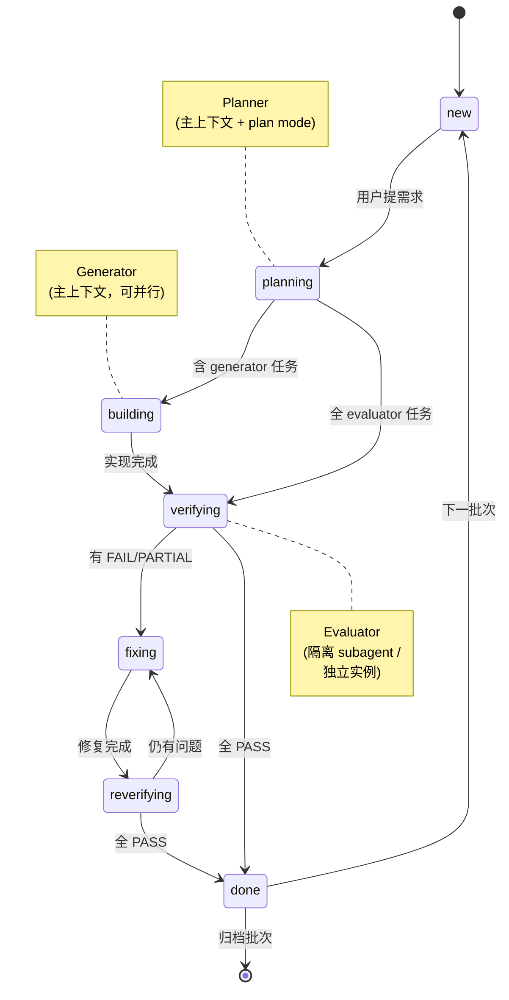

# Triad Workflow

> **三角色 · 状态机 · 无自评** —— 基于 Claude Code 的工程化 AI 协作开发框架（v1.0）

沉淀自 AIGC Gateway / KOLMatrix 等项目的完整实施过程。v1.0 起以 Claude Code 为第一公民：角色以**上下文隔离**实现独立性（subagent / 独立会话），状态机配套 hooks 机制化守门与并行编排；仍兼容跨机器、跨工具（外部 agent 担任 evaluator）的异步协作。

---

## 一图看懂



**三角色协作示意：**

```
┌──────────────┐  规格 + 拆分     ┌──────────────┐  代码          ┌──────────────┐
│   Planner    │ ──────────────► │  Generator   │ ─────────────► │  Evaluator   │
│  (主上下文)   │                 │  (主上下文)   │                │ (隔离上下文)  │
└──────────────┘ ◄────────────── └──────────────┘ ◄───────────── └──────────────┘
                  改善反馈                          PASS/FAIL 反馈

     ┌────────────────────────────────────────────────────────────────┐
     │  无人评估自己的工作 · 阶段状态一律落盘 progress.json（可断点恢复）  │
     └────────────────────────────────────────────────────────────────┘
```

---

## 核心特征

- **三角色不重叠**：Planner（规划）/ Generator（实现）/ Evaluator（验收），没有任何 agent 评估自己的工作——独立性由**上下文隔离**保证（fresh-context subagent 或独立实例），不依赖特定第二产品
- **状态机驱动**：7 状态 `new → planning → building → verifying → fixing ⟷ reverifying → done`，阶段推进由 `progress.json` 决定，每个阶段边界落盘 commit
- **两条执行车道**：快车道（单会话内流转，默认）+ 慢车道（git 作协作总线，跨机器 / 跨工具 / 跨会话）
- **机制化守门**：`.claude/` hooks 启动注入状态、写入即校验状态 JSON；evaluator subagent 定义受限工具集；`/plan` `/build` `/verify` 角色入口——把「知情自律」变成「技术强制」
- **并行编排**：独立 feature 并行实现（worktree 隔离）、fan-out 验收 + 对抗复核、后台 CI、/loop 自排程（见 `harness/orchestration-patterns.md`）
- **记忆分层沉淀**：T0/T1/T2 共享记忆 + `patterns/` 技术域经验库 + framework 自迭代，经验跨项目复用

---

## 30 秒快速开始

```bash
npx degit tripplemay/harness-template my-new-project
cd my-new-project && bash bootstrap.sh
# 打开 Claude Code："按 INIT.md 初始化项目"
```

详细见 [开箱即用手册](docs/03-quickstart.md)。

---

## 文档导航

| 文档 | 给谁看 | 内容 |
|---|---|---|
| 📘 [01 · 功能介绍](docs/01-concepts.md) | 想了解"这是什么、解决什么问题、为什么这么设计" | 三角色 / 状态机 / 两条车道 / 记忆分层 / 设计哲学 |
| 📗 [02 · 使用方法](docs/02-usage.md) | 已经初始化完，想了解"具体怎么跑" | 一次完整批次详解 / 关键文件 / 高级用法 |
| 📙 [03 · 开箱即用手册](docs/03-quickstart.md) | "我要现在就跑起来" | 前置条件 / 3 步初始化 / 第一个批次实战 / FAQ |
| 📕 [CHANGELOG](CHANGELOG.md) | 想看版本演进 | 每次迭代的变更内容、来源批次、触发原因 |

---

> **历史说明：** 早期版本曾命名 "Cowork + Harness"（v0.7.0 改名 Triad Workflow）；v0.x 时代 Evaluator 由 Codex 专职承担，v1.0 起改为上下文隔离实现、外部工具降级为可选 evaluator。部分文件名（`harness-rules.md` 等）保留历史名以维持向后兼容；历史项目 `executor:"codex"` 与 `.agent-id` 的 `cli:`/`codex:` 格式均作为别名兼容。

---

## 框架由什么组成

```
framework/
├── bootstrap.sh            # 一键初始化脚本（机械复制 + 目录建立 + .claude 装配）
├── INIT.md                 # Claude Code 初始化引导 prompt（智能填占位符，一次性工件）
├── README.md               # 本文件（同时作为 template repo GitHub 落地页）
├── CHANGELOG.md            # 框架版本变更记录
├── proposed-learnings.md   # 待沉淀提案（done 阶段处理）
├── archive/                # 已闭环提案归档
├── docs/                   # 框架自身文档（01 概念 / 02 使用 / 03 quickstart）
├── harness/                # 状态机核心（每批次必读）
│   ├── harness-rules.md    # 状态机规则 + 铁律 + 独立性铁则 + 机制化守门
│   ├── planner.md          # Planner 角色指令（铁律 1-9 核查矩阵 + 裁决规则）
│   ├── generator.md        # Generator 角色指令
│   ├── evaluator.md        # Evaluator 角色指令
│   ├── orchestration-patterns.md  # 同会话编排 / 并行 / fan-out 验收 / Workflow / loop
│   ├── pre-impl-adjudication.md   # 开工前审计 → Planner 裁决模式
│   └── progress.init.json  # 初始 progress.json
├── patterns/               # 技术域经验库（触发条件命中才读，见 patterns/README.md）
│   ├── deploy-patterns.md / database-patterns.md / ai-action-contract.md
│   ├── ui-fidelity-guardrail.md / i18n-namespace-add-checklist.md
│   └── material-symbols-pattern.md / web-runtime-patterns.md / testing-env-patterns.md
├── memory/                 # 跨会话记忆系统模板（T0/T1/T2 分层加载）
│   ├── MEMORY.md / project-status.md / environment.md
│   ├── role-context/{planner,generator,evaluator}.md
│   └── user-role.md / reference-docs.md
└── templates/              # 项目级配置模板
    ├── CLAUDE.md / AGENTS.md          # 主实例 / 独立 evaluator 实例指令（占位符版本）
    ├── claude/                        # → 项目 .claude/（hooks + evaluator agent + 角色技能）
    │   ├── settings.json / hooks/     # SessionStart 状态注入 + PostToolUse JSON 校验
    │   ├── agents/evaluator.md        # 隔离验收 subagent 定义
    │   └── skills/{plan,build,verify} # /plan /build /verify 角色入口
    ├── signoff-report.md / features.template.json
    ├── pre-commit-hook.sh / migration-batch-checklist.md
    └── prod-launch-audit-template.md
```

### 文档分层设计

主文件（CLAUDE.md / AGENTS.md）只放**每次启动必读**的内容，详细规则按需加载：

```
项目根目录/
├── CLAUDE.md               # 启动流程 + Commands + 子文档索引
├── AGENTS.md               # 独立 evaluator 实例指令（慢车道用）
├── harness-rules.md        # 状态机规则（始终加载）
├── planner.md / generator.md / evaluator.md / orchestration-patterns.md
├── .claude/                # hooks 守门 + evaluator subagent + 角色技能
├── progress.json / features.json / backlog.json  # 状态机数据
├── .agent-id / .agents-registry  # 实例身份与注册表
├── .auto-memory/           # 共享记忆（git-tracked）
└── docs/dev/               # 按需加载的参考文档
```

**原则：** agent 启动时加载量越少，信息焦点越清晰。架构详情、技术域 pattern、报告模板等只在需要时才读取。

---

## 日常使用流程（快车道）

### 开启新需求批次（/plan）

1. 对 Claude Code 说「根据 harness 规则，开发 [需求描述]」或 `/plan`
2. Planner 读 `docs/test-reports/user_report/` + `backlog.json` → 与用户确认批次范围
3. 写规格文档（新功能批次硬性）、生成 features.json、确认车道与编排方式
4. 建议以 plan mode 提交确认（批准 = spec lock）→ status 置 `building` 或 `verifying`

### 开发中（/build，Generator）

- 逐条实现（独立 feature 可并行 worktree），每完成一个：更新 progress.json + push + **CI 检查（铁律，可后台 watch）**
- CI 红色 → 立即停止新功能，先修复 CI
- 所有 `executor:generator` 完成 → status 改为 `verifying`

### 验收（/verify，Evaluator）

- 主上下文启动**隔离 evaluator subagent**（不传实现叙述，铁律 12）
- Evaluator 设计并执行测试（测试域所有权归 Evaluator）、执行 `executor:evaluator` 功能、逐条 PASS / PARTIAL / FAIL
- 结论**原样**落盘 evaluator_feedback；有问题 → `fixing`；全 PASS → 写 signoff → `done`

### 修复（fixing ⟷ reverifying）

- Generator 针对 evaluator_feedback 修复；**critical/high 修复必须同 commit 补 regression test**
- 修复完成 → `reverifying`，fix_rounds +1 → 隔离复验

### 会话结束（所有角色通用）

1. 检查 project-status.md 是否需要更新（覆盖写，≤30 行），有变更则 commit + push
2. 在 progress.json 的 `session_notes.[myId]` 写本会话叙事性上下文

---

## 测试分层约定（L1 / L2）

| 层级 | 环境 | 依赖 | 职责 |
|---|---|---|---|
| L1 | 本地 | 无外部依赖（mock/stub） | auth 逻辑、路由、格式、协议合规 |
| L2 | Staging | 真实外部服务（API Key） | 全链路调用、计费、端对端写入 |

**铁律：** L1 FAIL ≠ 产品 Bug（环境误报清单见 `patterns/testing-env-patterns.md`）。L2 测试需用户明确授权才执行。
acceptance 中带 [L1] / [L2] 标注的项，按层级处理。

---

## 记忆系统约定（分层加载）

`.auto-memory/` 目录纳入 git，作为跨设备、跨会话的"项目记忆"。**确定性加载，不再"按需"。**

| 层级 | 何时加载 | 文件 | 大小限制 |
|---|---|---|---|
| **T0** | 每次启动必读 | `MEMORY.md` + `project-status.md` + `environment.md` | 各 ≤30 行 |
| **T1** | 按当前角色加载 | `role-context/{当前角色}.md` | ≤50 行 |
| **T2** | 触发条件命中时 | `feedback-*.md` / `user-role.md` / `framework/patterns/*.md` | 按需 |

写入职责与内容边界铁律见 `harness-rules.md §记忆分层`（WHAT 与 HOW 分离、覆盖写、每条信息只存一处）。

---

## 需求池（backlog.json）

独立于当前批次的需求暂存区。任意阶段与用户确认需求后，若有正在执行的批次，写入 `backlog.json` 而非打断；Planner 在新批次 status=new 时必读并与用户确认本批次包含哪些。

**条目格式：** `{ id, title, description, decisions[], confirmed_at, priority, order? }`（`order` 用于大型多批次重构的串行执行）

---

## 角色动态分配（role_assignments）

支持在 `progress.json` 中按批次指定角色，覆盖默认映射（详见 `harness-rules.md`）：

```json
{
  "role_assignments": {
    "planner": "Mark",
    "generator": "Kimi",
    "evaluator": "Reviewer"
  }
}
```

**约束：** generator ≠ evaluator（同一执行上下文）；外部工具类实例只能担任 evaluator；done 阶段清除。

---

## 签收报告约定

每个完整批次交付时，在 `docs/test-reports/` 创建签收报告（`[批次名称]-signoff-YYYY-MM-DD.md`，用 `framework/templates/signoff-report.md` 模板）。**`progress.json.docs.signoff` 为空不得置 done。**

---

## 经验教训

跨项目通用的实战沉淀已全部结构化：

- **流程纪律** → `harness/` 各角色文件铁律（spec 源码核查、CI 红灯即停、回归测试同 commit、hotfix 走流程等）
- **技术域坑** → [`patterns/`](patterns/README.md)（部署 / DB / LLM 集成 / UI 还原 / i18n / 测试环境，每条带来源批次与反面案例）
- **精选原则**（UI 设计系统先行、设计稿一致性、成本控制等）→ [docs/01-concepts.md §经验教训精选](docs/01-concepts.md)

演进全史见 [CHANGELOG.md](CHANGELOG.md)。
